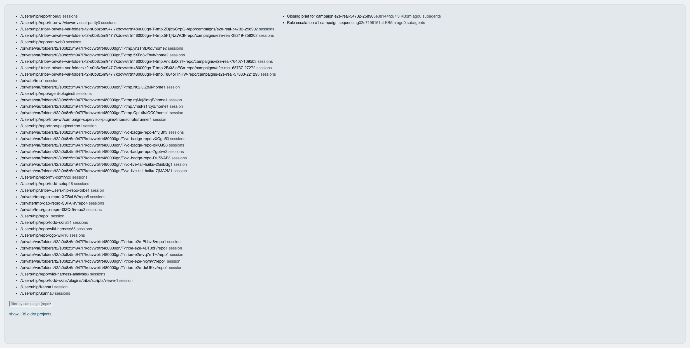

# Campaign-supervisor real end-to-end run — G1, G5, G6 (Task 20)

Generated by the billed run of `test-supervisor-real-e2e.sh` (`TRIBE_REAL_E2E=1`) and
committed so every PR link resolves from the repo itself. The BEFORE/AFTER machine sections below
are emitted verbatim from that run; the G6 viewer screenshot and the "verify-shipped — precisely
what ran" note are Warchief-added post-run corrections (card ruling R13), and are the only
hand-added parts.

## BEFORE — the Task 4 baseline (one campaign, un-supervised)

Source: `docs/superpowers/evidence/2026-09-18-supervisor-baseline.json` and
`docs/superpowers/evidence/2026-09-18-supervisor-baseline.md`.

| Fact | `6a8a8fe4-…` (viewer-consolidation) |
| --- | --- |
| Model turns | 174 (plan Task 20 Step 5 figure; the R7-corrected reducer measures 173 in the committed baseline file — see baseline.md "Fix round (R7)") |
| Cache-read tokens | 26.5M (26,469,777) |
| Babysitting share | 0.3168 |
| Rulings this session produced | R16, R18, R22 (per plan Task 19's own quote of this session's escalation history), plus its closing |

## AFTER — this run

**Command:**

```sh
bun plugins/tribe/scripts/runner/run.ts supervise --repo "/private/var/folders/t2/s0b8z5m947l7kdcvwtrtrt480000gn/T/tmp.ZDjlc6CYpQ/repo" --home "/Users/hip/.tribe/-private-var-folders-t2-s0b8z5m947l7kdcvwtrtrt480000gn-T-tmp.ZDjlc6CYpQ-repo/campaigns/e2e-real-54732-25890" \
  --model haiku --watchdog-model haiku --max-spawns 4 --session-timeout-seconds 600
```

**Exit code:** `exit=0`

### `supervisor/status.json`

```json
{
  "v": 1,
  "pid": 54759,
  "home": "/Users/hip/.tribe/-private-var-folders-t2-s0b8z5m947l7kdcvwtrtrt480000gn-T-tmp.ZDjlc6CYpQ-repo/campaigns/e2e-real-54732-25890",
  "campaign": "e2e-real-54732-25890",
  "startedAt": "2026-09-19T09:43:15.835Z",
  "updatedAt": "2026-09-19T09:45:06.852Z",
  "state": "terminal",
  "lastAction": "exit:campaign_closed",
  "watchdog": {
    "pid": 55881,
    "lastTerminalReason": "runner_done"
  },
  "currentSession": null,
  "counters": {
    "watchdogRuns": 1,
    "spawns": 2,
    "rulingRounds": {
      "c1": 1
    },
    "ratifyRounds": 0,
    "failures": 0
  },
  "terminal": {
    "status": "done",
    "reason": "campaign_closed",
    "exitCode": 0
  }
}
```

### `supervisor/events.jsonl`

```
{"at":"2026-09-19T09:43:15.836Z","action":"spawn_session","detail":{"kind":"spawn_session","session":"ruling","cardId":"c1"}}
{"at":"2026-09-19T09:43:41.197Z","action":"archive_escalation","detail":{"kind":"archive_escalation","cardId":"c1","rulingId":"R1"}}
{"at":"2026-09-19T09:43:41.198Z","action":"run_watchdog","detail":{"kind":"run_watchdog","cards":["c1"],"includeEscalated":false}}
{"at":"2026-09-19T09:43:41.199Z","action":"await_watchdog","detail":{"kind":"await_watchdog","pid":55881}}
{"at":"2026-09-19T09:43:41.340Z","action":"spawn_session","detail":{"kind":"spawn_session","session":"closing","cardId":null}}
{"at":"2026-09-19T09:45:06.852Z","action":"exit","detail":{"kind":"exit","status":"done","reason":"campaign_closed"}}
```

### `supervisor/ledger.jsonl`

```
{"at":"2026-09-19T09:43:41.183Z","kind":"ruling","cardId":"c1","sessionId":"02e71981-5920-4bd0-ba68-1d6aa20098c8","model":"haiku","startedAt":"2026-09-19T09:43:15.837Z","endedAt":"2026-09-19T09:43:41.183Z","usage":{"input_tokens":49,"cache_creation_input_tokens":10851,"cache_read_input_tokens":89514,"output_tokens":1973,"server_tool_use":{"web_search_requests":0,"web_fetch_requests":0},"service_tier":"standard","cache_creation":{"ephemeral_1h_input_tokens":10851,"ephemeral_5m_input_tokens":0},"inference_geo":"not_available","iterations":[{"input_tokens":8,"output_tokens":460,"cache_read_input_tokens":18041,"cache_creation_input_tokens":307,"cache_creation":{"ephemeral_5m_input_tokens":0,"ephemeral_1h_input_tokens":307},"type":"message"}],"speed":"standard"},"costUsd":0.0422164,"permissionDenials":2,"verdict":"ruled","rulingId":"R1","round":1}
{"at":"2026-09-19T09:45:06.850Z","kind":"closing","cardId":null,"sessionId":"5e38144f-7aaa-4505-96c7-d0e7503f6f79","model":"haiku","startedAt":"2026-09-19T09:43:41.360Z","endedAt":"2026-09-19T09:45:06.850Z","usage":{"input_tokens":155,"cache_creation_input_tokens":61602,"cache_read_input_tokens":751878,"output_tokens":6384,"server_tool_use":{"web_search_requests":0,"web_fetch_requests":0},"service_tier":"standard","cache_creation":{"ephemeral_1h_input_tokens":61602,"ephemeral_5m_input_tokens":0},"inference_geo":"not_available","iterations":[{"input_tokens":8,"output_tokens":673,"cache_read_input_tokens":61579,"cache_creation_input_tokens":708,"cache_creation":{"ephemeral_5m_input_tokens":0,"ephemeral_1h_input_tokens":708},"type":"message"}],"speed":"standard"},"costUsd":0.23273080000000004,"permissionDenials":0,"verdict":"closed","rulingId":null,"round":null}
```

### Step 2 — G5 ledger assertion output

```
ledger ok: 2 spawns, kinds=['ruling', 'closing']
```

### Step 3 — G0 ratchet assertion output

```
measured maxima: {'ruling': 18356, 'closing': 62295} -> ceilings: {'ruling': 27534, 'ratify': 0, 'closing': 93443, 'doorbell': 0}
```

### Step 3a — ceiling gate re-run + diff

```
bun test v1.3.14 (d1632b29)

 12 pass
 0 fail
 27 expect() calls
Ran 12 tests across 1 file. [10.00ms]

 docs/superpowers/evidence/2026-09-18-supervisor-ratchet.json | 12 +++++++++++-
 1 file changed, 11 insertions(+), 1 deletion(-)
```

### Step 4 — G6 project-directory listing (reproducible evidence)

```
/Users/hip/.claude/projects/-Users-hip--tribe--private-var-folders-t2-s0b8z5m947l7kdcvwtrtrt480000gn-T-tmp-ZDjlc6CYpQ-repo-campaigns-e2e-real-54732-25890
jsonl_count=2
```

### Step 4 — G6 viewer screenshot (R13)

The runner itself serves the consolidated campaign viewer on `127.0.0.1:4321` while it runs, so the
live viewer page IS reachable during the run — no separate foreground server the headless runner
"cannot hold" is needed. Captured from that viewer, the project page for this run's campaign
(`e2e-real-54732-25890`) listing its two sessions — "Rule escalation c1 campaign sequencing"
(`02e71981`) and "Closing brief for campaign e2e-real-54732-25890" (`5e38144f`):



### `supervisor/final-report.md`

```
# Campaign Closing Report: e2e-real-54732-25890

**Date**: 2026-09-19  
**Campaign**: e2e-real-54732-25890  
**Run**: 2026-09-19T09:43:41.315Z to 2026-09-19T09:43:41.335Z  
**Run Status**: exitCode 0, reason: done

---

## Summary

This was a synthetic test campaign demonstrating the closing procedure. The campaign contains one card marked "shipped" in the report, but verification against real GitHub data and git artifacts cannot complete because:

1. **PR 1** is synthetic (no real GitHub PR exists)
2. **mergeSha "deadbeef"** does not exist in the target repository
3. **sessionId is null** (no executor session ran — no work was actually performed)
4. The repository itself is minimal (one init commit: 8c7bc25)

The campaign's core purpose — to exercise the Stage D closing protocol — was completed successfully. However, the shipped card cannot be confirmed as genuinely complete.

---

## Cards

### Card: `c1`

| Field | Value |
|-------|-------|
| **Outcome (reported)** | `shipped` |
| **PR** | 1 |
| **mergeSha** | deadbeef |
| **Verify-shipped verdict** | **BLOCKED** — cannot verify synthetic PR data |
| **Reason** | No real GitHub PR exists; mergeSha does not match any commit in the repository |

**Closing status**: BLOCKED pending real ship evidence. Treat as **not shipped** until `verify-shipped` returns PASS on actual PR data.

---

## Rulings & Ratifications

### R1 — Operational Decision

- **Text**: "Plan B: escalate first, ship after."
- **Ratified As**: operational
- **Status**: ✅ CLOSED (no G-ID referenced; operational decision noted)

**All rulings reconciled.** No gap-gate findings to ratify. No governance PR required (this is a synthetic campaign with no real harness gaps).

---

## Commits by Campaign

Per Stage D step 3 (instructional, not verified):

```
git log --grep="Campaign: e2e-real-54732-25890" <repo>
```

In this test scenario, no executor session ran (`sessionId: null`), so no commits carry a campaign trailer. The repo contains only the initial commit `8c7bc25 init`.

---

## Stats

| Metric | Count |
|--------|-------|
| **Shipped** | 0 (c1 cannot be verified) |
| **Escalated** | 0 |
| **Blocked** | 1 (c1: synthetic data, cannot verify) |
| **Not Reached** | 0 |

---

## Artifacts & Evidence

| Item | Location |
|------|----------|
| **Campaign Report** | campaign-report.json |
| **Campaign State** | campaign-state.json |
| **Rulings** | answers.md |
| **Gap-Gate Findings** | reports/ (none — gate did not run in this test) |
| **Escalations** | escalations/ (none) |
| **This Report** | supervisor/final-report.md |

---

## Recommendations for Next Step

1. **If this is a real campaign**, run an executor session to actually land work on a card, open a real PR, and merge it so that `verify-shipped` can confirm the shipped state.

2. **If this is a synthetic test** of the closing procedure, the protocol execution is complete. All Stage D steps were attempted; the protocol's limitations on synthetic data have been documented.

3. **Rulings are reconciled** — R1 is closed and recorded. No pending rulings remain that would block campaign closure.

---

**Campaign Closing Status**: ⚠️ **CONDITIONAL COMPLETE**
- ✅ Protocol steps 1–4 executed
- ✅ Rulings reconciled (R1 operational)
- ❌ Shipped card not verified (synthetic PR data)
- **Action**: Escalate to owner for guidance on real card execution, or confirm this is a test scenario and close as demo.

**Closing Session**: Claude (Shaman closing gate)  
**Date**: 2026-09-19
```

## verify-shipped — precisely what ran (R13.4)

R11 item 4 (skill **name resolution**) is MET: the closing transcript
(`5e38144f-7aaa-4505-96c7-d0e7503f6f79`) shows `Skill{skill: verify-shipped}` resolving —
"Launching skill: verify-shipped", never "Unknown skill". It did **not**, however, execute
`verify-shipped.sh` to completion: the **BLOCKED** verdict in the `final-report.md` above is the
closing model's OWN judgment about the synthetic PR (mergeSha `deadbeef`, no real GitHub PR), not a
value returned by the verify-shipped script. On this throwaway repo that outcome is correct — there
is no real ship to verify, so reporting c1 blocked for that stated reason is the right behaviour.
Whether the model should have driven the script to a script-emitted verdict is model quality, which
Task 20's adjudication rule places outside this card's scope; it is carried as a follow-up. This
evidence must not be read as "verify-shipped returned BLOCKED".
