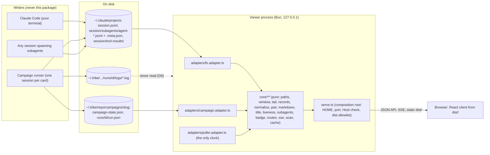
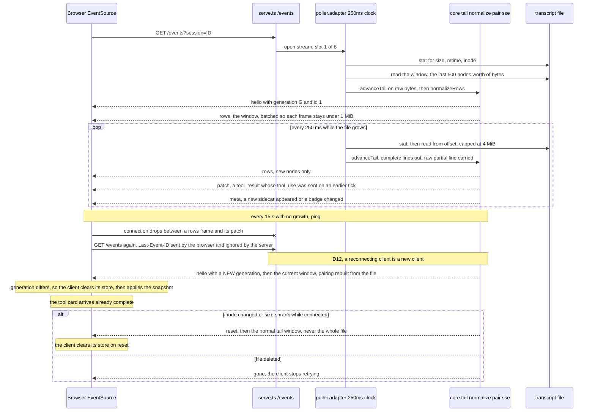
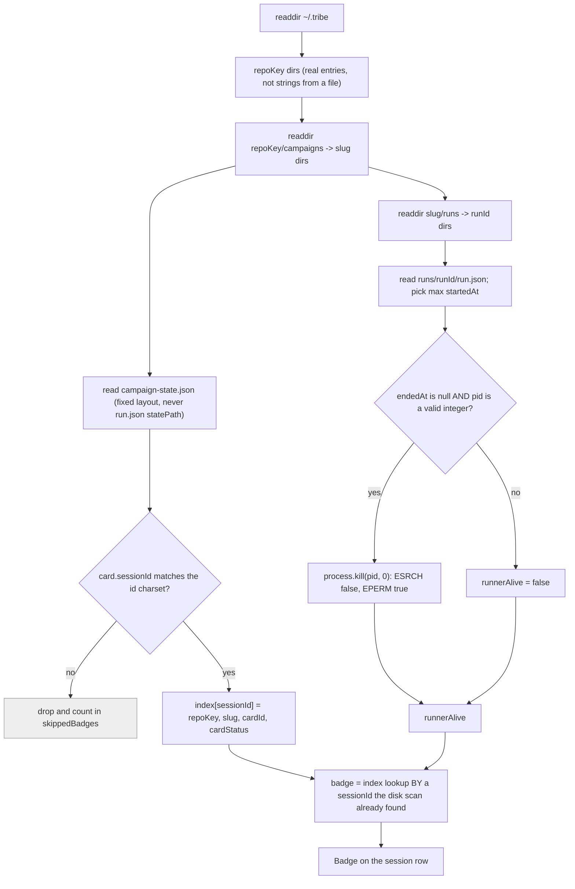

# Viewer consolidation — implementation spec (the How)

Card: `~/.tribe/-Users-hip-repo-tribe/cards/viewer-consolidation.md` (the approved direction, summarised in §1 below, ruled 2026-09-11).
State: `~/.tribe/-Users-hip-repo-tribe/viewer-consolidation/STATE.md` (D1–D9, P1, F1/F2).
References (background, **not required to read this page** — the glossary below makes every id
here self-contained): `references/` next to this file holds `tribe-viewer-research.md` (B1–B25),
`kanna-store-vs-transcript.md` (L1–L9), `runner-log-vs-transcript.md` and `option-a.body.html`.

**The short-code glossary**, so every `B`/`L`/`F` id on this page is followable without leaving it.
`B<n>` = a defect of the **pre-consolidation viewer** (`tribe-viewer-research.md`); `L<n>` = a
**limitation of the transcript format** (`kanna-store-vs-transcript.md`); `F<n>` = a **fix already
in the current code** whose reasoning must survive a rewrite.

| Id | In three words | Used in |
| --- | --- | --- |
| B1 | tool results dropped | §6.4, §16.1 |
| B2 | array prompts dropped | §2, §7.1, §7.2, §16.1 |
| B3 | state-file path traversal | §9, §12.2 |
| B4 | stream frozen to one card | §9 |
| B7 | never auto-scrolls | §8.3 |
| B9 | empty thinking renders empty cards | §7.2 |
| B12 | rotation re-emits the whole file | §6.1 |
| B13 | per-connection state grows forever | §6.5 |
| B10 | system rows dropped | §7.1, §7.4 |
| B16 | no Host check | §12.5 |
| B25 | status page unbounded | §16.1 |
| L1 | no `result` row on disk | §7.1, §7.7 |
| L2 | transcript format drifts between releases | §17 |
| L7 | cwd encoding non-injective | §17 |
| L9 | stream-only events never on disk | §7.7 |
| F34 / F36 | subagent orphan / cycle guards | §5.5 |
| F44 | multi-byte char split across reads | §3.1 |
| F51 | latency measured per event, not per frame | §16.3 |
| F54 | shell metacharacters quoted in `commands.md` | §16 |
| F56 | offset advances by bytes consumed | §6.1 |

This document answers **How**. It does not reopen What or Why: the scope fence in the card is
settled law, and every ruling D1–D9 below is quoted, never paraphrased.

---

## 0. The oracle (read this before any parsing or rendering decision)

> **The Claude Code transcript files on this machine are the oracle.** Kanna's code is a
> reference, never the standard. **Under-rendering** (a row type or content block present on disk
> that the viewer drops silently) **is a bug. Over-rendering** (showing a raw-JSON fallback card
> for an unknown row) **is by design.** File order is the display order — never sort by timestamp.

Claude Code on this machine is **2.1.267**. **Every count in this spec comes from one scan, run
2026-09-12 over the whole corpus at `~/.claude/projects`** — not recalled, and not stitched together
from several passes. That last point is load-bearing: the corpus is *live* (sessions are being
written while it is read), so two scans minutes apart legitimately disagree. An earlier revision
quoted tool counts from two different passes and produced a five-row discrepancy that was real but
meaningless. If a number here is ever disputed, re-run the whole scan and replace **all** of them
together.

| Fact | Measured (single scan, 2026-09-12) |
| --- | --- |
| Parent transcripts | 181 files |
| Subagent sidecar transcripts | 727 files (`<session>/subagents/agent-*.jsonl`) |
| Subagent `.meta.json` sidecars | 813 |
| Session directories | 257, of which 116 have a `subagents/` folder |
| `tool-results/` spill directories | 26, holding 153 files |
| Rows parsed | 127,085 |
| Rows that failed `JSON.parse` | **0** |
| Rows with a `parentUuid` naming a uuid absent from the same file | **0** |
| Timestamp inversions in file order | **906** — therefore file order, never timestamp order |
| `isSidechain: true` in a **parent** file | **0** (77,601 in sidecar files) |
| `tool_use` blocks | **33,721**, every one of them on an `assistant` row |
| `tool_result` blocks | **33,720**, every one of them on a `user` row |
| `tool_result` with no `tool_use` in the same file | **0** |
| `tool_use` with no `tool_result` in the same file | **1** |
| Parent transcripts over 2,000 rows | **4** (2,061 / 2,125 / 2,188 / 2,515 rows) |
| Symlinks anywhere under `~/.claude/projects` | **1** — a sidecar pointing at the same agent file under a **sibling session** in the same project (§12.2) |
| Largest transcript | 13,178,184 B in **677 lines** (≈19 KB/line average) |
| Most rows in one transcript | 2,515 |

The two tool-block counts differ by exactly one, and that one is the single unmatched `tool_use`
above — the numbers reconcile to each other with nothing left over, which is what makes them usable
as a contract.

Three of those numbers are load-bearing and are cited again later: **0 dangling `parentUuid`** plus
**906 timestamp inversions** is the proof for "file order is the display order"; **0
`isSidechain: true` in parent files** is the proof that the parent stream needs no sidechain
filter (Kanna has one; we do not need to port it, and its absence is not a defect); and **the one
symlink** is why §12.2's containment root is the projects directory and not the session directory.

---

## 1. Standing constraints this design is built to (quoted)

### Who reads this, and what Option A is

**Option A, in three sentences.** One local web server over `~/.claude/projects`, the folder where
Claude Code writes every session transcript: it lists every session on the machine, renders any one
of them, and follows the ones still being written. Campaign facts — which session belongs to which
card of an automated run — appear as a small **badge** on a session, read from exactly two files
under `~/.tribe` (`campaign-state.json` for session-to-card, `run.json` for whether the runner
process is alive). The previous viewer's status page and its `/live` route are deleted, and the
viewer never reads the runner's own log.

**The roles this page names**, each in one clause. The **Shaman** decides What and Why and is the
owner's delegate. The **Warchief** decides How: it writes this spec and the plan beside it, and
dispatches the work. A **hunter** implements one planned task at a time under test-first
discipline. A **skinner** — run on the GPT-5.6 Sol model, hence "Sol audits" — audits a finished
change by *running* its proof rather than reading claims. **Terra** is a blind reader: a fresh model
given this page and nothing else, whose job is to find what cannot be understood from the page
alone.

Everything below is settled law for the build: the rulings are quoted, never paraphrased, and this
document does not reopen them.


- **D6** — "The viewer reads the Claude transcript ONLY. The runner's per-session log stays as a
  watchdog/debug artifact; the viewer never reads it."
- **D7** — "No second transcript store. Every parse/render need resolves in memory from the
  transcript."
- **D1** — "Stack: React + Vite client with a build step (Kanna-style)."
- **D2** — "Liveness of a session = file growth only (mtime within N min or size grew)."
- **D3** — "Process: spec is an artifact co-authored over several sessions; once the owner approves
  it, the Shaman drives the whole chain (planning warchief → build → Sol audits → merge) without
  further approval stops."
- **D4** — "Audit/review lenses run on GPT-5.6 Sol via Codex (`codex exec -m gpt-5.6-sol`);
  blind-reader page reviews on GPT-5.6 Terra (`codex exec -m gpt-5.6-terra --sandbox read-only`);
  Claude Sonnet hunters implement."
- **D5** — "One server, one root (`~/.claude/projects`), no modes. Runner keeps reuse-or-spawn and
  prints a session URL."
- **D8** — "Option A approved: single surface over ~/.claude/projects; campaign facts appear as a
  badge on sessions, sourced from campaign-state.json (session id → card) and run.json (runner
  alive); status page and /live route deleted; viewer never reads the runner log."
- **Card, scope fence** — "No design tokens invented by the implementer: the client consumes the
  owner's design system (P1). Until P1 is delivered, the spec names tokens; the build does not
  start."
- **`pure-core.md`** — "core logic never constructs or reaches out for its dependencies; it
  receives them."
- **`fail-closed-edges.md`, obligation 4** — "A path from outside is contained before it is used."
- **D10** — "the sidebar shows by default only projects whose newest session is within 30 days; a
  visible 'show N older projects' link (URL `?all=1`) reveals the rest. Stateless default, not a
  preference, so D7 holds. Sessions inside a project are never hidden."

Three further rulings arrived with review round 2 and **supersede** the earlier transport design:

- **D12 — reconnect is a fresh snapshot.** *"Drop byte-offset resume entirely: `id:` on frames is a
  per-stream monotonic sequence used only for client-side dedupe; `Last-Event-ID` is ignored by the
  server; on reconnect the client receives `hello` + the current window + current pairing state
  rebuilt from the file, and dedupes by stable row id. Rotation/inode handling stays for the live
  stream."*
- **D13 — the tail core works on raw bytes.** *"The pure tail transition takes the raw byte chunk
  and the file observation; it finds the last `0x0A` in the raw bytes itself, carries raw bytes (not
  a decoded string), and decodes only complete lines. The adapter does no decoding."*
- **D14 — one containment root.** *"Containment root for all transcript reads is the resolved
  `~/.claude/projects` directory, not the session directory. Symlinks that resolve inside that root
  are accepted; anything resolving outside is refused."*
- **D15 — every node kind has a size bound.** *"Text-bearing nodes (prompt, assistant text,
  thinking, raw card) whose encoded size exceeds 64 KiB are elided the same way tool payloads are,
  with `expandable` and `/api/block?at=&i=` for the full body. Therefore no single node can exceed
  the frame cap and `batchFrames` has no 'emit oversized alone' branch."*
- **D18 — the scope of the zero-write wall (D16, below), and how tokens reach the build.** *"The allowlist applies to
  `core/**`, `adapters/**`, `serve.ts` and `client/src/**` — runtime code. `tools/**` (measurement
  scripts, never imported by runtime code; `structure.test.ts` asserts no runtime import of
  `tools/`) and `fixtures/**`, `e2e/**` are outside the wall. Token delivery: no fs copy step; Vite
  imports `../../../../../../../docs/tribe/planning/viewer-consolidation/design/sea-salt/tokens.css` (seven parents — verified) by path from
  `client/src/styles/index.css` (`@import`), so the build reads it and nothing copies it."*
- **D19 — a tool node carries two anchors.** *"`call: {at,i}` (the `tool_use` block) and
  `result: {at,i} | null` (the `tool_result` block in its later row, set by pairing). `/api/block`
  stays `at`+`i`. The client expands the call payload with `call` and the result payload with
  `result`. Orphan results carry only `result`. 'One address per payload' stands; a tool card simply
  has two payloads."*
- **D20 — window boundaries are whole rows.** *"The backward read trims from the front by whole rows
  only, stopping at the largest prefix removal that still leaves ≥500 nodes; the window may
  therefore exceed 500 by at most one row's nodes. `from` = the first retained row's offset (so
  back-fill with `before=from` never loses blocks). Pairing runs AFTER trimming, on retained rows
  only: a result whose call is outside the window renders as `orphan_result` with label 'call is
  above the window'; loading earlier and re-pairing replaces it with the paired card."*
- **D21 — the window boundary counts PRE-pairing nodes.** *"The window count used for the boundary
  is the pre-pairing node count: every row's nodes are counted as the normalizer emits them before
  pairing, and a `tool_result` block counts as one candidate node. The boundary is therefore
  derivable before pairing; after pairing the rendered node count may be lower."*
- **D16 — the zero-write wall is an allowlist, not a denylist.** *"`structure.test.ts` permits only
  these world-touching imports in adapters (`node:fs` readFile / open with read flags / stat / lstat
  / readdir / realpath / read; `Bun.file` read; `Bun.serve`) and fails on any other `node:fs`,
  `fs/promises`, `Bun.write`, `child_process` or `node:net` import or member."*

D18, D19 and D20 are each a correction of the same over-reach: a rule stated more absolutely than
the world allows. "Only adapters touch the filesystem" forgot that a measurement script and a build
config are not runtime code. "One address per node" forgot that a tool card is two payloads in two
different rows. "Exactly 500 nodes" forgot that a row is atomic and a window that splits one loses
the blocks it cut. In each case the fix is to name the real unit — runtime code, a payload, a row —
rather than to weaken the rule.

D15 and D16 share a shape worth naming, because it is the same lesson twice: **an enumerated list
of bad things is only as good as the enumerator's imagination.** A denylist of write calls misses
`Bun.write`, `createWriteStream`, `copyFile`, `truncate` and a write-mode `open`; a frame cap that
bounds *some* node kinds leaves the others able to blow it. Both are replaced by a rule that is
total by construction: an allowlist of what is permitted, and a size bound on every kind rather than
on the kinds we happened to think of.

D12 is the larger change and it simplifies rather than complicates: a wire that cannot resume cannot
resume *wrongly*. Everything the old byte cursor was trying to protect — a partial UTF-8 sequence, a
patch stranded by a disconnect, a rotation that happened while nobody was watching — stops being a
wire problem and becomes a non-problem, because a reconnecting client is simply a new client.

Shaman rulings taken as settled (do not reopen): SSE transport with `id:` on every frame (a
**sequence number** under D12, not an offset) and `retry:` set; the URL scheme in §3; static serving of a
built `dist/` from a fixed allowlist with no dev server in production; the title rule; live =
grew-or-mtime-within-10-min; the sidecar-glob subagent tree; single-forward-pass tool pairing with
orphan cards; collapsed raw-JSON cards for unknown rows; `<persisted-output>` loaded on expand.

---

## 2. Goal map — every G maps to a named, end-user-level proof

Every row's proof is observed **where the goal states the behaviour**: G1, G2, G4 and G6 are
user-visible claims, so each is proved in a real browser against the real server, not at an API or
unit boundary. Layer-local tests still exist and are still required — they are listed as
*supporting*, never as the proof of a user-visible claim.

| # | Goal (abridged) | Proof (the assertion that decides the goal) | Supporting | Where |
| --- | --- | --- | --- | --- |
| G1 | `~/.tribe` absent; list + render every kind from a fixture tree built from nothing | `e2e/dom-kinds.e2e.test.ts` — headless Chromium against the real server, driven by the runtime `RENDER_NODE_KINDS` witness (§4) so the kind list cannot silently drift from the model, **plus one DOM assertion per distinguishable input shape** (§16.2): kind-coverage alone is not enough, because a string prompt and an array prompt are both `k:"prompt"` and a pending, an ok and an error tool are all `k:"tool"`. (**B2** = the pre-consolidation viewer dropped array-form prompts.) | `core/normalize.coverage.test.ts` (one case per row of §7), `e2e/real-transcript.e2e.test.ts` | §7, §16.2 |
| G2 | Appended line rendered within 1 s; follows tail at bottom, stops when scrolled up | `e2e/live-tail.e2e.test.ts` — a **controlled writer** appends a row and records its own `performance.now()`; the browser reports when that row's `[data-row-id]` first exists; worst sample ≤ 1000 ms. Follow proved on `scrollTop`: it advances on append while at bottom and is byte-identical before/after append while scrolled up | `adapters/poller.adapter.test.ts`, `client/src/useEventStream.test.ts` | §6, §16.3 |
| G3 | Badge from campaign state; click filters; runner prints root URL + one session URL per card | `e2e/campaign-badge.e2e.test.ts` — the real runner on Haiku 4.5; both stdout lines captured verbatim; the badge asserted in the DOM; the filter proved by **clicking the badge element** and asserting the resulting session-row count and the URL. Its fixture carries **two campaigns sharing one slug under two repo keys** — the collision that exists on this machine today (§9) | `core/badge.test.ts`, `runner/core/viewer-launch.test.ts` | §9, §10, §16.4 |
| G4 | Read-only, 127.0.0.1, zero writes, every path contained, fail-closed refusals, `Host` checked | `core/paths.containment.test.ts` (lexical **and** resolved-symlink containment), `adapters/readonly.test.ts` (the D16 allowlist holds; narrow catches distinguish a parse error from a filesystem error), the fixture-tree **before/after hash** in `e2e/dom-kinds.e2e.test.ts` (no write actually happened), `serve.security.test.ts` (`Host`/`Origin`, the refusal matrix), `deletion-guard.test.ts` rule 5 | `structure.test.ts` (§12.6) | §12, §13 |
| G5 | Status page, `/live`, scan adapter, session-tail reader, `--tribe-root` gone; no `runs/*/logs/` read | `deletion-guard.test.ts` (grep guard over the package) + `git diff --stat` in the PR body | — | §11 |
| G6 | `install.sh` builds the client; runner spawn serves the built output; `bun test` green both packages; c3-215 updated; D9 applied | `e2e/served-build.e2e.test.ts` — rebuild into the **real** `dist/`, hash it, start the server, fetch `/` and every asset it references and assert the hashes match, then restore the prior `dist/` (§16.5 — the server serves its fixed `dist/`, so a proof that needs it to serve somewhere else is not a proof of anything it does); plus `test-install-viewer-build.sh` | `bun run check` in both packages, `bunx @c3x/cli@11.6.3 check`, ADR + change units | §10.3, §10.4, §11.3, §15 |

The three file names in G4's proof column are the names the plan actually creates: tasks 4, 15 and
20 respectively. A goal map that names a test nobody schedules is a goal with no proof at all.

---

## 3. Architecture

Three layers, one process. The diagram is the contract; the ASCII sketch under it is the same
picture with the module names spelled out.



```
                 ~/.claude/projects/          ~/.tribe/*/campaigns/*/
                 (content: everything)        (badge only: 2 files)
                          |                            |
                   adapters/fs.adapter.ts    adapters/campaign.adapter.ts
                          \                            /
                           \__ the ONLY world-touching modules __/
                                          |
                                    core/**  (PURE)
                     paths · tail · records · normalize · markdown
                     title · liveness · subagents · badge · routes · sse
                                          |
                                      serve.ts
                        (composition root: HOME, port, Host check,
                         wiring, dist/ allowlist, SSE lifecycle)
                                          |
                     JSON API + SSE  ------------------  dist/ static
                                          |
                          client/src (React 19 + Vite)
                   maps RenderNode[] -> components; tokens only
```

**The pure core decides everything and touches nothing.** The two adapters are the only files
that name `node:fs`; `adapters/poller.adapter.ts` is the only clock owner; `serve.ts` is the only
file that reads `process.env` / `process.argv`. This is the current package's discipline and it is
kept verbatim, enforced mechanically by `structure.test.ts` (§12).

**The server sends data, not HTML.** Today `core/live/normalize.ts` emits `html` strings. With a
React client that becomes both redundant and dangerous (it forces `dangerouslySetInnerHTML`). The
carried-over `markdown.ts` is therefore ported from *escape-then-markup* to a **token emitter**:
it produces an `MdToken[]` tree and never a string of HTML. The client maps tokens to React
elements, which React escapes by construction. This is strictly stronger than the current
escape-then-markup property, and §12 bans `dangerouslySetInnerHTML` mechanically so it cannot
regress. The existing `core/live/markdown.test.ts` corpus is carried over as the tokenizer's test
corpus (same inputs, token assertions instead of string assertions).

**Normalization runs on the server.** The client receives `RenderNode[]` and knows nothing about
Claude's row shapes. Consequence: `client/src/**` may `import type` from `core/`, never a value
import — enforced in §12. The whole coverage table (§7) is therefore testable under `bun test`
with no DOM.

### 3.1 Package layout

```
plugins/tribe/scripts/viewer/
  package.json            deps: react, react-dom  devDeps: vite, @vitejs/plugin-react,
                          @types/react, @types/react-dom, @happy-dom/global-registrator,
                          @types/bun, typescript
  tsconfig.json           server + core (bun types, noEmit)
  tsconfig.client.json    client (DOM lib, jsx: react-jsx)
  vite.config.ts          root: client/, build.outDir: ../dist, base: '/assets/'... see §10.3
  index.html              the SPA shell (Vite entry)
  serve.ts                composition root
  core/                   PURE — no fs, no clock, no env, no network
    model.ts              the wire contract: RenderNode, MdToken, SessionSummary, Frame, Route
    paths.ts              cwd encoding, containment, fixed-layout joins
    window.ts             complete-line selection over supplied raw bytes (the adapter decides nothing)
    cache.ts              pure cache/eviction policy over a supplied clock reading
    scan.ts               the project/session index + the D10 30-day partition
    tail.ts               pure tail transition: offset, ackOffset, carry, inode reset
    records.ts            tolerant JSONL row parse              (carried over, widened)
    markdown.ts           markdown -> MdToken[]                 (carried over, re-targeted)
    normalize.ts          rows -> RenderNode[]                  (rewritten, §7 is its contract)
    pair.ts               single forward pass tool_use/tool_result
    title.ts              title selection (§5.3)
    liveness.ts           live = grew or mtime within 10 min
    subagents.ts          sidecar tree (carried over from core/live/processes.ts)
    badge.ts              badge derivation + campaign selection/cap (pure over already-read JSON)
    routes.ts             URL -> Route (rewritten for §3.2)
    sse.ts                frame encode/decode, sequence ids, 1 MiB frame batching
  adapters/
    fs.adapter.ts         every transcript read (stat, readdir, ranged read, realpath)
    campaign.adapter.ts   the ONLY two ~/.tribe reads + the pid liveness probe
    poller.adapter.ts     the only clock owner: one poll loop per SSE stream
  client/
    src/main.tsx  src/App.tsx  src/routes.ts  src/api.ts  src/useEventStream.ts  src/rowStore.ts
    src/styles/index.css    @imports the owner's design/sea-salt/tokens.css by path (D18)
    src/components/…        (§8)
    src/styles/app.css      layout/typography only — zero literal colours (§12)
  dist/                   built by Vite; git-ignored; absence is a fail-closed startup error
  fixtures/build.ts       builds a whole ~/.claude/projects tree FROM NOTHING (§16.2)
  tools/title-window.ts   one-off corpus measurement (§5.3); NOT core, NOT shipped in a request path
  structure.test.ts       the executable purity + safety wall
  deletion-guard.test.ts  G5's mechanical proof
  e2e/                    opt-in, real proofs (§14)
  README.md
```

### 3.2 Routes

Two families. Everything under `/api` and `/events` is JSON/SSE; everything else that is not a
built asset returns the SPA shell so the client router can own the address bar.

| Method + path | Response | Notes |
| --- | --- | --- |
| `GET /` | `index.html` | list view; `?campaign=<repoKey>/<slug>` pre-fills the filter (§9 — the pair, never the slug alone); `?all=1` shows projects older than the D10 window (§5.6) |
| `GET /p/<encodedProjectDir>` | `index.html` | one project; `encodedProjectDir` is the on-disk directory name |
| `GET /s/<sessionId>` | `index.html` | one session; project resolved by scanning (§5.2) |
| `GET /s/<sessionId>/a/<agentId>` | `index.html` | one subagent tab |
| `GET /index.html` | `index.html` | the same bytes as `GET /` — named because §16.5 hashes it against the built file |
| `GET /assets/<name>` | the built file | fixed allowlist read from `dist/` at boot (§12.4) |
| `GET /healthz` | `{"ok":true,"viewer":"tribe-viewer","v":2}` | **deliberately NOT the old body** — see §10.4, stale-viewer reuse |
| `GET /api/projects?all=1` | `{"projects":[Project],"olderCount":n,"skippedBadges":n}` | §5.1, §5.6; without `all=1`, `projects` is the D10 window and `olderCount` is the remainder |
| `GET /api/sessions?project=<dir>` | `{"project":Project,"sessions":[SessionSummary]}` | §5.1 |
| `GET /api/session/<sessionId>` | `{"session":SessionSummary,"subagents":[Agent],"badges":[Badge]}` | metadata only. **Rows never come from here** — they arrive on `/events` or `/api/rows`; E1 asserts rows in the DOM, never from this route |
| `GET /api/rows?session=&agent=&before=&limit=` | `{"nodes":[RenderNode],"from":n,"to":n,"more":bool}` | back-fill on scroll-up; returns **nodes**, and `from`/`to` are byte offsets (§6.3) |
| `GET /api/block?session=&agent=&at=&i=` | `{"block":…}` | one elided payload, addressed by `RowAnchor.id` (§4): an image, a 64 KiB+ tool input/result, a `raw` card's JSON, an expandable `attachment` |
| `GET /api/spill?session=&name=` | `text/plain` | a `<persisted-output>` file, contained (§7.4) |
| `GET /events?session=&agent=` | `text/event-stream` | §6 |
| anything else | see the one rule below | never a stack trace |

**The one rule for a path not in the table above**, because two rules for the same request is a
defect and an earlier draft had two:

> A path that is **client-routed** — `/`, `/index.html`, or anything under `/p/` or `/s/` — returns
> the index shell with `200`, because the React router owns those addresses and the server cannot
> know which of them is meaningful. **Everything else returns `404` with a JSON body**
> `{"error":"not found","path":"<path>"}`.

So `/s/does-not-exist` returns the shell and the client renders "no session with that id"
(`/api/session/<id>` is what 404s), while `/nonsense`, `/api/nonsense` and `/assets/nonsense` all
return JSON 404s. The split is by **prefix, not by existence** — the server never probes the
filesystem to decide a status code, which is also what keeps the routing layer free of the traversal
surface §12.2 exists to close.

Every `sessionId` / `agentId` / `project` value above is validated and contained **before any path
is joined** (§12.2). `GET /live`, `GET /`-as-status-page, `GET /app.js`, `GET /app.css` and
`GET /api/processes` are **deleted** (§11).

---

## 4. Shared wire contract (`core/model.ts`)

### Two words, fixed here and used consistently everywhere after

The rest of this document depends on keeping these apart, so they are defined once:

- A **row** is one line of a transcript file — one JSON object, one `\n`-terminated record on
  disk. Every count in §0 and §7.1 is a count of rows.
- A **node** is one rendered unit in the client — one `RenderNode`, one card or chip in the DOM.

**The mapping is not one-to-one.** One row can produce several nodes (an assistant row with a text
block, a thinking block and two `tool_use` blocks produces four), and some rows produce none (an
empty `thinking` block, §7.2). So a number is always labelled: "500 nodes" and "500 rows" are
different claims, and the window in §6.3 counts **nodes**, because nodes are what the client holds
and renders.

```ts
export interface Project {
  dir: string;            // on-disk encoded directory name under ~/.claude/projects
  cwd: string | null;     // real cwd read from inside a transcript; null => label with `dir`
  sessionCount: number;
  newestMtimeIso: string | null;
  live: boolean;          // any session live (§5.4)
}

export interface SessionSummary {
  id: string;             // <sessionId>, the .jsonl basename
  projectDir: string;
  title: string;          // §5.3
  titleSource: 'custom-title' | 'ai-title' | 'last-prompt' | 'first-user' | 'session-id';
  sizeBytes: number;
  mtimeIso: string;
  live: boolean;
  subagentCount: number;
  badges: Badge[];          // usually 0 or 1; 2+ on a real collision (§9)
  /** True when two project directories hold a session file with THIS id (§5.2 — possible after a
   * `relocated` row, 44 measured). The server resolves to the newest by mtime and says so; the
   * client renders a "this id exists in N projects" note beside the title so the user knows which
   * one they are looking at rather than silently getting one of two. False in every ordinary
   * case. */
  ambiguous: boolean;
}

/** A campaign's claim on one session. **A session can carry more than one badge**: the same
 * sessionId legitimately appears under two repo keys on this machine today (§9), so
 * `SessionSummary.badges` is an array and the identity of a campaign is the PAIR
 * `(repoKey, slug)` — never the slug alone. */
export interface Badge {
  repoKey: string; slug: string; cardId: string; cardStatus: string;
  runnerAlive: boolean; runId: string | null;
}

export interface Agent {
  id: string;             // agentId, from agent-<id>.jsonl
  parentId: string | null;// from .meta.json parentAgentId, when it resolves in the same batch
  depth: number;          // spawnDepth, default 1
  agentType: string | null;
  label: string;          // description, else `agent <id>`
  toolUseId: string | null;
  model: string | null;
  sizeBytes: number; mtimeIso: string | null; birthtimeIso: string | null;
  live: boolean;
}

export type MdToken =
  | { t: 'text'; v: string }
  | { t: 'code'; v: string; lang: string | null }   // fenced block
  | { t: 'inline-code'; v: string }
  | { t: 'strong' | 'em'; c: MdToken[] }
  | { t: 'link'; href: string; c: MdToken[] }       // href gated exactly as today
  | { t: 'heading'; level: 1|2|3|4|5|6; c: MdToken[] }
  | { t: 'li'; ordered: boolean; c: MdToken[] }
  | { t: 'br' };

/** THE address of a node and of its payload — one scheme, used everywhere.
 *
 *   `at` = the byte offset of the ROW's first byte in the file.
 *   `i`  = the 0-based index of this node's content block within that row's
 *          `message.content` array.
 *
 * A row with no `message.content` — an `attachment`, a `last-prompt`, a `system` row, an unknown
 * row rendered as a raw card — produces exactly one node and uses **`i = 0`**, meaning "the row
 * itself". There is no third case.
 *
 * `id` is the pair rendered as a string, and it is what the `patch` frame (§6.4), the client's
 * dedupe (§8.4), the DOM's `data-row-id` and `GET /api/block?at=&i=` all address. Both halves are
 * properties of the bytes on disk, so the same node re-derived on a later tick, on a back-fill, or
 * after a reconnect gets the SAME id. There is no line index anywhere in this model: a line index
 * would change the moment the window moved. */
/** The two numbers that address any payload. `RowAnchor` is this plus identity and display fields;
 * a tool node carries a second one for its result half (D19). */
export interface Anchor { at: number; i: number }

export interface RowAnchor {
  id: string;             // `${at}:${i}` — the two fields below, joined
  at: number;             // byte offset of the ROW's first byte
  i: number;              // index of the block within message.content; 0 for a whole-row node
  uuid: string | null;    // the row's own uuid, when it has one; NEVER the identity
  ts: string | null;      // the row's timestamp, verbatim; NEVER used for ordering
}

/** D15: EVERY node kind carries these two fields — there is no exception and no kind without
 * them, which is what makes "no node exceeds 64 KiB" a total statement rather than a list.
 *
 *   `elided`     — true when the node holds a truncated prefix of its payload.
 *   `expandable` — true when the full payload is fetchable at `/api/block?at=&i=`.
 *
 * Where a kind cannot have a larger payload — a `divider`, a `chip`, an `unreadable` note — both
 * are `false`. They are still present, because a consumer that has to ask "does this kind have
 * them?" is a consumer that will one day guess wrong. */
export interface Sized { elided: boolean; expandable: boolean }

export type RenderNode = RowAnchor & Sized & (
  | { k: 'prompt';        body: MdToken[]; chips: Chip[] }
  | { k: 'assistant';     body: MdToken[]; model: string | null }
  | { k: 'thinking';      body: MdToken[] }
  | { k: 'tool';          name: string; input: unknown; state: 'pending'|'ok'|'error';
                          result: ToolResult | null; toolUseId: string | null;
                          agentId: string | null;
                          /** D19: a tool card is TWO payloads in two different rows. `call` is the
                           * `tool_use` block (always `= {at, i}` of this node); `result` is the
                           * `tool_result` block in its LATER row, filled by pairing, null while
                           * pending. Each is expanded with its own `/api/block?at=&i=`. */
                          call: Anchor; resultAnchor: Anchor | null }
  | { k: 'orphan_result'; toolUseId: string; result: ToolResult;
                          /** only the result half exists here, by definition */
                          resultAnchor: Anchor }
  | { k: 'image';         mediaType: string; bytes: number }
  | { k: 'attachment';    label: string; detail: string | null }
  | { k: 'chip';          label: string; detail: string | null; href: string | null }
  | { k: 'divider';       label: string }
  | { k: 'error';         status: number | null; body: MdToken[] }
  | { k: 'raw';           rowType: string; json: string; bytes: number }
  | { k: 'unreadable';    count: number }
);

/** A tool call's result, once it has one. `elided` here is the RESULT half's own flag — a call can
 * have a small input and a 2 MiB result, and the two halves are elided independently. The result's
 * expansion address is the node's `resultAnchor`, never its `call` (D19): the result physically
 * lives in a later row, so one address could not reach both. */
export type ToolResult =
  | { r: 'text';   body: MdToken[]; isError: boolean; elided: boolean }
  | { r: 'spill';  name: string; note: string; previewBody: MdToken[] } // <persisted-output>
  | { r: 'images'; count: number }
  | { r: 'refs';   count: number };                                     // array[tool_reference]
```

**`uuid` is deliberately not the identity.** 14,032 measured `attachment` rows and every
`last-prompt` / `ai-title` row carry no uuid at all, and one row can produce several nodes, so a
uuid is neither always present nor ever unique per node. `at` + `i` is both, for every node, with no
exceptions — which is why it is also the only address `/api/block` accepts.

`RowAnchor.at` is the byte offset the `/api/rows` back-fill addresses by, and half of the
`/api/block` address. **There is no SSE cursor at all** (D12): frame `id:` is a per-stream sequence
number and the server ignores `Last-Event-ID`. `RowAnchor.ts` is carried for display only:
**nothing ever sorts by it** (906 measured inversions).

```ts
/** The runtime witness for `RenderNode["k"]`. TypeScript types are erased, so a test cannot
 * iterate the union — it iterates THIS, and the `Record<RenderNode["k"], true>` annotation makes
 * the compiler reject the file the moment a kind is added to the union without being added here.
 * That is what turns §16.2's DOM coverage test from "one element per kind we remembered" into a
 * check that cannot drift from the model. */
export const RENDER_NODE_KINDS: Record<RenderNode["k"], true> = {
  prompt: true, assistant: true, thinking: true, tool: true, orphan_result: true,
  image: true, attachment: true, chip: true, divider: true, error: true,
  raw: true, unreadable: true,
};

/** A later-arriving fact about a node the client has already rendered — today, exactly one case:
 * a `tool_result` whose `tool_use` was emitted on an earlier tick (§7.5). The client replaces the
 * node with this `id` and re-renders it in place; it never appends. */
export interface Patch {
  id: string;                 // RowAnchor.id of the node being replaced
  node: RenderNode;           // the complete replacement node, not a delta
}

/** What a stat must report for the tail transition to be correct (§6.1). `inode` is what makes
 * rotation detectable when the replacement file is the same size or larger — size alone cannot. */
export interface FileObservation {
  sizeBytes: number;
  mtimeMs: number;
  inode: number;              // st.ino; 0 when the platform cannot supply one
  birthtimeMs: number;
}
```

**The 64 KiB ceiling applies to every kind (D15), and `Sized` is on the union itself so the type
system says so.** Before a node is emitted, its encoded size is measured; past 64 KiB its text is
truncated to a prefix, `elided` becomes true, and `expandable` becomes true so the client can fetch
the rest at **that payload's own anchor** — `at`+`i` for every kind, with one refinement: a tool
card has two payloads, so its input expands through `call` and its result through `resultAnchor`
(D19). "The node's own `at`+`i`" is right for every kind except `tool` and `orphan_result`, and
saying so here rather than three sections later is the difference between a rule and a trap. A `divider`, a `chip` and an `unreadable` note carry
`elided: false, expandable: false` — they have no larger payload, and saying so explicitly is
cheaper than a reader inferring it. Two consequences fall out, and both are contracts elsewhere in this document:
no single node can exceed the 1 MiB frame cap, so `batchFrames` (§6.2) needs no "emit an oversized
node alone" branch; and `/api/block` is the one mechanism that serves every full payload.

Measured relevance: the largest transcript on this machine averages ≈19 KB per row and its largest
rows are base64 images, so 64 KiB is comfortably above the ordinary case and bites only where it
should.

**Every expandable node addresses its payload the same way, and `attachment` is no exception.**
`GET /api/block?session=&agent=&at=&i=` takes the node's own `RowAnchor.at` (the row's byte offset)
and `i` (the block index) — **not a uuid**. That matters because uuids are not universally present:
14,032 measured `attachment` rows carry none, and neither do `last-prompt`, `ai-title` or
`custom-title` rows. `at` + `i` is exactly `RowAnchor.id`, which every node has by construction, so
one addressing scheme covers `image`, an elided tool input or result, a `raw` card's full JSON, and
an `attachment`'s own payload. An `attachment` node sets `expandable: true` when the row carried a
payload worth showing (its `rendered` string, or the attachment object itself) and `false` when the
label is the whole of it — the client renders no affordance in the second case rather than offering
an expansion that returns nothing.

---

## 5. On-disk discovery

Everything below reads only `~/.claude/projects`, resolved once in `serve.ts` from `HOME`.
`HOME` is the *only* environment value this package reads (§12.3), which is also what makes the
fixture e2e possible without inventing a flag.

### 5.1 The scan

```
projectsRoot = <HOME>/.claude/projects
1. readdir(projectsRoot)                        -> candidate project dir names
   - skip anything that is not a directory
2. for each project dir D:
     readdir(D)
       *.jsonl                                  -> session ids (basename minus .jsonl)
       <sessionId>/                             -> that session's sidecar home
3. for each session S:
     stat(S)                                    -> sizeBytes, mtimeIso, birthtimeIso
     head+tail read (§5.3: the first 64 KiB and the last 256 KiB of the file, never the whole
       file)                                    -> title, titleSource, cwd
     readdir(D/<S>/subagents)                   -> agent-*.jsonl  => subagentCount
4. project.cwd = the first non-null `cwd` field seen in any of its sessions' head reads (§5.3)
```

Depth is **fixed** at every step: no path component is ever taken from a file's contents, a query
parameter, or a JSON field. `readdir` results are real directory entries, which is what makes the
walk structurally traversal-free (§12.2 states the one exception and how it is contained).

Ordering: projects by `newestMtimeIso` descending, sessions within a project by `mtimeIso`
descending. This is *display* ordering of files, not of rows — §0's file-order rule is about rows
inside a transcript and is unaffected.

### 5.2 Resolving `/s/<sessionId>` without a project in the URL

`sessionId` is validated (`^[0-9a-fA-F-]{8,64}$`, no dots, no separators) and then **never
joined**: the server asks the scan index for a session with that id and uses the `projectDir` the
scan itself produced from `readdir`. A miss is a `404` with the message
`no session <id> under ~/.claude/projects`, never a path probe. Two sessions with the same id in
two project dirs (possible after a `relocated` row — 44 measured) resolve to the newest by mtime,
and the response carries `ambiguous: true` so the client can say so.

### 5.3 Title and `cwd` — bounded reads, never a whole file

Reading 181 files whole (566 MB) per list request is not acceptable, and D7 forbids a store. The
bounded alternative:

- **Head read**: first 64 KiB. Yields `cwd` (present on essentially every message row — 61,971
  assistant rows carry it) and the first user message.
- **Tail read**: last 256 KiB. Drop the first (possibly partial) line, parse the rest. Yields the
  last `custom-title` / `ai-title` / `last-prompt`.

Title rule (Shaman ruling, in order): last `custom-title`, else last `ai-title`, else
`last-prompt`, else the first user message, else the session id. Measured coverage over the
corpus: `custom-title` in 1/181 files (the row type only appeared in CC 2.1.267),
`ai-title` in 130/181, `last-prompt` in 176/181, a first user message in 175/181 — so the rule
resolves a human title for **180/181** files and falls through to the session id for 1.

`last-prompt` occurs ~14 times per file that has it, so a 256 KiB tail almost always contains one.
**This is an assumption with a measurement task attached**: plan task T1.5b measures, over all 181
files, how often the head+tail window resolves the *same* title a whole-file read resolves, and
the acceptance threshold is **≥ 99%** (≤ 1 file may differ). If the measurement misses, the window
grows — it is a constant, not a design change.

**Where the decisions live (`pure-core.md`).** The adapter performs exactly two acts — `stat` and
"read bytes `[a, b)`" — and decides nothing:

- **Which bytes form complete lines** is `core/window.ts#completeLines(buffer, dropLeadingPartial)`,
  a pure function. The tail read's "drop the first, possibly partial, line" is a line-boundary
  *decision* over supplied bytes, not an I/O act, so it is not the adapter's to make.
- **Cache policy** is `core/cache.ts`: a pure `decideCache(entryKey, existing, nowMs)` returning
  `hit | stale | miss` plus the eviction victim, over an explicitly supplied clock reading. The
  adapter holds the `Map` and calls it.
- **The tail transition** is `core/tail.ts#advanceTail` (§6.1), a pure function over a
  `FileObservation` and a byte chunk. The poller adapter observes and emits; it branches on nothing.

Cache identity: `path + ':' + sizeBytes + ':' + mtimeMs + ':' + inode`, bounded to 500 entries,
LRU, with a 60 s absolute expiry so a file rewritten within the same millisecond and size cannot
serve a stale summary forever. **This is not a store and does not violate D7**: it is keyed on the
file's own identity, holds derived summaries only, never survives the process, and a miss is always
a correct re-read. Stated explicitly because it is exactly the shape an auditor should challenge.

### 5.4 Liveness (D2)

`live = (sizeBytes grew since the previous scan) || (now - mtime <= 10 min)`. No pid, no campaign
state, no lock file. The "grew" half needs the previous scan's size, held in the same bounded
map; on the first scan only the mtime half can fire, which is correct (a file that has not been
touched in 10 minutes is not live).

### 5.5 Subagent discovery

`glob` is a fixed join, not a pattern walk: `readdir(<projectDir>/<sessionId>/subagents)`, keep
entries matching `^agent-(.+)\.jsonl$`, and for each read the sibling `agent-<id>.meta.json`.
Measured sidecar key coverage over 813 meta files: `agentType` 813, `description` 813,
`spawnDepth` 813, `toolUseId` 811, `parentAgentId` 360, `model` 351 — so `parentAgentId` is absent
more often than present and **absence means "hangs off the session"**, never an error.

Tree construction is carried over verbatim from `core/live/processes.ts` (including its
`reachesSession` cycle guard, F34/F36): a `parentAgentId` that does not name another entry in the
same batch, or that walks a cycle of any length, terminates at the session root. Order: by
`birthtimeIso`, then `agentId`.

`meta.json` is untrusted input: `toolUseId`, `description`, `agentType`, `model` are rendered as
text only; `parentAgentId` is used only as a lookup key within the batch; **none of them is ever
joined into a path**. The only path-forming value is the `agentId` captured by the regex above
from a real `readdir` entry.

### 5.6 The default project window (D10)

STATE.md D10, verbatim: *"the sidebar shows by default only projects whose newest session is within
30 days; a visible 'show N older projects' link (URL `?all=1`) reveals the rest. Stateless default,
not a preference, so D7 holds. Sessions inside a project are never hidden."*

Mechanically:

- `core/scan.ts#partitionProjects(projects, nowMs, windowDays = 30)` — pure — splits the scanned
  project list into `recent` (newest session's mtime within the window) and `older`.
- `GET /api/projects` returns `recent` plus `olderCount: older.length`. `GET /api/projects?all=1`
  returns everything and `olderCount: 0`.
- The sidebar renders a `show N older projects` link when `olderCount > 0`; it navigates to
  `?all=1`, which is a real URL the user can bookmark and share. There is no toggle state, no
  storage, and no per-project flag — that is what "stateless" means here and it is why D7 holds.
- **Sessions are never filtered.** The window applies to projects only; opening any project, or any
  `/s/<id>` URL, always shows every session it has. A session named by a campaign badge is
  reachable by its own URL regardless of its project's age, which is what keeps G3 independent of
  D10.

Measured today: 139 project directories exist and the large majority are `plugins-eval` and
`/private/tmp` throwaways. The window is the reason the sidebar is legible on this machine.

---

## 6. Tail and the SSE contract

### 6.1 The tail state machine — pure, and over raw bytes (D13)

`core/tail.ts#advanceTail` is a **pure transition** over three supplied values: the previous state,
a `FileObservation` (§4), and **the raw bytes read this tick** (`Uint8Array`). It returns the new
state plus the complete lines it could decode.

D13 is the shape, and it is what makes the newline invariant true *by construction* rather than by
arithmetic:

- The transition scans the raw bytes for the last `0x0A` **itself**. Everything up to and including
  that byte is complete; everything after it is the carry.
- The carry is **raw bytes**, never a decoded string.
- Only complete lines are decoded, and each is decoded whole, so a multi-byte character can never
  straddle a decode boundary.
- **The adapter does no decoding at all.** It performs `stat` and "read bytes `[a, b)`" and hands
  both to core (`pure-core.md`).

The earlier design handed core a *decoded string* plus a raw byte count and computed
`ackOffset = offset - byteLengthOf(carry)`. That formula is wrong whenever a streaming `TextDecoder`
withholds an incomplete UTF-8 sequence: the withheld bytes are in neither the string nor the carry,
so the computed offset can land mid-character rather than after a newline. Under D13 there is no
decoder state to hide bytes in, and `ackOffset` is simply "one past the last `0x0A` I found".

Two offsets remain in the state, and their meanings are now trivial:

| Field | Meaning |
| --- | --- |
| `offset` | every byte read so far, including the raw carry |
| `ackOffset` | one byte past the last `0x0A` seen — always a real line boundary in the file |

`ackOffset` is **no longer a wire value** (D12 removed byte-offset resume). It survives for two
reasons: it is what makes "we have processed exactly these complete rows" checkable in a test, and
it is where a re-read starts after a reset.

**How the next tick combines the carry with new bytes — the formula, because a reader cannot derive
it from the two definitions alone:**

```
read     := bytes [state.offset, min(fileSize, state.offset + 4 MiB))   # NOT from ackOffset
combined := state.carry ++ read           # raw bytes, concatenated
cut      := index of the LAST 0x0A in `combined`
lines    := decode(combined[0 .. cut])    # complete rows only, each decoded whole
carry'   := combined[cut+1 ..]            # raw bytes, still incomplete
offset'  := state.offset + read.length
ack'     := offset' - carry'.length       # equivalently: one past that last 0x0A
```

**The next read starts at `offset`, not at `ackOffset`** — that is the whole point of keeping both.
`offset` is "every byte I have already pulled off disk", so reading from it takes each byte exactly
once; the bytes between `ackOffset` and `offset` are not re-read, they are already **in `carry`**
and are re-joined by the concatenation above. Reading from `ackOffset` instead would re-read the
carry bytes and duplicate them; dropping the carry and reading from `offset` would lose the partial
row. Carrying the tail and advancing by what was read is what makes the pair lossless and
duplication-free at once.

**Reset — two triggers.** `reset` fires when **either**:

1. `obs.sizeBytes < state.offset` — the file was truncated, or
2. `obs.inode !== state.inode` and `state.inode !== 0` — the file was **replaced**.

Trigger 2 exists because size alone cannot detect a rotation whose replacement is the same size or
larger, and the spec promises a `"rotated"` reason it would otherwise have no way to produce. The
inode arrives on the `FileObservation`; a platform that cannot supply one reports `0` and the
transition degrades to trigger 1 alone — toward the behaviour we already had, never toward a false
reset.

**What a reset actually sends, exactly.** The server drops its tail, normalize and pairing state,
emits a `reset` frame carrying the reason, and then streams **the normal tail window — the last 500
nodes computed by §6.3's algorithm against the file as it now is.** It does **not** stream the file
from byte 0, and it does not send the first 500 nodes. A rotated 13 MB file would otherwise
re-deliver everything the viewer has ever seen through a 1 MiB-framed pipe, which is both the worst
case for the frame budget and not what the user wants: after a rotation, the interesting bytes are
the new ones at the end. The client **clears its store on `reset`** (§8.4) and then applies the
window that follows, so the two sides agree with no merge step.

Rotation **while disconnected** needs no mechanism at all: under D12 a reconnecting client is a new
client and gets a fresh snapshot of whatever file is there now.

**The carry cap is one number: 1 MiB — and the discard needs a state machine, not a sentence.** A
partial line is held until it completes or exceeds 1 MiB. Past the cap the tail must *skip the rest
of that row*, and the only way to do that without treating the remainder as a fresh row is to carry
a flag:

```
if not skipping and carry.length > 1 MiB:
    skipping   := true
    rowStart   := the offset at which the oversized row began
    skipped    := carry.length                 # bytes discarded so far
    carry      := empty                        # drop them; they are unusable
if skipping:
    find the next 0x0A in the incoming bytes
    if none:      skipped += chunk.length; carry := empty; return (still skipping)
    if found at k: skipped += k + 1
                  emit ONE `raw` node, anchored at {at: rowStart, i: 0},
                      rowType "oversized", text "row too large (<skipped> bytes)"
                  skipping := false
                  carry    := bytes after k      # a normal partial line again
```

Two properties this buys, and neither is obvious without the flag: the remainder of the oversized
row is **never parsed as a row** (so a JSON fragment cannot masquerade as a record), and the user
**sees that something was skipped, and how big it was**, rather than a silent gap — which is
§0's under-rendering rule applied to a case where showing the content is impossible. The `raw` node
is anchored at the row's own start, so it sorts in file position like every other node.

The real case is a multi-megabyte base64 image row caught mid-write. Named test (task 5):
*a 2 MiB single-line row is skipped, exactly one `raw` "row too large" node is emitted at its
offset, and the next row parses normally.*

### 6.2 One stream per open session view

`GET /events?session=<sessionId>[&agent=<agentId>]`.

A "session view" is one **focused** transcript — the parent, or one subagent tab — plus the metadata
that decorates it. Switching tabs navigates to `/s/<id>/a/<agent>`, which closes the old
`EventSource` and opens a new one. Cap: **8 concurrent streams**; a 9th gets `503` with the body
`too many live streams`.

| `event:` | `data` | Emitted |
| --- | --- | --- |
| `hello` | `{"generation":string,"session":SessionSummary,"agents":[Agent],"badges":[Badge],"from":n,"to":n,"truncatedBefore":bool}` | once, on connect (§6.3); `generation` is new per connection |
| `rows` | `{"nodes":[RenderNode],"from":n,"to":n}` | the initial window, then on every growth tick. Append-only: every node in a `rows` frame is new |
| `patch` | `{"patches":[Patch]}` | a later-arriving fact about a node already sent (§6.4) |
| `meta` | `{"agents":[Agent],"badges":[Badge],"live":bool}` | whenever the agent set, the badges, or liveness changes — including a **new sidecar appearing mid-stream** |
| `reset` | `{"reason":"truncated"\|"rotated"}` | §6.1's two triggers |
| `ping` | `{"t":"<iso>"}` | every 15 s |
| `gone` | `{"reason":"deleted"}` | the focused file disappeared; the client stops retrying |

(The event is still named `rows` for continuity with `EventSource` listeners, but its payload is
`nodes` — §4's vocabulary. A frame carries rendered nodes, not transcript lines.)

**`id:` is a per-stream monotonic sequence number (D12).** It starts at 1 on `hello` and increments
by one per frame, for every frame type. It exists for exactly one purpose: the client ignores a
frame whose `id` it has already processed. **The server never reads `Last-Event-ID`** — the browser
will send it on reconnect and the server discards it.

`retry: 2000` is written once, in the first frame of every response.

**Reconnect is a fresh snapshot, and that is the whole mechanism (D12).** A reconnecting client is
treated as a brand-new client: a new `hello`, the current window read from the file as it is *now*,
and pairing state rebuilt by the forward pass over that window. Nothing is "resumed".

**The `generation` is what tells the client the snapshot replaces rather than extends what it
holds.** Every connection mints a fresh `generation` (an opaque string; a counter or a random token
both work) and puts it on `hello`. The client's rule is two lines and covers every case:

1. If the incoming `generation` **differs** from the one the store holds, **clear the store**, adopt
   the new generation, then apply the snapshot.
2. Dedupe by row id **only within a generation** — an id seen under the previous generation means
   nothing now, because the window it belonged to has been discarded.

Without this the client cannot know whether an arriving `rows` frame extends its window or replaces
it, and the promised "one contiguous window" is underivable: it would be merging a window read from
a file it may no longer recognise into one it read minutes ago. Sequence-id dedupe (§8.4) is a
separate, narrower mechanism — it drops a duplicated *frame* within one connection; the generation
drops a stale *window* across connections. Both are needed and they do not overlap.

This is a deliberate trade: a reconnect costs one window read instead of a delta. What it buys is
the disappearance of an entire class of defects that a byte cursor cannot avoid — the connection
dropping between `hello` and the first `rows` (the old cursor would skip the window), between a
`rows` frame and the `patch` that completes it (the patch would be lost forever), or between a
`tool_use` and its `tool_result` (the new stream's pending map would be empty and the result would
orphan). Under D12 all three are the same case: reconnect, re-read, re-pair, re-render. The client's
dedupe by stable row id (§8.4) makes the overlap invisible.

The one behaviour a reader might expect and will not get: a client that was scrolled far back in
history and loses its connection returns at the **tail**, not where it was. That is stated here
rather than discovered, and it is the honest cost of the simpler wire.

**Frame size is bounded at the frame as well as the node, and the two bounds compose.** D15 caps
every node at 64 KiB, so no node can alone exceed the frame cap — but a tick may read 4 MiB, and
many sub-64-KiB nodes can still serialize past 1 MiB together. So the poller **batches `rows` into
as many frames as it takes**, each encoded frame ≤ 1 MiB, emitted in order, each with its own `id:`.

Because of D15, `batchFrames` is total and has **no "emit an oversized node alone" branch**: such a
node cannot exist. The earlier draft carried that branch, and it was an outright contradiction —
the same paragraph promised every frame stayed under the cap and then blessed one that did not. The
fix is at the node, not the frame: bound every kind, and the frame bound becomes satisfiable by
simple accumulation.

Poll interval: **250 ms**. G2's budget is 1 s end-to-end; 250 ms leaves room for parse and transport
at one `stat` per tick per stream. Per-tick read is capped at **4 MiB**; the remainder arrives next
tick, and no byte is skipped or double-counted because `offset` advances only by bytes consumed.

The whole lifecycle, including the two cases the earlier draft could not express — a later-arriving
tool result, and a disconnect landing between a row and its patch:



### 6.3 The window — one contiguous range, counted in nodes

The client holds **one contiguous window of the file**, `[first, last]` in byte offsets, never a
sparse set of ranges. That single sentence is what makes back-fill, eviction and dedupe consistent
with each other.

- **On connect**, the window is the **last 500 nodes** (§4's vocabulary: nodes, not rows — a
  500-node window may span fewer than 500 rows when rows carry several blocks, or more when rows
  produce none).

  Finding where a 500-**node** window starts, with no index and without parsing the whole file, is
  the one non-obvious algorithm here, so it is stated exactly:

  ```
  anchor   := EOF
  nodes    := 0
  step     := 256 KiB
  while nodes < 500 and anchor > 0:
      lo     := max(0, anchor - step)
      read bytes [lo, anchor)
      drop the leading partial row unless lo == 0      # core/window.ts
      parse the complete rows in that slice
      nodes  += the node count those rows produce      # core/normalize.ts, counted only
      anchor := offset of the FIRST complete row in the slice
  # nodeCount() above and below is the PRE-PAIRING count (D21): what the normalizer emits
  # per row before pairing runs, with each tool_result block counting as one candidate node.
  # the loop reads whole 256 KiB slices, so it usually OVERSHOOTS. Trim by WHOLE ROWS (D20):
  rows     := the accumulated rows, in file order
  # drop the largest prefix of whole rows that still leaves >= 500 nodes
  while nodeCount(rows[1:]) >= 500:
      rows := rows[1:]
  anchor          := offset of the FIRST retained row
  truncatedBefore := anchor > 0
  # pairing runs HERE, after the trim, over `rows` only
  nodes    := normalize(rows)
  ```

  **The trim is by whole rows, and "exactly 500 nodes" is deliberately not the contract (D20).** The
  loop reads whole 256 KiB slices and overshoots; trimming to *precisely* 500 nodes would cut
  through the middle of a row, and that loses data irrecoverably. Consider a four-block row where
  the 500-node boundary falls at block `i=2`: an exact trim keeps blocks 2 and 3 and records `from`
  as that row's byte offset — so "load earlier" with `before=from` reads rows *before* it and blocks
  0 and 1 can never be reached by any request. They would be silently gone.

  So the trim removes **the largest prefix of whole rows that still leaves ≥500 nodes**, and the
  window may exceed 500 by at most one row's worth of nodes. A row is the atomic unit because a row
  is what a byte offset can name; a block is not addressable as a window boundary, only as a payload
  (§4).

  `from` is the **first retained row's** offset, which makes `before=from` exactly the boundary of
  what the client does not have — back-fill is lossless by construction rather than by luck.
  `truncatedBefore` is true iff any row precedes the anchor, covering both "the scan stopped early"
  and "the scan reached BOF but the trim discarded rows". Reading backwards costs one or two slices
  for a typical session and terminates at BOF for a short one.

  **The count is the PRE-PAIRING node count (D21).** Pairing runs after the trim, so a count that
  depended on pairing would be circular — the boundary would depend on the pairing, which depends on
  which rows survive the boundary. D21 breaks it: count what the normalizer emits per row **before**
  pairing, with each `tool_result` block counting as **one candidate node**. That number is a pure
  function of the rows, so the boundary is derivable in one pass. After pairing the rendered count
  may be **lower** — a result that pairs into its call becomes a patch and stops being its own node
  — and that is expected, not a defect: the window is "at least 500 candidates", never "exactly 500
  rendered cards".

  **Pairing runs after the trim, over retained rows only** — the order matters and §7.5 states the
  consequence. Normalizing before trimming would let a `tool_result` pair into a call node that the
  trim then discards, leaving no node at all for the result: the result would produce nothing,
  because it was consumed by a patch to a node that no longer exists. That is the pre-consolidation
  viewer's B1 (tool results dropped) reintroduced through the back door. Pairing after the trim
  cannot do that: a result whose call is outside the window has nothing to pair with and emits an
  `orphan_result`.
- **"Load earlier"** calls `GET /api/rows?session=…&before=<first>&limit=500`, a ranged read
  backwards from a known byte offset — no index, no store. The returned nodes are **prepended**, and
  `first` moves backwards. Order is preserved because the new range is contiguous with the old one.
- **Past the 2,000-node cap, eviction is from the TAIL** — the newest end — and follow-live is
  switched **off** at the same moment. This is the one non-obvious rule and it is deliberate: the
  user is reading history, so dropping the history they just asked for (head eviction) would make
  "load earlier" unable to reach past 2,000 nodes at all. Four transcripts on this machine exceed
  2,000 rows, so this is a real case, not a theoretical one.

- **While the window is at the cap AND the user has loaded earlier rows — that is, follow-live is
  off — incoming `rows` frames are COUNTED, NOT APPENDED.** This is the rule that keeps contiguity
  true, and it is the case the earlier draft left undefined. Appending them while the tail is being
  evicted would produce a window with a hole in the middle; dropping them silently would lose the
  user's place in the live session. So they are counted, and the count is shown as a **"N new
  below"** pill.

  Clicking that pill — or simply scrolling back to the bottom — **reloads the tail window**: a fresh
  `GET /api/rows` with no `before`, exactly equivalent to what `hello` delivers, replacing the
  store's contents. Follow-live is re-enabled at the same moment and the counter resets to zero.

- **Contiguity therefore holds unconditionally**: the client's window is always `[first, last]` of
  what it actually holds, in file order, with nothing missing between them. The window either grows
  at the tail (following), or grows at the head (reading history, tail frozen), or is replaced
  wholesale (reset, reconnect with a new generation, or the "N new below" reload). There is no
  fourth transition and no state where the window is a set of disjoint ranges.

A `tool_result` whose `tool_use` is before the window is an **orphan** and renders as an
`orphan_result` node; it is never dropped (§0: under-rendering is a bug). Today's code drops exactly
this case.

### 6.4 Live tool results: the `patch` frame

(**B1** = the pre-consolidation viewer dropped tool results already on disk at connect time.) The
historical half is easy: one window, one forward pass, the pair is found. The **live** half is the
common one during a campaign: a `tool_use` arrives on tick *n* and is emitted immediately as a
`tool` node with `state: "pending"` (it must be — holding it back until its result would defeat live
rendering and make the `pending` state unreachable), and its `tool_result` arrives on tick *n+k*,
after the client has already rendered the card.

An append-only wire cannot express that. So:

1. `core/pair.ts` keeps a **pending map** `tool_use_id -> RowAnchor.id`, carried in the stream's
   normalize state across ticks.
2. When a later tick produces a `tool_result` whose id is in that map, the normalizer emits **no new
   node**. It emits a `Patch` (§4) whose `id` is the already-sent node's `RowAnchor.id` and whose
   `node` is the complete replacement `tool` node with `state: "ok" | "error"` and its `result`.
3. The poller sends those in a `patch` frame, after the tick's `rows` frame (order matters: a patch
   may target a node emitted in the same tick).
4. The client (§8.4) keys its window by `RowAnchor.id`. A `patch` **replaces in place**; a `rows`
   node whose id is already present is **ignored, not appended**.

A disconnect anywhere in that sequence is harmless under D12: the reconnecting client re-reads the
window and the forward pass pairs the call with its result before either reaches the wire, so the
card arrives already complete. The named test is exactly that: *disconnect between `rows` and
`patch`, reconnect, the card shows its result exactly once.*

### 6.5 The eviction contract — every per-stream structure has a number

Every per-stream structure has a stated maximum. "Bounded because our corpus is small today" is not
a bound — the oracle is open-world.

| Structure | Bound | What happens at the bound |
| --- | --- | --- |
| tail carry (raw bytes) | 1 MiB | emit one `unreadable` node, drop the carry, resync at the next `0x0A` |
| per-tick read | 4 MiB | the remainder arrives next tick |
| one node, any kind | 64 KiB encoded | its text is truncated to a prefix; `elided` and `expandable` are set; the full body is at `/api/block` (D15) |
| one encoded SSE frame | 1 MiB | the tick's nodes are split across several `rows` frames; no single node can exceed the cap, so batching is total (§6.2) |
| pending tool map (`core/pair.ts`) | 512 entries | evict the oldest; its eventual result renders as an `orphan_result` — a visible outcome rather than unbounded growth |
| server-side normalize state | the pending map plus a seq counter | nothing else is retained; nodes are **not** buffered server-side |
| client window | 2,000 nodes | evict from the **tail** and turn follow-live off (§6.3) |
| incoming nodes while at the cap with follow-live off | not stored at all | counted into the "N new below" pill; the tail window is reloaded on click or on scroll-to-bottom (§6.3) |
| client patch targets | the window above | a `patch` for an id outside the window is dropped |
| open streams | 8 | the 9th gets `503`; a closed connection releases its slot exactly once |

The property this table asserts, and that `e2e/perf.test.ts` measures: **nothing a stream holds is
proportional to the transcript's total size** — only to the window and the caps above. That is D7
restated as numbers.

---

## 7. The normalizer — measured coverage table

This section is the contract for `core/normalize.ts` and the checklist for its audit. Every count
is from the single 2026-09-12 corpus scan (§0); `parent` and `sub` columns are separated where the
difference matters. Every number is from the **single 2026-09-12 scan** of §0 — the same scan, not a
later one, which is what lets these counts be compared with each other.

### 7.1 Top-level row types

| `type` | parent | sub | Rendered as | Note |
| --- | --- | --- | --- | --- |
| `assistant` | 15,399 | 46,827 | per content block (§7.2) | |
| `user` | 8,425 | 27,486 | per content block (§7.2) | includes every runner prompt — B2 |
| `attachment` | 10,744 | 3,288 | `attachment` chip, collapsed, consecutive ones grouped | label = `attachment.type` (§7.3) |
| `last-prompt` | 2,519 | 0 | title source (§5.3); also a `raw` card under "show metadata rows" | |
| `ai-title` | 2,123 | 0 | title source; `raw` under metadata | |
| `queue-operation` | 1,996 | 0 | `chip` — `operation`, plus `content` when present (1,391) | |
| `mode` | 1,877 | 0 | `chip` — `mode` | |
| `atis-latch` | 1,596 | 0 | `raw`, collapsed | undocumented; over-render by design |
| `permission-mode` | 1,320 | 0 | `chip` — `permissionMode` | |
| `system` | 1,062 | 0 | per `subtype` (§7.4) | payload is `content`, **not** `message` — B10 |
| `pr-link` | 710 | 0 | `chip` with `href` = `prUrl` | href gated (§12.5) |
| `file-history-snapshot` | 413 | 0 | `raw`, collapsed | |
| `frame-link` | 304 | 0 | `chip`, `href` = `frameUrl` when present (25) | |
| `bridge-session` | 242 | 0 | `raw`, collapsed | |
| `agent-name` | 238 | 0 | `chip` — `agentName` | |
| `file-history-delta` | 128 | 0 | `raw`, collapsed | |
| `artifact-autoreact-ledger` | 107 | 0 | `raw`, collapsed | |
| `custom-title` | 91 | 0 | title source; `raw` under metadata | CC 2.1.267+ |
| `cost-state` | 76 | 0 | `chip` — `totalCostUSD`, `totalDuration` | L1: there is no `result` row ever |
| `relocated` | 44 | 0 | `chip` — `relocatedCwd` | |
| `worktree-state` | 44 | 0 | `raw`, collapsed | |
| `artifact-comment-monitor` | 24 | 0 | `raw`, collapsed | a Claude row type — **never** renamed by D9 (§15) |
| `fork-context-ref` | 0 | 2 | `raw`, collapsed | |
| **anything else** | — | — | `raw`, collapsed | the open-world case; this is the rule, not the exception |

**The rule that makes this maintainable:** five buckets, and nothing outside them.
1. **Message rows** (`assistant`, `user`) render per content block.
2. **Named metadata rows** render as a one-line `chip` or a `divider`.
3. **`attachment` rows** render as an `attachment` node, grouped by the client into one collapsed
   strip (§7.3). They are their own bucket, not a sub-case of the others: there are 14,032 of them,
   more than every metadata row type combined, and collapsing them into chips would bury the
   conversation while rendering them as raw cards would bury it differently.
4. **Everything else** renders as a collapsed `raw` card carrying `rowType` and the row's JSON
   (elided past 64 KiB per D15, expandable via `/api/block`).
5. **Silent by design** — the closed, exhaustive list of inputs that deliberately produce **no
   node**. It is a list, not a judgement, and the coverage test asserts the **exact set** so a fifth
   case cannot be added by accident:

   | Input | Why no node |
   | --- | --- |
   | a `thinking` block whose `thinking` is `""` | there is nothing on disk to render — 8,411 of 17,873 measured (§7.2) |
   | an assistant row whose **only** block is such a `thinking` | the row is not dropped; its blocks all fell in the line above, so the row legitimately yields nothing |
   | a `tool_result` that **pairs** with a call in the window | it is not lost — it becomes a `Patch` on the call's node (§6.4). A node would be a duplicate |
   | a row consumed **entirely** as a title source (`ai-title`, `custom-title`, `last-prompt`) when the metadata toggle is off | the content is rendered, as the session title; the toggle shows the row as a `raw` card |

   Nothing else. Any other row that produces no node is a bug, and the test is what says so.

A new Claude Code release that invents a row type therefore falls into bucket 4 and renders as a raw
card on day one, and is never silently dropped.

**The mechanical guarantee, stated so it is actually true of bucket 5.** The old phrasing — "every
input row produces at least one node or is accounted for in a fold" — was false the moment a row's
only block was an empty `thinking`: that row produces nothing and is not a fold. The honest form
partitions every input row into exactly one of four outcomes, and `normalize.coverage.test.ts`
asserts the partition is **total and disjoint**:

```
for every row: exactly one of
  (a) it produced >= 1 node
  (b) it was folded into another node        (attachment strip, title source)
  (c) it became a Patch on an earlier node   (a paired tool_result)
  (d) it is in bucket 5's silent-by-design set, which is an EXACT list
```

No row may fall outside all four, and none may satisfy two. The test reports any row that does **by
row type and byte offset** — a bare count would say "one row vanished" without saying which, which
is the difference between a failure you can fix and one you can only stare at.

### 7.2 Content blocks

| role | block `type` | count | Rendered as |
| --- | --- | --- | --- |
| assistant | `tool_use` | 33,721 | `tool` card, paired (§7.5) |
| user | `tool_result` | 33,720 | attached to its `tool` card; unpaired => `orphan_result` |
| assistant | `thinking` (non-empty) | 9,462 | `thinking`, collapsed |
| assistant | `thinking` (empty string) | 8,411 | **not rendered** — see the named exception below |
| assistant | `text` | 10,640 | `assistant` with `MdToken[]` |
| user | `text` | 402 | `prompt` with `MdToken[]` — **B2**, array-form prompts dropped today |
| user | `image` | 15 | `image` node; bytes fetched on expand |
| — | `message.content` is a bare string (user) | 1,799 | `prompt` |
| — | `message.content` is a bare string (assistant) | 0 measured | handled anyway: treated as one `text` block |

The two tool counts are the same two as §0 and differ by exactly one — the single unmatched
`tool_use`. Every `tool_use` measured sits on an `assistant` row and every `tool_result` on a `user`
row, with no exceptions in 127,085 rows, which is why §7.5's forward pass can assume that shape.

**Named exception — empty `thinking`.** A `thinking` block whose `thinking` field is the empty
string carries no content; 8,411 of 17,873 measured are empty (they arrive with a `signature` and
nothing else — B9). Rendering them produces 8,411 empty cards. Skipping them is **not**
under-rendering, because there is nothing on disk to render; it is the only content-bearing block
type this spec declines to emit a node for, and it is declared here so an auditor does not have to
guess. `signature` is never rendered.

### 7.3 `attachment` rows — the largest non-message type

14,032 rows across 30 distinct `attachment.type` values. Top three measured:
`total_tokens_reminder` 6,703, `output_style` 2,443, `batching_reminder_sent` 943.

Rendering each as its own card would bury the conversation. Rendering none would be
under-rendering. The design: each becomes an `attachment` node with `label = attachment.type`, and
the client **groups consecutive attachment nodes into one collapsed strip** ("6 attachments").
Nothing is dropped; nothing dominates.

**Expansion, concretely** (the node's `expandable` flag, §4): a `rendered` field is present on 5,817
measured rows and, when it is, it becomes the node's `detail` and is shown inline — that costs no
fetch. Beyond that, an attachment expands exactly like every other elided payload: the strip's
entry calls `GET /api/block?session=…&at=<RowAnchor.at>&i=0` — an `attachment` row has no
`message.content` array, so `i` is 0, "the row itself" — which re-reads that one row
and returns the attachment object. **The address is `at` + `i`, never a uuid** — 14,032 measured
`attachment` rows carry no uuid at all, which is precisely why §4 addresses blocks by row offset.
An attachment whose whole content is its label sets `expandable: false` and the client offers no
affordance, rather than an expansion that would return nothing.

### 7.4 `system` rows, by `subtype`

| `subtype` | count | Rendered as |
| --- | --- | --- |
| `turn_duration` | 561 | `divider` — `"32.3s · 22 messages"` from `durationMs`/`messageCount` |
| `away_summary` | 190 | `chip`, `content` as detail |
| `stop_hook_summary` | 149 | `chip` — `hookCount`, `stopReason` |
| `local_command` | 107 | `chip` — the `<command-name>` parsed out of `content` (§7.6) |
| `informational` | 48 | `chip`, `content` as detail |
| `bridge_status` | 5 | `chip` |
| `compact_boundary` | 1 | `divider` — "context compacted" |
| `scheduled_task_fire` | 1 | `chip` |
| absent `subtype` | 0 measured | `raw` |

`system` payload is the **top-level `content` string** (350 rows carry it), not `message` — today's
normalizer looks for `message` and therefore drops all of them (**B10**, system rows dropped today). A row also carrying
`isCompactSummary: true` (1 measured, on a `user` row) renders as the compaction divider; Kanna
matches a string prefix instead, which we do not need.

### 7.5 Tool pairing

Single forward pass, `Map<tool_use_id, RowAnchor.id>` (Shaman ruling), carried across ticks in the
stream's normalize state. There are exactly two outcomes for a `tool_result`:

- **Its id is in the map.** Within the same pass, the `tool` node is completed before it is ever
  emitted. Across ticks — the live case — no new node is emitted and a `Patch` (§6.4) replaces the
  already-sent node in place. These are the same decision expressed at two different times, which
  is why the pending map must survive a tick and why its lifetime is bounded (§6.5: 512 entries).
- **Its id is not in the map** (the call is before the window, or its entry was evicted). An
  `orphan_result` node is emitted **in file position** — never dropped — carrying its own
  `resultAnchor` (D19) so its payload is still expandable.

**The window boundary is counted before pairing (D21).** §6.3 chooses which rows the window keeps
using the **pre-pairing** node count — every node the normalizer would emit per row, with a
`tool_result` block counting as one candidate. Pairing then runs over the retained rows and may
reduce the rendered count, because a result that finds its call becomes a patch rather than a node.
Both statements are true at once and neither is a bug: the boundary is about rows and candidates,
the rendered list is about cards.

**Sequencing, stated once here and once in §6.3, because getting it backwards silently loses data.**
Pairing runs **after** the window trim, over retained rows only. Normalizing first would let a
result pair into a call node that the trim then discards: the result produces no node of its own
(it became a patch) and the node it patched is gone, so the result vanishes — which is exactly the
B1 defect (tool results dropped) coming back through a different door. Pairing after the trim cannot
do that, because a result whose call is not in the window has nothing to pair with.

The orphan therefore has a specific, honest label: **"call is above the window"**. It is not an
error state and the client does not present it as one. Loading earlier brings the call's row into
the window, re-pairing runs over the enlarged row set, and the orphan is **replaced by the paired
card** in place — the user sees the card complete itself, which is the truthful account of what
happened.
Measured: **0 orphan results and 1 unmatched call** across 33,721 calls in the whole corpus, so the
orphan path is rare in *history* — but it is the normal path for a window that starts mid-session,
which is exactly why it must be tested rather than trusted (fixture case `tool_result before its
window`).

`tool_result.content` shapes measured: `string` 32,608; `array[text]` 849; `array[tool_reference]`
138; `array[image]` 125; `is_error: true` 993. Each maps to a `ToolResult` variant in §4.

A `tool_use` whose `name` is `Task` and whose `id` matches a sidecar's `toolUseId` renders with
`agentId` set, and the client turns it into a link to that subagent's tab (§8.1). Measured: 811 of
813 sidecars carry a `toolUseId`.

### 7.6 Two content-level conventions

- **XML chips.** Slash commands and reminders arrive as text: `<command-name>` 107,
  `<command-message>` 105, `<command-args>` 99, `<local-command-stdout>` 71, `<system-reminder>` 26,
  `<ide_opened_file>` 2. `core/normalize.ts` extracts these into `chip` nodes (label = the
  command, detail = args/stdout) rather than dumping the XML into markdown. Parsing is a bounded
  regex over the *first* 4 KiB of the text, and an unbalanced or unrecognised tag degrades to
  plain text — never a throw.
- **`<persisted-output>` spills.** 100 measured occurrences. The marker carries an **absolute**
  path into `<projectDir>/<sessionId>/tool-results/<name>`. That path is **never used as given**
  (`fail-closed-edges` obligation 4): the normalizer takes `basename()` only, the result must match
  `^[A-Za-z0-9._-]{1,128}$`, and `GET /api/spill` re-joins it under the session's own
  `tool-results/` directory and proves containment before opening. The node keeps the preview text
  the marker already carries, so a refused spill still shows the first 2 KiB. Read capped at
  2 MiB. Note the directory also holds non-`.txt` artifacts (measured: `artifact-*.html`) — the
  gate is containment, never an extension allowlist.

### 7.7 What the transcript does not carry (L9 — declared, not a defect)

No `result` row exists on disk in any version (L1: 0 of 181 files), so there is no per-turn
cost/duration footer, no `task_notification`, no `background_tasks_changed`. `cost-state` rows
(76) give a cumulative cost chip and that is the whole of it. (**L1** and **L9** are limitations measured in `references/kanna-store-vs-transcript.md`: L1 = no
`result` row is ever written to disk, L9 = 9.2% of a live chat's events never reach disk at all.)
**Any audit finding that the viewer is missing a Kanna behaviour whose data is not on disk is
REFUTED in advance** (plan.md's
adjudication rule, clause (b)).

---

## 8. The client

React 19 + Vite (D1). No router library: `client/src/routes.ts` is ~40 lines of `URLPattern`-free
`pathname.split('/')` matching against the four shapes in §3.2, plus `history.pushState`. No state
library: one `useSyncExternalStore` over the event-stream hook. Both choices are deliberate — the
package's value is the parsing, not the framework surface.

### 8.1 Component tree

```
<App>                                   route dispatch; owns document.title
├── <Shell>                             two-column frame            tokens: paper, ink, rule
│   ├── <Sidebar>                                                   tokens: surface, rule
│   │   ├── <ProjectList>               one row per Project
│   │   │   └── <ProjectRow>            cwd label, session count    tokens: ink, ink-soft
│   │   │       └── <LiveDot>           live boolean                tokens: live
│   │   ├── <CampaignFilter>            the filter box; a badge click fills it
│   │   └── <ShowOlderProjects>        D10: "show N older projects" -> ?all=1   tokens: accent, ink-soft
│   └── <Main>
│       ├── <SessionList>               route / and /p/<dir>
│       │   └── <SessionRow>            title, id, size, age        tokens: ink, ink-soft, rule
│       │       ├── <LiveDot>                                       tokens: live
│       │       ├── <SubagentCount>                                 tokens: ink-soft
│       │       └── <CampaignBadge>     slug · card · status · runner  tokens: badge-bg, badge-ink, warn
│       └── <SessionView>               route /s/<id>[/a/<agent>]
│           ├── <SessionHeader>         title, live, badges, ambiguous note   tokens: ink, rule, live, warn
│           ├── <AgentTabs>             parent + one tab per Agent  tokens: surface, accent, rule
│           ├── <RowList>               windowed RenderNode[]
│           │   ├── <PromptCard>        k=prompt                    tokens: surface, ink, accent
│           │   ├── <AssistantCard>     k=assistant                 tokens: paper, ink
│           │   ├── <ThinkingCard>      k=thinking, collapsed       tokens: ink-soft, rule
│           │   ├── <ToolCard>          k=tool, collapsible + result tokens: surface, rule, ink-soft,
│           │   │                                                           error (state=error)
│           │   ├── <OrphanResultCard>  k=orphan_result             tokens: warn, rule
│           │   ├── <ImageCard>         k=image, fetch on expand    tokens: rule
│           │   ├── <AttachmentStrip>   consecutive k=attachment    tokens: ink-soft, rule
│           │   ├── <ChipRow>           k=chip                      tokens: ink-soft, badge-bg
│           │   ├── <Divider>           k=divider                   tokens: rule, ink-soft
│           │   ├── <ErrorCard>         k=error (apiErrorStatus)    tokens: error, surface
│           │   ├── <RawCard>           k=raw, collapsed JSON       tokens: ink-soft, font-mono
│           │   └── <UnreadableNote>    k=unreadable                tokens: warn
│           ├── <Markdown>              MdToken[] -> elements       tokens: ink, font-sans, font-mono,
│           │                                                              accent (links), surface (code)
│           ├── <LoadEarlier>           back-fill button            tokens: accent
│           ├── <FollowTail>            "⇣ follow live" pill        tokens: accent, live
│           └── <NewBelowPill>          "N new below" (§6.3)        tokens: accent, live
└── <ConnectionNote>                    SSE state                   tokens: warn, ink-soft
```

The token names beside each component are the real ones from §8.2 (`--surface-raised` for a lifted
card, `--accent-soft` for the faintest wash, `--size-14` for transcript text, `--space-12` for card
padding, `--radius-8` for a card corner, `--badge-radius` for the campaign chip, `--focus-ring` for
every focusable element). **No component contains a literal colour, font family, radius, or spacing
value** — §12.6 enforces it mechanically, and §8.2's table is the complete vocabulary.

### 8.2 The design system (P1) — the tokens, verbatim

The card's fence: *"No design tokens invented by the implementer: the client consumes the owner's
design system (P1). Until P1 is delivered, the spec names tokens; the build does not start."*

**P1 is met.** Three candidate themes were offered at
`docs/tribe/planning/viewer-consolidation/design/` — `matcha/`, `coffee/`, `sea-salt/` — sharing
**one schema**, differing only in values. The owner chose **sea salt**, recorded in STATE.md as D17
(2026-09-12). So:

> **The client's single token source is
> `docs/tribe/planning/viewer-consolidation/design/sea-salt/tokens.css`, used verbatim — imported, never copied (see the mechanism below).**

`matcha/` and `coffee/` stay in the repo as the rejected candidates — the record of what was
considered — and are **never imported**. Verified 2026-09-12: `sea-salt/tokens.css` defines all 38
tokens in the table below, with none missing.

**The gate stays, and stays mechanical.** Naming the theme here does not retire the check; before
any task is dispatched the gate still asserts (1) STATE.md names a theme and (2)
`design/<that-theme>/tokens.css` exists. Both hold today. Keeping the check executable is what makes
the decision auditable later and what would catch a future theme change that updated one of the two
and not the other — a spec sentence alone can go stale, an assertion cannot.

**There is no alias layer, and the implementer invents nothing.** The token names below are copied
from `design/matcha/tokens.css` and are identical in all three candidates. Every component style
uses these names and only these names:

| Group | Tokens |
| --- | --- |
| Surface | `--paper`, `--surface`, `--surface-raised` |
| Ink | `--ink`, `--ink-soft` |
| Structure | `--rule`, `--rule-weight`, `--rule-style`, `--card-stroke` |
| Accent | `--accent`, `--accent-soft` |
| Status | `--live`, `--warn`, `--error` |
| Badge | `--badge-bg`, `--badge-ink`, `--badge-radius` |
| Type | `--font-sans`, `--font-mono` |
| Size | `--size-12`, `--size-13`, `--size-14`, `--size-16`, `--size-20`, `--size-24` |
| Leading | `--leading-tight`, `--leading-body`, `--leading-loose` |
| Space | `--space-4`, `--space-8`, `--space-12`, `--space-16`, `--space-24`, `--space-32` |
| Radius | `--radius-4`, `--radius-8` |
| Depth | `--shadow`, `--focus-ring` |

Note the scales are **named by step, not by index**: the space scale's steps are 4/8/12/16/24/32 and
the radius scale's are 4/8, so `--space-12` is the 12-step and `--radius-8` is the 8-step. The space
tokens happen to equal their step in pixels; **the radius tokens deliberately do not** — matcha
renders `--radius-8` as 10 px, because each theme tunes its own corner character on a shared scale.
Read the number as the rung on the ladder, never as a guaranteed pixel value. An earlier draft
invented `--space-1…6` and `--radius-1…3`; those names exist nowhere and are retracted.

Mechanism:

1. `design/sea-salt/tokens.css` (the theme STATE.md names) is the single stylesheet imported once at
   the app root, before any component style.
2. **Nothing copies it (D18).** `client/src/styles/index.css` carries

   ```css
   @import "../../../../../../../docs/tribe/planning/viewer-consolidation/design/sea-salt/tokens.css";
   ```

   and Vite resolves that path at build time. **Seven `../`, verified against the worktree** rather
   than counted by eye: from `plugins/tribe/scripts/viewer/client/src/styles` the hops are `src`,
   `client`, `viewer`, `scripts`, `tribe`, `plugins`, repo root. An earlier draft wrote four, which
   would have failed the build with a resolver error and nothing else.

   A copy step would have needed a filesystem write from `vite.config.ts` — exactly what the D16
   wall forbids in runtime code, and inventing an exception for it would have weakened the wall to
   save one line. An `@import` needs no exception: the bundler reads the owner's file directly, so
   there is one copy of the tokens in the repo and it is the owner's.
3. `client/src/styles/app.css` and every `.tsx` reference tokens only via `var(--…)`. The P1 gate
   resolves **the exact relative path above, from `client/src/styles/`** — the same string the build
   reads — so a gate that passes and a build that fails cannot happen. §12.6 bans a literal
   colour, font, radius or `px` length anywhere under `client/` — with **no exempt file there**,
   because the owner's `tokens.css` lives outside `client/` and is reached by the import above.

**Dark mode is free and must not be re-implemented.** Each `tokens.css` already declares its dark
values twice — under `@media (prefers-color-scheme: dark)` and under `[data-theme="dark"]` — so the
client follows the OS with no application code. The client sets `data-theme` only if it later
offers a manual override, which this card does not.

**`design/sea-salt/preview.html` is the reference implementation of both screens.** Its class names
(`.item`, `.badge`, `.tool`, `.tab`, `.thinking`, `.pill`) map one-to-one onto the components in
§8.1, so a hunter building `SessionRow` or `ToolCard` has a rendered target to match rather than a
description to interpret.

**The gate: no phase starts before STATE.md names the theme and that theme's `tokens.css` exists** —
see §17 R1 and plan.md's Global Constraints. Both conditions are satisfied as of D17, so the gate is
**open**; it stays in the plan because a check that is only written down after it fails is not a
check.

### 8.3 Follow-the-tail (G2)

One rule, no heuristics: the node list is a scroll container, and `atBottom` is the single
predicate `(scrollHeight - scrollTop - clientHeight) <= 32`. While `atBottom`, every incoming `rows` frame scrolls to the
new bottom. A user scroll that leaves the 32 px band sets `following = false` and shows the
`<FollowTail>` pill; clicking it (or scrolling back into the band) resumes. New rows arriving
while not following never move the viewport — the list grows below the fold. This is the direct
fix for B7 (today the transcript section is not a scroll container at all and `pinToBottom` is a
no-op).

**How it is proved (G2's second clause).** A screenshot cannot show that the viewport *did not*
move, so the proof is the number itself: in headless Chromium, read `scrollTop` of
`[data-scroll="rows"]`, append a row through the controlled writer, wait for that row's node
`[data-row-id]` to exist, and read `scrollTop` again.

- While following: the second reading is **greater** than the first, and the `atBottom` predicate
  above still holds.
- After scrolling up 400 px: the second reading is **byte-identical** to the first, and the
  `[data-testid="follow-pill"]` element exists.
- After clicking that pill: `scrollTop` returns to the bottom band and the following behaviour
  resumes on the next append.

Those three assertions are the whole of G2's follow clause, and they are observed in the browser,
never inferred from component state.

### 8.4 The client window store — identity, dedupe, contiguity

One structure, `client/src/rowStore.ts`, and the rules that make §6.4's live patch and §6.3's
window contract work together:

- The store holds **one contiguous window** of nodes, `[first, last]` in byte offsets, in file
  order, keyed by `RowAnchor.id`. Never a sparse set of ranges — that is what makes every rule
  below expressible without a merge algorithm.
- Every rendered element carries `data-row-id` and `data-kind`; the list carries
  `data-scroll="rows"`. These are the addresses §16's DOM proofs assert against.
- **The sequence watermark is per connection and is cleared on every `EventSource` `open`.** Frame
  `id:` restarts at 1 on each connection (§6.2), so a watermark carried across a reconnect would
  make the new stream's `hello` (id 1) look already-processed and silently discard the whole window.
  Clearing on `open` is what makes "ignore an id I have already seen" safe; the *node*-level dedupe
  below is what makes the resulting overlap invisible. The two are different mechanisms and both are
  required.
- A node arriving in `rows` whose id is **already present is ignored**, never appended. This is what
  makes D12's reconnect-as-fresh-snapshot invisible to the user: the overlap between the old window
  and the new one is dropped silently instead of duplicating every visible card.
- A `patch` **replaces** the node with that id in place, preserving position. A patch naming an id
  outside the window is dropped silently — not an error.
- **Back-fill prepends.** `GET /api/rows?before=<first>` returns the nodes immediately preceding the
  window; they go on the front and `first` moves backwards. The result is still one contiguous
  range, which is why no ordering logic is needed beyond concatenation.
- **At the 2,000-node cap, eviction is from the tail**, and follow-live switches off in the same
  operation (§6.3). Head eviction would delete the history the user just requested and cap
  "load earlier" at 2,000 nodes forever.
- **With follow-live off and the window at the cap, an incoming `rows` frame increments a counter
  and is not appended** (§6.3); the count renders as the "N new below" pill.
- **Clicking that pill, or scrolling back to the bottom, reloads the tail window** (a fresh
  `/api/rows` with no `before`), replaces the store's contents, re-enables following and zeroes the
  counter. That is the only transition that discards the back-filled range, and it is
  user-initiated.
- **The store clears itself on `reset` and on a changed `generation`** (§6.1, §6.2), then applies
  the window that follows. Those are the two server-initiated replacements.

The store is therefore always in one of two honest states: *following the tail*, or *reading history
with following off and a count of what it is not showing*. There is no third state where it claims
both, and no state where its window is anything other than one contiguous range.

---

## 9. The campaign badge — algorithm and containment

The only two **file types** read under `~/.tribe` (D8) — `campaign-state.json` and `run.json`, one
of each per campaign and per run, so the walk below opens many files but never a third kind. They
are the only reason the viewer knows campaigns exist.

```
tribeRoot = <HOME>/.tribe
1. readdir(tribeRoot)                                     -> repoKey candidates (real dir entries)
2. for each repoKey: readdir(<tribeRoot>/<repoKey>/campaigns) -> slugs (real dir entries)
3. read <tribeRoot>/<repoKey>/campaigns/<slug>/campaign-state.json
     shape: { sequence: string[], cards: { <cardId>: { status, sessionId, … } } }
     for each cardId in sequence with a card whose sessionId is a valid session id:
       index[sessionId].push({ repoKey, slug, cardId, cardStatus: card.status ?? 'unknown' })
4. readdir(<…>/<slug>/runs) -> runIds; read <…>/runs/<runId>/run.json for each
     latest = max by startedAt
     runnerAlive = latest.endedAt == null && processAlive(latest.pid)
5. badges(sessionId) = every entry in index[sessionId], each with its own campaign's
     { runnerAlive, runId } — a LIST, because one session can belong to two campaigns
```

**A campaign is identified by the pair `(repoKey, slug)`, never by the slug alone, and a session
can carry more than one badge.** This is measured, not defensive: on this machine today, of 17
campaigns, **2 slugs** (`followups-2026-09-04`, `gh-issues-2026-09`) exist under **two** repo keys
(`-Users-hip-repo-tribe` and `-Users-hip-repo-todd-skills.migrated-1788705562`), and **6 session ids
appear under both**. A `Map<sessionId, Badge>` would silently drop one of each pair depending on
directory order, and a `?campaign=<slug>` filter would merge two unrelated campaigns.

So:

- the index is `Map<sessionId, Badge[]>`, keyed for lookup by session id but **identified** by
  `(repoKey, slug, sessionId)`;
- `SessionSummary.badges` is an array and the client renders **all** of them — a session belonging
  to two campaigns says so, rather than picking one;
- the filter parameter is `?campaign=<repoKey>/<slug>` (the `/` is the separator; both halves are
  percent-encoded), and it matches on the pair;
- **no directory is excluded**, including `.migrated-*` keys. Guessing which repo key is "stale" is
  a product judgment the viewer has no standing to make, and a wrong guess hides real history.

Caps: at most 200 campaigns and 200 runs per campaign are admitted per scan. **Which 200 is a pure
decision** — `core/badge.ts#selectCampaigns(entries, cap)`, deterministic over the supplied
directory listing (newest `campaigns/<slug>` mtime first, ties by name) — and the adapter merely
performs the reads that selection names (`pure-core.md`: an adapter executes, it does not choose).
The whole badge scan is cached for 5 s (wall clock, supplied, in memory) because the list view and
every open stream want it.



The containment step is the diamond at `E` and the word **BY** at `M`: the session id read out of a
campaign state file is only ever a lookup key against ids the filesystem scan produced. It never
becomes a path.

**Containment — structural, not a filter.** This is what closes finding B3 of
`tribe-viewer-research.md` (a session id read out of a state file being used as a path):

- `repoKey`, `slug`, `runId` come from `readdir` — they are real directory entries, so no traversal
  is *spellable* in them. **That is not sufficient on its own:** a directory entry cannot contain
  `..`, but it can be a **symlink** pointing anywhere. So the same two-stage containment §12.2
  applies under `~/.claude/projects` applies here, with `realpath(~/.tribe)` as the root: each
  `repoKey`, `slug` and `runId` directory is resolved and proven inside the tribe root **before**
  `campaign-state.json` or `run.json` is opened. A symlinked campaign directory escaping the root is
  refused and counted, exactly like an escaping project directory.
- **The two files are contained too, not just the directories above them.** `campaign-state.json`
  and `run.json` are each `realpath`-resolved and proven inside `realpath(~/.tribe)` **before they
  are opened** — a fixed layout says where a file *should* be, not what it *is*, and either of them
  can be a symlink pointing anywhere. An escaping one is refused: that campaign contributes **no
  badge**, the count goes into `skippedBadges`, and one line goes to stderr naming the path. It is
  not a crash and not a silent skip. Named test (task 16): a `campaign-state.json` symlinked to a
  file outside the tribe root, and the same for a `run.json`.
- `sessionId` **is** a string from a file, and it is used **only as a `Map` key**, never joined
  into a path. The badge index is looked up *by* the session ids the §5.1 scan already found on
  disk. A `sessionId` of `../../../etc/passwd` in a state file therefore indexes nothing and opens
  nothing. It is additionally required to match `^[0-9a-fA-F-]{8,64}$` and dropped otherwise, so
  the failure is loud in tests rather than merely harmless.
- `run.json`'s **`statePath` is never read at all.** Today's code reads that absolute path
  verbatim (B3's other half). The new code resolves `campaign-state.json` by fixed layout next to
  the run directory. `repo`, `answersPath`, `escalationsDir`, `logsDir` are likewise never opened
  — `logsDir` in particular is what D6 forbids.
- `pid` is an integer from a file: it is validated `Number.isInteger && > 0 && < 2**22` and passed
  only to `process.kill(pid, 0)` inside `campaign.adapter.ts`, which catches `ESRCH`/`EPERM` and
  returns a boolean. `EPERM` means alive-but-not-ours, which is `true`.

Clicking a badge fills the campaign filter (`?campaign=<repoKey>/<slug>`), which filters the session
list to sessions carrying a badge for **that pair**, newest first. That is the whole of "follow a campaign" — there
is no page bound to "the running card", which is what B4 was.

---

## 10. Runner integration

### 10.1 What stays

`--viewer-port` (validated 1–65535) and `--no-viewer`; a `/healthz` reuse probe; the detached,
`unref`ed spawn that can never gate a run; the `child.on('error')` stderr degradation. What the
probe *accepts* changes — see §10.4, which is not optional.

### 10.2 What changes — the exact stdout lines

Today (`core/viewer-launch.ts#viewerUrlFor`):

```
campaign viewer: http://127.0.0.1:4321/live?repo=<repoKey>&slug=<slug> (read-only)
```

After:

```
campaign viewer: http://127.0.0.1:4321/?campaign=<repoKey>/<slug> (read-only)
card C5: http://127.0.0.1:4321/s/d7d21837-6f4e-4b1a-9a02-2b6e4c1f8e55
```

- Line 1 is printed once, before the first card's session, by `cli/main.ts` exactly where it is
  printed today. It carries the **pair** `<repoKey>/<slug>` (§9: a slug alone does not identify a
  campaign on this machine), with each half `encodeURIComponent`'d and a literal `/` between them —
  the existing function already percent-encodes both halves and that guard is kept.
- Line 2 is printed **once per card, the instant the SDK assigns a session id** — that is
  `buildSessionIOForCard`'s `onSessionStart` in `core/loop/card-actions.ts:487`, which already runs
  at exactly that moment and already has the card id in scope.

Plumbing, minimal and purity-preserving:

| Change | File |
| --- | --- |
| `viewerUrlFor(homeDir, port)` -> `viewerRootUrl(port, repoKey, slug)`; add `sessionUrlFor(baseUrl, sessionId)` — both pure string math | `runner/core/viewer-launch.ts` |
| `RunLoopConfig` gains `viewerBaseUrl: string \| null` (null = `--no-viewer`/`--dry-run`/skip) | `runner/core/types.ts` |
| `LoopIO` gains `LinePort` (`printLine`) — **the interface already exists** in `ports/ports.ts:305` for the watchdog; it is reused, not invented | `runner/ports/ports.ts` |
| `printLine: (line) => console.log(line)` | `runner/adapters/run-io.adapter.ts` |
| `onSessionStart` calls `io.printLine(...)` when `viewerBaseUrl !== null` | `runner/core/loop/card-actions.ts` |
| `main()` sets `viewerBaseUrl` from the launch decision before building the loop config | `runner/cli/main.ts` |

`--tribe-root` **is deleted from the viewer**, which is what the card means by "drop `--tribe-root`
plumbing for the viewer": the runner never passed it, and the viewer now resolves both roots from
`HOME` (§5, §12.3). The spawn argv becomes `['bun', <entryPath>, '--port', String(port)]` — the
same shape it has today, minus a flag that no longer exists.

### 10.3 `install.sh` and the build

The root `install.sh` deliberately does not touch `scripts/` (it says so in its own comment); the
plugin-level hook `plugins/tribe/install.sh` is the right home. Added at its end, in the same
`set -euo pipefail` style the repo's `rule-bash-strict-mode` requires:

```sh
# --- viewer client build (D1: React + Vite, served as static files) ---
VIEWER_DIR="$PLUGIN_DIR/scripts/viewer"
if [ -d "$VIEWER_DIR" ]; then
  if command -v bun >/dev/null 2>&1; then
    ( cd "$VIEWER_DIR" && bun install --frozen-lockfile && bun run build ) \
      && printf '  built   viewer client -> %s/dist\n' "$VIEWER_DIR" \
      || printf 'WARN: viewer client build failed — the viewer will refuse to start until `bun run build` succeeds\n' >&2
  else
    printf 'WARN: bun not found — skipping the viewer client build\n' >&2
  fi
fi
```

- The build failing **warns and continues**; it never fails the whole install (the installer links
  agents and skills, which must keep working on a machine with no bun).
- `serve.ts` fails closed when `dist/index.html` is absent: one line on stderr —
  `viewer: client not built — run ./install.sh (or: cd plugins/tribe/scripts/viewer && bun run build)`
  — and exit code 2. Never a blank page, never a stack trace.
- `dist/` is git-ignored. Committing a build artifact into a symlink-installed plugin would make
  every client change a binary-ish diff; the installer is the build step, which is exactly what D1
  asked for.
- `plugins/tribe/scripts/doctor.sh` gains one check: `viewer client built (dist/index.html)`.
- New test `plugins/tribe/scripts/tests/test-install-viewer-build.sh`: runs the hook with
  `CLAUDE_DIR` pointed at a temp dir, asserts `dist/index.html` exists afterwards, and asserts the
  hook still exits 0 when `bun` is masked out of `PATH`.

### 10.4 Stale-viewer reuse — why `/healthz` must change

A viewer spawned before this card lands is a long-lived detached Bun process that **does not
reload**: its route table and its boot-time static asset map are fixed at start. Symlink-installing
new source on disk changes nothing about it. So on the first campaign after the upgrade, the
runner's probe would find that old process answering on 4321, reuse it, and print
`http://127.0.0.1:4321/s/<sessionId>` — a URL the running process has never heard of. The user gets
a 404 and the card's whole G6 claim ("the runner's spawn serves the built output") is false while
every test is green. Today's probe cannot tell the two apart, because it checks only
`viewer === 'tribe-live-viewer'` and ignores `v` entirely.

The fix is a deliberate, breaking identity change:

| | Before | After |
| --- | --- | --- |
| `/healthz` body | `{"ok":true,"viewer":"tribe-live-viewer","v":1}` | `{"ok":true,"viewer":"tribe-viewer","v":2}` |
| Runner probe accepts | `viewer === 'tribe-live-viewer'` | `viewer === 'tribe-viewer' && typeof v === 'number' && v >= 2` |

Three outcomes, all of them explicit:

1. **A v2 viewer answers** → reuse, exactly as today.
2. **Nothing answers** → spawn, exactly as today.
3. **Something answers that is not a v2 viewer** — the old viewer, or any unrelated process
   holding the port. The runner **does not spawn** (the port is taken; a spawn would die to
   `EADDRINUSE` invisibly, which is the failure mode the current code already cannot see) and
   prints exactly one stderr line:

   ```
   campaign viewer: stale viewer on port 4321, stop it or pass --viewer-port <n> (needs v2, got v1)
   ```

   The run proceeds; no session URL is printed, because printing a URL that 404s is worse than
   printing none. This is still "observability exhaust never kills a run".

Both sides are tested: the viewer's `/healthz` body is asserted exactly (task 20), and the probe's
three outcomes are asserted against a fake server that returns a v1 body, a v2 body and a
non-JSON body (task 27).

---

## 11. The deletion list (G5)

### 11.1 Files deleted outright

| Path | Lines | Why |
| --- | --- | --- |
| `core/derive.ts` + `core/derive.test.ts` | 176 + 366 | status-page derivation |
| `core/render.ts` + `core/render.test.ts` | 148 + 149 | status-page HTML renderer |
| `core/model.ts` | 69 | status-page model (replaced by the new `core/model.ts` of §4) |
| `core/live/model.ts` + `core/live/model.test.ts` | 65 + 29 | the old live wire contract, superseded by §4 |
| `adapters/scan.adapter.ts` + `.test.ts` | 380 + 338 | the `~/.tribe` five-file scanner **and the runner-log tail** (D6) |
| `core/live/page.ts` + `.test.ts` | 60 + 35 | the `/live` shell |
| `core/live/campaign.ts` + `.test.ts` | 73 + 99 | `run.json` -> `statePath` -> `selectLiveCard` (B3, B4) |
| `client/app.js`, `client/app.css`, `client/app.test.ts` | 192 + 55 + 222 | the vanilla client |
| `fixtures/session-valid.jsonl`, `session-malformed.jsonl`, `subagent-valid.jsonl` | 3 files | replaced by `fixtures/build.ts` (§16.2) |
| `e2e/harness.ts`, `e2e/harness.test.ts`, `e2e/live-viewer.e2e.test.ts` | 800 + 82 + 21 | rewritten against the new routes (§14) |
| `idle-timeout.integration.test.ts` | 87 | folded into `serve.security.test.ts` |

Total removed: **~3,200 lines** of the current 6,076. The PR body carries the real
`git diff --stat` numbers, not this estimate.

### 11.2 Files rewritten in place (logic carried, contract replaced)

`core/live/tail.ts` -> `core/tail.ts` (+ reset applied), `core/live/records.ts` -> `core/records.ts`
(widened: keep `subtype`, `content`, `attachment`, `isMeta`, `isCompactSummary`, `apiErrorStatus`,
`isApiErrorMessage`, `agentId`, `parentUuid`, and the raw line for `raw` cards),
`core/live/markdown.ts` -> `core/markdown.ts` (token emitter, §3),
`core/live/processes.ts` -> `core/subagents.ts` (tree + cycle guard kept; status/`ProcessNode`
dropped), `core/live/paths.ts` -> `core/paths.ts` (`sanitizeProjectDirName` kept verbatim; lexical
and resolved containment added), `core/live/routes.ts` -> `core/routes.ts` + `core/sse.ts`,
`core/live/normalize.ts` -> `core/normalize.ts` (rewritten; §7 is the contract),
`adapters/transcript.adapter.ts` -> `adapters/fs.adapter.ts`, `adapters/poller.adapter.ts`
(rewritten for §6).

### 11.3 Docs and model

| Target | Change |
| --- | --- |
| `plugins/tribe/scripts/viewer/README.md` | rewritten: one surface, the route table of §3.2, the discovery algorithm, the build step |
| `plugins/tribe/scripts/viewer/e2e/README.md` | rewritten for the three e2e proofs of §14 |
| `plugins/tribe/README.md` §"Status viewer" (l. 278–300) | retitled "Transcript viewer"; `--tribe-root` row deleted; the two-surface description replaced |
| `plugins/tribe/README.md` l. 249 | "zero-token **supervisor** script" -> "zero-token **watchdog** script" (D9) |
| `plugins/tribe/scripts/runner/README.md` §"Live viewer" (l. 125–157), l. 63–64, 76–77, 215–216, 814, 860 | the printed-URL shape, the two stdout lines, "status viewer" -> "watchdog" where it means the run.json reader |
| `.c3/c3-2-plugins/c3-215-tribe.md` row 76 (viewer Contract) | rewritten wholesale |
| `.c3/c3-2-plugins/c3-215-tribe.md` row 72 (runner Contract) | the viewer sentences updated to the new URL shape |
| `docs/superpowers/specs/2026-09-02-campaign-live-viewer-design.md` | header note: superseded by this spec + the new ADR |
| `.c3/adr/adr-20260911-viewer-consolidation.md` (new) | the decision record; `supersedes: adr-20260903-fix-viewer-launch-docs` |
| `.c3/changes/adr-20260911-viewer-consolidation/*.patch.md` (new) | change units for c3-215 rows 72 and 76 — **applied in the same PR** (`rule-change-unit-ships-with-code`) |

Both c3-215 rows must escape every literal `|` as `\|` (`rule-c3-table-cell-no-pipe`).

### 11.4 The grep guard (`deletion-guard.test.ts`)

Mechanical, so G5 is a test and not a claim. Over every non-test `.ts`/`.tsx` file in the package:

1. none contains `runs/` adjacent to `logs` (no code path can open a runner log — D6);
2. none contains the strings `scanTribeRoot`, `sessionTail`, `newestLog`, `--tribe-root`,
   `/live`, `/api/processes`, `app.css`;
3. the deleted paths in §11.1 do not exist;
4. `adapters/campaign.adapter.ts` is the **only** file whose source contains `.tribe`;
5. the zero-write wall of §12.6 — an **allowlist** (D16), not the old denylist of eight call names.

---

## 12. Security model (G4)

### 12.1 Read-only and local

127.0.0.1 only, hard-coded (no `--host`). **Asserted two ways, because reading the config proves
only intent**: `serve.security.test.ts` checks that the configured hostname is exactly `127.0.0.1`,
**and** that a connection to the machine's own non-loopback address on that port is **refused**
(resolve a LAN/interface address with `os.networkInterfaces()`, attempt a socket, expect
`ECONNREFUSED`; skip only if the machine has no non-loopback interface, and say so in the output
rather than passing silently). A server bound to `0.0.0.0` passes the first check and fails the
second, which is exactly the mistake worth catching. Zero writes anywhere outside `fixtures/`/`e2e/`,
enforced by §11.4 rule 5. No `git`, no `gh`, no outbound network — the only `fetch` in the tree is
the runner's own probe, which lives in the runner package.

### 12.2 Path containment (`fail-closed-edges` obligation 4)

`core/paths.ts` exports one primitive and everything path-shaped goes through it:

```ts
export function containedJoin(root: string, ...segments: string[]): string | null
```

It returns `null` (never throws, never a partial path) when any segment is empty, is `.`/`..`,
contains `/`, `\`, or a NUL byte, or when the **lexically normalised** join — `path.resolve`, pure
string math, **no filesystem access and no symlink following** — does not start with `root + sep`.
"Normalised" here means only that `.` and `..` segments are collapsed textually. The *other*
sense of resolved — `realpath`, which follows symlinks and does touch the disk — belongs to stage 2
below and is deliberately a different function, `isContainedResolved`. The two stages are named
apart because conflating them is how a lexical check gets mistaken for a real one.
The caller turns `null` into a `400`/`404` with a one-line message.

Applied to, exhaustively: `project` (query), `sessionId` (path), `agentId` (path), `name`
(`/api/spill`), and every asset name. **Not** applied to `sessionId` from `campaign-state.json` or
to `statePath` from `run.json` — because neither is ever used as a path at all (§9); that is the
stronger form of the same obligation and it is why B3 cannot recur.

**Lexical containment is not enough, and the root matters as much as the check.** `containedJoin`
refuses textual traversal, but it cannot see a symlink *inside* the root that points outside it. So
containment has two stages, and both are mandatory before any open:

1. **Lexical** — `containedJoin` above, over the untrusted segments.
2. **Resolved** — `core/paths.ts#isContainedResolved(root, resolvedTarget)`, applied to the
   `realpath` the adapter reports. A resolved target that does not start with
   `realpath(root) + sep` is refused, whatever the lexical result was.

**The root is the resolved `~/.claude/projects` directory (D14) — not the session directory, not
the project directory.** This is decided by the oracle, not by taste. There is exactly one symlink
under `~/.claude/projects` on this machine, and it is a legitimate one: a subagent sidecar in
session `f900f274-…` pointing at the same agent file under the **sibling session** `6c9855d5-…` in
the same project. A session-rooted check would refuse a real row that Claude Code itself wrote,
which is under-rendering — the one thing §0 calls a bug. A projects-rooted check accepts it and
still refuses everything that leaves the tree.

Applied to every read, with no exception: transcripts, sidecars, `.meta.json`, spills, and the
project and session directories themselves. The last two matter — a symlinked *project directory*
pointing outside the root must be refused during discovery, before any file inside it is opened,
which is why resolved containment is part of the scan (§5.1) and not only of the spill route.

Named tests (task 4 for the decision, task 15 for the adapter):

- **accept** a sidecar symlinked to a sibling session inside the projects root — the real shape
  above, and the case a session-rooted design got wrong;
- **refuse** a symlink pointing at `/tmp/evil` (or anywhere outside the root);
- **refuse** a symlinked project directory whose target is outside the root;
- **refuse** a broken symlink (no resolution, no read);
- **accept** an ordinary non-symlinked file, so the check is not merely refusing everything.

`realpath` is also used once in `serve.ts` to resolve `HOME` and the two roots at boot.

### 12.3 Environment

`HOME` is the only environment value read, and only in `serve.ts`. `structure.test.ts` keeps
today's raw-source ban on `process.env` under `core/`, extended to `client/`, and adds a ban on
`process.argv` outside `serve.ts`.

### 12.4 Static assets

`dist/` is read into memory **once at boot** into a `Map<name, {body, contentType}>` built from a
`readdir` of `dist/assets` plus `dist/index.html`. A request for `/assets/<name>` is a map lookup,
never a path join. An unknown name is `404`. Content types come from a fixed extension table
(`.js`, `.css`, `.svg`, `.woff2`, `.png`); an unknown extension is not served.

### 12.5 Browser-side

- **`Host` header check** (B16, DNS rebinding): `Host` must be `127.0.0.1[:port]` or
  `localhost[:port]`; anything else is `403` before routing. If `Origin` is present it must match
  the same set. Named test: `serve.security.test.ts > refuses a rebound Host`.
- **No `dangerouslySetInnerHTML`, anywhere** — banned by §12.6. The server never emits HTML.
- Link `href`s in `MdToken`/`chip` nodes are gated to `http:`, `https:`, `mailto:` — the existing
  `markdown.ts` gate, carried over — and rendered with `rel="noopener noreferrer"`.
- `Content-Security-Policy: default-src 'none'; script-src 'self'; style-src 'self'; img-src
  'self' data:; connect-src 'self'` on the SPA shell. `img-src data:` is required by the 15
  measured base64 images.
- `X-Content-Type-Options: nosniff` on every response.

### 12.6 The structural wall (`structure.test.ts`, extended)

Carried over as-is: `core/**` names no world-touching module in any import form; adapters are
value-imported only by `serve.ts` or other adapters; no `process.env` in `core/**` (raw-source
scan, deliberately failing toward false positives — keep that comment).

Added:

1. `client/src/**` value-imports nothing from `core/` or `adapters/` (`import type` only).
2. No file in `client/**` contains `dangerouslySetInnerHTML`.
3. No file in `client/**` (`.css`, `.tsx`, `.ts`) contains a literal colour (`#rgb`, `#rrggbb`,
   `rgb(`, `rgba(`, `hsl(`, `oklch(`), a `font-family` value, or a bare `px` length outside
   `var(--…)` usage. **There is no exempt file under `client/`**: D18 delivers tokens by `@import`
   from `design/sea-salt/tokens.css`, so the owner's file — the only place literals legitimately
   live — sits outside `client/` entirely, and the rule needs no carve-out. Every `var(--name)` the
   client references must be defined in that imported file. This is the scope fence's "no design
   tokens invented by the implementer" made mechanical.
4. `adapters/campaign.adapter.ts` is the only file naming `.tribe` (also §11.4).
5. `process.argv` appears only in `serve.ts`.
6. Every rendered row element carries `data-kind` and `data-row-id`, and the row list carries
   `data-scroll="rows"`. These are the addresses §16.0's DOM proofs assert against, so they are
   part of the contract, not test scaffolding — a component that stops emitting one silently
   disarms a goal's proof.
7. **The zero-write wall is an allowlist (D16), scoped to runtime code (D18).** This is the rule G4
   rests on, and it has three parts. Each answers a different question; read them in order.

   **(7a) What the wall covers.** Runtime code, and only runtime code: `core/**`, `adapters/**`,
   `serve.ts`, `client/src/**`. Outside it: `tools/**` (one-off measurement scripts, never shipped
   in a request path) and `fixtures/**`, `e2e/**` (test scaffolding, which must write or it could
   not build a fixture). The wall governs what the **shipped viewer** can do, not what a developer
   can run. To stop that scope becoming a loophole, one extra rule: **no file under the wall may
   import from `tools/`** — a measurement script the server could reach at runtime would be inside
   the wall in every sense that matters.

   **(7b) What is permitted inside it**, as a table, because an allowlist that is a prose sentence
   is an allowlist nobody can check against:

   | Operation | Where | Why it is permitted |
   | --- | --- | --- |
   | `readFileSync`, `openSync` (**read flags only**), `readSync`, `closeSync` | `adapters/**` | the bounded reads every transcript and sidecar needs |
   | `statSync`, `lstatSync`, `readdirSync`, `realpathSync` | `adapters/**` | size/mtime/inode, directory walks, and the resolved-containment check of §12.2 |
   | `Bun.file(...)` read methods | `adapters/**` | the same reads through Bun's own API |
   | **`process.kill(pid, 0)`** | `adapters/campaign.adapter.ts` | **a liveness probe, not a write and not a signal.** Signal `0` delivers nothing: the kernel only performs the permission-and-existence check and returns. §9 needs it for `runnerAlive`, and the alternative — a time-based staleness guess — is wrong in both directions. It is named here with its zero argument because `process.kill(pid, <anything else>)` really would be a side effect, and the wall must be able to tell the two apart |
   | `Bun.serve` | **`serve.ts` only** | the single place the process binds a socket; `serve.ts` is the composition root, not an adapter, so "adapters only" would be the wrong home for it |

   **(7c) What is refused inside it.** Everything else: any other `node:fs` member, any
   `fs/promises` import, `Bun.write`, `node:child_process`, `node:net`, `node:http`, `node:https`.
   Imports are resolved with Bun's own transpiler (as the current wall already does) **and** member
   expressions are scanned, so `fs.writeFileSync` reached through a namespace import is caught as
   well as a named one.

   Why an allowlist at all: a denylist is only as good as its author's memory. An earlier revision
   listed eight write calls and left `Bun.write`, `createWriteStream`, `copyFile`, `truncate`, a
   write-mode `open` and all of `fs/promises` open. Inverted, the rule is total — and a new
   legitimate read primitive is added by extending (7b) deliberately, so growth is a decision
   someone makes rather than an omission nobody notices.
8. No `catch` in `adapters/**` or `core/**` is bare: every `catch` either names the error classes it
   handles or immediately re-throws anything it does not recognise. `fail-closed-edges` obligation 1
   — and the distinction that matters here is **a malformed file (`SyntaxError` from `JSON.parse`)
   versus an unreadable one (`OSError`/`ENOENT`/`EACCES`)**: the first is a tolerated data shape
   that degrades to a counted skip, the second is an absent artifact that degrades to `null`. A
   single `catch {}` swallowing both makes a permissions bug look like an empty campaign forever.
   `adapters/readonly.test.ts` asserts the two are distinguishable by injecting each.

---

## 13. Failure modes — the fail-closed table

Every row is "what the user sees", and no row is a stack trace.

| Input / condition | Behaviour |
| --- | --- |
| `--port abc`, `--port 0`, `--port 70000` | one stderr line `viewer: --port expects an integer 1-65535, got "abc"`, exit 2 (today: `NaN` -> a random port, B14) |
| unknown flag | one stderr line naming it, exit 2 |
| port already in use | one stderr line `viewer: port 4321 is already in use`, exit 1 (today: a Bun stack dump, B14) |
| `dist/index.html` missing | one stderr line + exit 2 (§10.3) |
| `~/.claude/projects` missing or unreadable | the list renders, empty, with the note `no sessions found under <path>` — never a crash |
| `~/.tribe` missing entirely | every session's `badges` is `[]` (an empty array — never `null`, per §4's wire contract); nothing else changes (**this is G1's precondition**) |
| `campaign-state.json` malformed / wrong shape | that campaign contributes no badges; other campaigns unaffected (per-campaign fault isolation, carried over) |
| `run.json` malformed | `runnerAlive: false`, `runId: null` |
| `sessionId` in a state file is not a valid id | dropped from the index; counted in a `skippedBadges` number on `/api/projects` |
| a transcript line fails `JSON.parse` | counted; the window emits one `{"k":"unreadable","count":n}` node; never a throw (measured: 0 in 127,085 rows, so this is defence, not a hot path) |
| a row is a JSON array or a bare scalar | same as above |
| transcript deleted while streamed | `gone` frame, stream closed, client shows "this session's file is gone" and stops retrying |
| transcript truncated or replaced **while streamed** | `reset` frame, then the **normal tail window** — never the file from byte 0; the client clears its store first (§6.1) |
| transcript truncated or replaced **while disconnected** | nothing special is needed: a reconnect is a fresh snapshot of whatever file is there now, under a new `generation` (D12, §6.2) |
| carry exceeds the 1 MiB cap | one `unreadable` node, the carry is dropped, the tail resyncs at the next `0x0A` (§6.1) |
| `/api/spill` name fails the charset or containment check | `400 spill name refused`; the preview text already on the card still shows |
| `/api/block` names an `at`/`i` that does not resolve to a block | `404`, the card keeps its elided placeholder |
| 9th concurrent SSE stream | `503 too many live streams` |
| `Host`/`Origin` mismatch | `403` |
| a path is not in the route table | the index shell for `/`, `/index.html`, `/p/*` and `/s/*` (client-routed); JSON `404` for everything else (§3.2) |
| `process.kill(pid, 0)` throws `EPERM` | `runnerAlive: true` (alive, not ours) |
| the spill/preview path escapes its root **lexically** | refused by `containedJoin`; never opened |
| the path is lexically fine but **resolves** outside `~/.claude/projects` (a symlink) | refused by `isContainedResolved`; never opened (D14) |
| a symlink resolves to a **sibling session inside** the projects root | **served** — a real shape Claude Code writes (§12.2) |
| a project directory is a symlink pointing outside the root | refused during discovery, before any file in it is opened |
| `JSON.parse` throws `SyntaxError` on a state file | that campaign contributes no badges; counted, never confused with an unreadable file |
| a state file is unreadable (`EACCES`, `ENOENT`) | degrades to `null` and is reported as absent, never as malformed |
| the file's inode changed since the last tick | `reset` with reason `rotated`, then the **normal tail window** — never byte 0 (§6.1) |
| the browser sends `Last-Event-ID` on reconnect | **ignored** by the server (D12); the client gets a fresh snapshot and dedupes by row id |
| a tick's nodes would serialize past 1 MiB in one frame | split across several `rows` frames, each under the cap (§6.2) |
| the client window reaches 2,000 nodes while reading history | the tail is evicted and following switches off (§6.3) |
| a v1 (pre-consolidation) viewer holds the port | the runner prints one stale-viewer stderr line and does not spawn (§10.4) |
| a `patch` names a row id the client has evicted | dropped silently; not an error (§8.4) |

Every one of these is a named case in `serve.security.test.ts`, `core/*.test.ts`, or
`adapters/*.test.ts` — the table IS the test list.

---

## 14. Performance budget

Measured ceiling on this machine: **13,178,184 B in 677 lines** (one line averages 19 KB; the
largest lines are base64 images), 2,515 rows in the most row-dense file, 181 sessions across 139
project directories.

| Budget | Target | How it is held | Measured by |
| --- | --- | --- | --- |
| `GET /api/projects`, cold | ≤ 2.0 s over 181 sessions | head 64 KiB + tail 256 KiB per session, never a whole file | `perf.test.ts` against the real corpus, opt-in |
| `GET /api/projects`, warm | ≤ 150 ms | size+mtime-keyed LRU (500) | same |
| open a 13 MB session, first `rows` frame | ≤ 1.0 s | the **500-node** window of §6.3 — backwards 256 KiB steps, no full parse | `perf.test.ts` |
| back-fill 500 more **nodes** | ≤ 400 ms | ranged read from a known byte offset | `perf.test.ts` |
| append -> browser | ≤ 1 s (G2) | 250 ms poll + ranged read of the delta only | `e2e/live-tail.e2e.test.ts` |
| 8 concurrent streams, RSS | ≤ 300 MB | per-stream state is bounded by §6.5's eviction table in full — carry ≤ 1 MiB, pending tool map ≤ 512, no server-side row buffer; no materialised transcript (D7) | `perf.test.ts` (`process.memoryUsage().rss` after 8 streams on the 13 MB file, and again after 10 minutes of appends) |
| single SSE frame | ≤ 1 MiB | blocks over 64 KiB and images are elided to `/api/block` | `core/normalize.test.ts` |
| per-tick read | ≤ 4 MiB | the tick cap in §6.2 | `poller.adapter.test.ts` |

The "no materialised transcript" line is the D7 property restated as a number: nothing this
package holds is proportional to total corpus size; everything is proportional to *window* size (in nodes)
times *open streams*.

---

## 15. D9 naming sweep — the exact list

D9: *"'watchdog' is THE term for any mechanical process that watches a heartbeat and resumes/
relaunches work… 'supervisor' and 'monitor' as names for that process are retired."*

**Rename (7 sites — two `supervisor`, five `status viewer`).** The inventory is the exact output of
the two greps in plan task 29; an earlier draft of this spec said five and was wrong, which would
have made task 29's before-evidence contract unsatisfiable.

| # | File:line | From | To |
| --- | --- | --- | --- |
| 1 | `plugins/tribe/README.md:249` | "zero-token **supervisor** script" | "zero-token **watchdog** script" |
| 2 | `plugins/tribe/scripts/runner/core/watchdog/watch-loop.ts:81` | "a crash of the **supervisor**" | "a crash of the **watchdog**" |
| 3 | `plugins/tribe/README.md:225` | "this is what the **status viewer** below reads" | "this is what the **watchdog** reads" |
| 4 | `plugins/tribe/scripts/runner/README.md:76` | "the **status viewer** (`scripts/viewer/`) reads to answer 'is this campaign's runner actually alive'" | "the **watchdog** reads…" — the viewer never reads `run.json` for liveness; the watchdog does |
| 5 | `plugins/tribe/scripts/runner/README.md:129` | "the same package as the **status viewer**, grown a second surface" | rewritten with the section: one surface, no status page |
| 6 | `plugins/tribe/scripts/runner/README.md:814` | "the shape a Monitor/`until` loop or the **status viewer** polls" | "…or the **watchdog** polls" |
| 7 | `plugins/tribe/scripts/runner/README.md:860` | "the shape the **status viewer** uses to detect a dead runner" | "…the **watchdog** uses…" |

Hits 4 and 5 fall inside README ranges that §11.3 already schedules for rewriting, so they cost
nothing extra — but they must be *in the inventory*, because task 29's gate is "the grep returned
exactly this set before, and returns empty after".

**Explicitly NOT renamed — these are false positives and a finding against them is refuted in
advance:**

- `Monitor` and `ScheduleWakeup` in `runner/core/session.ts:61–113`, `core/brief-template.md:52`,
  `core/brief.test.ts:91`, `core/session.test.ts`, `core/loop.test.ts:469` — these are **Claude
  Code tool names**. Renaming them breaks the wait-tool denial hook.
- `artifact-comment-monitor` — a **Claude Code transcript row type** (24 measured, §7.1).
- Any remaining "viewer" wording that refers to this package: the viewer is a viewer; D9 is about
  the watch-and-resume process, not about the browser page.

F2 (`watchdog-naming-sweep`) is therefore **closed by this card's docs task**, as STATE.md allows
("can ride with the viewer card's docs task").

---

## 16. Evidence plan

Two roles appear below and are named once here: the **Warchief** is the agent that owns this spec,
the plan and the pull request, and the **hunter** is the implementer it dispatches for one task at a
time. The rule that follows from the split: the Warchief captures every artifact **itself**, by
running the repo's own harness, and never accepts a hunter's report that something works as
evidence that it does. This repo has **no GitHub Actions workflows**: "CI green" for G6 means the repo's
own gate set (`bun run check` in both packages, the `scripts/tests/*.sh` suite,
`bunx @c3x/cli@11.6.3 check`, `pre-gate.sh`, `gap-gate.ts`) run and pasted with real output.

### 16.0 The browser harness — one decision, used by every user-visible proof

G1, G2, G4's client half, G3's click leg and G6 are all claims about **what a person sees in a
browser**. A screenshot proves a picture was produced; it cannot prove a kind was rendered, that a
viewport did not move, or that the bytes served are the bytes just built. So every one of those
proofs drives a real browser and asserts on the DOM.

- **`playwright-core` is a pinned devDependency of the viewer package** (an ordinary dependency entry, not source copied into the repo) (version 1.63.0, the
  version already present on this machine), pinned in `bun.lock`. It is **not** read from
  `/tmp/pwshot` — a test that depends on a scratch directory is not reproducible, and `/tmp` is
  cleared.
- Browsers come from Playwright's standard registry at `~/Library/Caches/ms-playwright`
  (`chromium_headless_shell-1234/chrome-headless-shell-mac-arm64/chrome-headless-shell` is present
  today), overridable with `PLAYWRIGHT_BROWSERS_PATH`. `playwright-core` deliberately does not
  download browsers, which is why it is the right dependency here.
- **Fail-closed, never skip-silently**: if no browser is resolvable, the DOM e2e suites *fail* with
  the one-line remedy (`bunx playwright install chromium`). A user-visible goal must never be able
  to go green because its browser was missing.
- Screenshots are still captured — they are how a human reviews the result — but no goal's verdict
  rests on one.

Every rendered element carries `data-kind` (the `RenderNode.k`) and `data-row-id`
(`RowAnchor.id`), and the row list carries `data-scroll="rows"`. Those three attributes are a
**contract**, not test scaffolding: §12.6 asserts they are emitted, because the DOM proofs address
them.

### 16.1 BEFORE captures (base branch, `master`)

Reproducible today with no new campaign run, because real campaign homes already exist:

The three finding ids below are from `references/tribe-viewer-research.md`, the audit of the
pre-consolidation viewer: **B1** is "tool results already on disk at connect time are dropped",
**B2** is "array-form user messages are dropped, so every runner prompt is invisible", and **B25**
is "the status page is unbounded — 387 KB for 17 campaigns".

1. `bun plugins/tribe/scripts/viewer/serve.ts --port 4398`, screenshot `GET /` → the status page
   (`before-status-page.png`; the 387 KB, 17-campaign page of B25).
2. Screenshot `GET /live?repo=-Users-hip-repo-tribe&slug=<an existing finished campaign>` →
   `before-live-view.png`. This is the **defect** capture: the prompt is absent (B2) and every tool
   call shows with no result (B1). The PR names both by finding id, so the AFTER shot is a
   comparison, not decoration.
3. `before-healthz.json`: the old `/healthz` body, so §10.4's deliberate break is documented rather
   than discovered.
4. `before-counts.txt`: `wc -l` over the package (6,076) and `bun test` output (159 pass / 1 skip).

### 16.2 E1 — fixture tree built from nothing, asserted in the DOM (G1, G4)

`fixtures/build.ts` builds a **complete `~/.claude/projects` tree in an empty `mkdtemp`
directory**, from nothing — `fixtures-mirror-reality.md` obligation 2, and plan task **1 runs it
before any implementation task exists**.

**`fixtures/build.ts` builds exactly TWO fake HOMEs, and every test names which one it uses.** One
directory cannot both hold a populated `.claude/projects` and have no `.claude` at all, so the
variants are enumerated rather than described:

| Name | Contains | Used by |
| --- | --- | --- |
| **`homeA`** | a populated `.claude/projects` (everything listed below) and **no `.tribe` at all** | G1, G2, G4 — the DOM, live-tail, refusal and write-hash suites |
| **`homeB`** | everything in `homeA`, **plus** `.tribe/` with the two same-slug campaigns of §16.4 | G3 — the campaign-badge suite |

Both come from `mkdtemp` (never a fixed `/tmp` path — a shared, unowned path makes concurrent runs
race and invites a destructive `rm -rf`), and the server under test is started with `HOME=<that
directory>` and nothing else. §5 resolves both roots from `HOME` (§12.3), which is what makes a
fixture run need no test-only flag.

```
<homeA>/
  .claude/projects/<proj-A>/<session-1>.jsonl          the "every kind" session
  .claude/projects/<proj-A>/<session-1>/subagents/agent-*.jsonl + .meta.json   (5 sidecars)
  .claude/projects/<proj-A>/<session-1>/tool-results/<id>.txt                  the spill
  .claude/projects/<proj-A>/<session-1>/tool-results/escaping.txt   -> outside the root  (symlink)
  .claude/projects/<proj-A>/<session-1>/tool-results/in-session.txt -> the spill          (symlink)
  .claude/projects/<proj-A>/<session-1>/subagents/agent-<sib>.jsonl -> <session-2>'s copy (symlink)
  .claude/projects/<proj-A>/<session-4>.jsonl          the >2,000-node session
  .claude/projects/<proj-A>/<session-4>.rotated        the same-size replacement (not served)
  .claude/projects/<proj-B>/<session-2>.jsonl          a second project
  .claude/projects/<proj-C>/<session-3>.jsonl          a THIRD project, mtime 90 days old
  (no .tribe — this absence IS G1's precondition)

<homeB>/ = <homeA>/ plus
  .tribe/<repoKeyA>/campaigns/<slug>/campaign-state.json
  .tribe/<repoKeyB>/campaigns/<slug>/campaign-state.json     same slug, same session id
```

**The full inventory — every shape, the file that holds it, and what consumes it.** Task 1 builds
all of it and its own test asserts all of it, before any implementation task exists. A shape a later
task needs but the fixture's test does not pin is a shape that can silently disappear.

| Shape | Where | Consumed by |
| --- | --- | --- |
| One row of **every `type`** in §7.1 and one block of every row in §7.2 | `<session-1>.jsonl` | G1 layer 1 (kind coverage) |
| String prompt **and** array prompt | `<session-1>.jsonl` | G1 layer 2 (the B2 case) |
| `tool_use` pending / paired ok / paired error | `<session-1>.jsonl` | G1 layer 2, task 9 |
| A `tool_result` whose call is **before the window** | `<session-1>.jsonl` | `orphan_result`, task 9, task 24 |
| Empty **and** non-empty `thinking` | `<session-1>.jsonl` | G1 layer 2 (absence asserted) |
| base64 `image` block | `<session-1>.jsonl` | G1 image proof, task 25 |
| `isCompactSummary` row | `<session-1>.jsonl` | compaction `divider` |
| `<persisted-output>` marker + its file | `<session-1>.jsonl`, `tool-results/<id>.txt` | §7.6, task 18 spill route |
| An invented `type` | `<session-1>.jsonl` | `raw` card, §7.1 bucket 4 |
| One malformed (unparsable) line | `<session-1>.jsonl` | `unreadable` node, §13 |
| **Three symlinks**: escaping / in-session / sibling-session sidecar | `tool-results/`, `subagents/` | D14, tasks 4, 15, 30 |
| Depth-2 subagent tree + missing-parent orphan + self-cycle | `subagents/` (5 sidecars) | §5.5, tasks 11, 25 |
| **A four-block row positioned to straddle the 500-node boundary** | `<session-4>.jsonl` | D20 whole-row trim, task 18 |
| **`<session-4>`: 2,400 rows / 2,600 pre-pairing candidates / ≥2,300 RENDERED nodes** | `<session-4>.jsonl` | §6.3 window, §6.5 eviction, tasks 18, 24, 31 |
| **Rotation pair**: a same-size, different-content replacement | `<session-4>.rotated` | D20/§6.1 inode reset, tasks 5, 19, 31 |
| **A third project, newest session 90 days old** | `<proj-C>/<session-3>.jsonl` | D10 window, the "show 1 older projects" link, task 17, task 23, G1 |
| Two campaigns, **same slug, two repo keys, same session id** | `homeB/.tribe/...` | §9 identity, G3, tasks 12, 16, 32 |

**`<session-4>` pins BOTH counts, and the second one is the load-bearing addition:**

| Count | Value | Why it must be pinned |
| --- | --- | --- |
| rows | **2,400** | the unit the window trims by (D20) |
| **pre-pairing** candidate nodes | **2,600** | the unit the window boundary counts (D21) |
| **post-pairing rendered** nodes | **≥ 2,300** | the unit the *client* holds, and therefore the only one the 2,000-node cap is measured in |

Pinning only the pre-pairing count is not enough: pairing removes a node per paired `tool_result`,
so a fixture with 2,600 candidates but many tool pairs could render **under** 2,000 and quietly stop
exercising eviction, the "N new below" pill and the tail-eviction path — the tests would pass while
proving nothing. The fixture therefore makes **most rows plain assistant text with no tool pairs**,
so few candidates are consumed by pairing and the rendered count stays above the cap by a margin.

With all three pinned: above the 2,000-node client cap (eviction and the pill are reachable), above
the 500-node window (the backward scan overshoots, so the whole-row trim runs), and the four-block
row sits where the 500-node boundary falls, so the trim is forced *through* a multi-block row — the
case an exact-node trim would silently lose blocks on. `fixtures/build.test.ts` asserts **all three**
numbers, the rendered one by running the normalizer **and pairing** over the fixture rather than by
counting rows.

Three projects, not two: D10 hides projects whose newest session is older than 30 days, so a
two-project fixture cannot produce the "show N older projects" link at all. `<proj-C>` is the
hidden one.

`e2e/dom-kinds.e2e.test.ts` spawns the real `serve.ts` with `HOME=<homeA>` — which has **no
`.tribe` inside it**, G1's precondition — opens a real Chromium page at `/s/<session-1>`, and
asserts **in the DOM**, in two layers:

**Layer 1 — kind coverage, driven by a runtime witness.** For every key of `RENDER_NODE_KINDS`
(§4), `document.querySelectorAll('[data-kind="k"]').length >= 1`. The test iterates the **witness
object**, not the TypeScript union — a union is erased at runtime and cannot be iterated, which is
why §4 declares `RENDER_NODE_KINDS: Record<RenderNode["k"], true>`: the annotation makes the
compiler reject the file if a kind is added to the union and not to the witness, so the DOM test
cannot silently drift from the model.

**Layer 2 — one assertion per distinguishable input shape.** Kind coverage alone is not enough,
because several genuinely different on-disk shapes collapse to one `k`: a string prompt and an array
prompt are both `prompt`, and a pending, a successful and a failed tool call are all `tool`. A test
that only counts kinds passes while the array-prompt path (B2, the defect that hid every runner
prompt) is completely broken. So the DOM is asserted for each shape by its own marker:

| Input shape on disk | DOM assertion |
| --- | --- |
| `message.content` is a bare string (user) | the prompt card's text matches the fixture's string |
| `message.content` is an array with a `text` block (user) | the prompt card's text matches the array block's text — **the B2 case** |
| `tool_use` with no result yet | `[data-kind="tool"][data-state="pending"]` exists |
| `tool_use` with a matching `tool_result` | the same card is `[data-state="ok"]` and contains the result text |
| `tool_result` with `is_error: true` | `[data-state="error"]` |
| `tool_result` whose call precedes the window | `[data-kind="orphan_result"]` exists |
| empty `thinking` block | **no** `[data-kind="thinking"]` for that row — the absence is asserted |
| non-empty `thinking` block | one collapsed thinking card |
| base64 `image` block | Two phases, both asserted from the browser's request log. **Before expand:** the node renders and the page has issued **zero** requests for its bytes. **On expand:** exactly **one** request, `GET /api/block?at=&i=`, and then an `` exists whose `src` is a `data:` URL of the **expected byte length**. G1 says the image renders, so the proof is a displayed image — and "no network request" alone would have been wrong, since the bytes have to come from somewhere |
| `isCompactSummary` row | `[data-kind="divider"]` with the compaction label |
| `<persisted-output>` marker | `[data-kind="tool"]` with a spill link, and `/api/spill` not called before expand |
| an invented `type` | `[data-kind="raw"]`, collapsed, showing the row type |

**Layer 3 — "lists every session", asserted as a set, not a sample.** G1's first clause is that the
viewer *lists every session on the machine*, and a test that finds "at least one row" does not prove
it. So: collect the rendered `SessionRow` ids from the DOM and assert the set is **exactly equal**
to the set of session ids `fixtures/build.ts` wrote, with these two passes:

1. Default view — the set equals every session in the projects inside D10's 30-day window
   (`<proj-A>`'s two sessions and `<proj-B>`'s one), and `<proj-C>`'s session is **absent**.
2. After clicking **"show 1 older projects"** (or loading `?all=1`) — the set equals **every**
   session the fixture built, `<proj-C>`'s included.

Set equality in both directions is the point: a missing id is under-listing, an extra id is a row
the fixture never created, and only comparing the whole set catches both.

Plus:

- the subagent tab tree renders, and clicking a tab navigates to `/s/<id>/a/<agentId>` and renders
  that agent's nodes;
- the empty-project, empty-root and no-`.claude` shapes — each its own directory, not a variant of
  `homeA` — each render the "no sessions found" note, not an error page and not a blank pane.

**The zero-write proof is a hash, not an inspection (D16/G4) — and its scope is exact, because
"hash the whole HOME across every suite" is not satisfiable.** Two suites legitimately write into
their fixture: E2's controlled writer appends transcript rows, and E3 runs a real campaign that
writes campaign state. A blanket digest would fail on the test's own fixture-making rather than on a
viewer write, and a proof expected to fail teaches nobody anything.

So the digest is scoped per suite, and the rule each time is "hash everything the **viewer** must not
touch":

| Suite | HOME | Digest covers | Taken |
| --- | --- | --- | --- |
| `dom-kinds`, `url-refusals`, `served-build`, `real-transcript` | `homeA` | **the whole tree** — nothing in these suites writes to it | before the suite and after it; byte-identical |
| `live-tail` (E2) | **its own copy of `homeA`** | the whole copy **except `<session-live>.jsonl`**, the single file its writer appends to | before the first append and after the last; byte-identical outside that file |
| `campaign-badge` (E3) | `homeB` | **`homeB/.claude` only — never `homeB/.tribe`**, which the runner writes by design | after the runner has exited, and again after the browser-read interval; byte-identical |

E2 works on a **copy** rather than sharing `homeA`, so a parallel run can never see another suite's
appends. It is the simpler of the two options and it is the one chosen here.

A structural allowlist (§12.6) proves no write call is *reachable in the source*; this proves no
write *happened in a real run*, over precisely the bytes the viewer is forbidden to touch. Both are
required and neither implies the other.

`e2e/url-refusals.e2e.test.ts` drives the same server over HTTP with the shapes a caller controls
(`fixtures-mirror-reality` obligation 1 — here the caller's input is the URL, not a path). Each case
names its expected outcome, because "a refusal matrix" with unstated outcomes is not a test:

| URL shape | Expected |
| --- | --- |
| a valid session id | `200`, renders |
| **an id belonging to the OTHER project** | **`200`, renders** — §5.2 resolves a session id globally, with no project in the URL, so this is correct behaviour and not a refusal. It is in the matrix precisely because a reader might expect a 404 |
| an absent id | the index shell (client-routed, §3.2); `/api/session/<id>` returns `404` |
| `..` as the id | `400` from the route parser, no path joined |
| a percent-encoded `/` | `400` |
| a double-encoded `..%2f` | `400` |
| a NUL byte | `400` |
| `/api/spill?name=escaping.txt` | `403`/`400` refusal — resolves outside the projects root |
| `/api/spill?name=in-session.txt` | `200` — resolves inside the session |
| the sibling-session sidecar | `200` — resolves inside the **projects** root, which D14 makes the boundary |

There is no `/p/<project>/s/<id>` route (§3.2 has `/p/<dir>` and `/s/<id>` as siblings, never
nested), so there is no "wrong project for this session" case to test — the global lookup is the
design, and the row above records it as intended rather than tolerated.

`e2e/real-transcript.e2e.test.ts` runs the same DOM assertions read-only against the **largest real
transcript on the machine** (13 MB) and one real session with subagents, and records §14's numbers
to `perf.json`.

### 16.3 E2 — live tail, measured from the writer's own clock (G2)

`e2e/live-tail.e2e.test.ts`, opt-in behind `TRIBE_VIEWER_E2E=1`.

The latency number does **not** come from a transcript row's `timestamp` field — that is the
model's clock, it can precede the write by seconds, and it makes the measurement a proxy. Instead
the test owns the writer:

1. Start the server against a fixture session and open it in Chromium.
2. A **controlled writer** in the test process appends one well-formed row, recording
   `performance.now()` at the instant `writeSync` returns, and the `RowAnchor.id` that row will
   have (it is `` `${byteOffsetItWasWrittenAt}:0` `` — computable before the write).
3. The page is polled for `[data-row-id="<that id>"]`; the sample is
   `arrivalMs - writeCompletedMs`, both from clocks the test owns.
4. 40 samples, appended at irregular intervals (so a tick boundary is sometimes hit and sometimes
   missed). **Worst sample ≤ 1000 ms.** `latency.json` records every sample; nothing is clamped or
   discarded, and a missed budget is reported as measured, never widened.

Then, in the same run:

- **The subagent case, which G2 names explicitly**: append to an existing `agent-*.jsonl` while its
  tab is open, and measure the same way.
- **A subagent appearing mid-stream**: create a brand-new `agent-*.jsonl` + `.meta.json` while the
  **parent** stream is open, and assert a new tab element appears without a reload (§6.2's `meta`
  promise).
- **The scroll assertions of §8.3**, on `scrollTop`, three readings as described there.
- **The patch case of §6.4**: write a `tool_use` row, wait for its card, then write the matching
  `tool_result` row in a later tick; assert the card's DOM element gains its result **and** that
  `document.querySelectorAll('[data-row-id]').length` is unchanged.
- **Reconnect**: kill the page's connection mid-write — the mechanism is
  `page.evaluate(() => window.__viewerEventSource.close())`, the client's own `EventSource` handle,
  which `useEventStream` assigns to `window.__viewerEventSource` **in dev builds only** so a test
  can close it deterministically instead of racing a network-level kill — then let it reconnect and
  assert every row appears exactly once — the store clears on the new `generation` and re-applies the snapshot (§6.2), so a
  duplicate card here means the generation rule is not being honoured.
- **Rotation**: replace the transcript with a **same-size** file of different content and assert the
  view clears and re-renders **the tail window** (§6.1) — this is B12, rotation re-emitting the
  whole file, in its user-visible form.

Screenshots `after-live-following.png`, `after-live-scrolled.png`, `after-resume.png` accompany the
numbers.

### 16.4 E3 — campaign badge and runner lines (G3)

`e2e/campaign-badge.e2e.test.ts`, opt-in behind `TRIBE_VIEWER_E2E=1`, model **Haiku 4.5**. Stated in
full here, because a proof that points at "the existing harness" cannot be reviewed or reproduced
from this page.

**1. The throwaway target repo.** `mkdtemp` a directory, `git init` it, write one trivial file,
commit it with a fixture identity (`-c user.email=… -c user.name=…`, so the run never depends on the
machine's git config), and assert `git remote -v` is **empty**. No remote is deliberate: the card
can then never open a real pull request, and the run's purpose is the viewer, not the card's
outcome.

**2. The fake HOME and the two campaign homes.** This is `homeB` of §16.2: the populated
`.claude/projects` tree **plus** a `.tribe/`. Both campaign homes are written under that fake HOME —
**the owner's real `~/.tribe` is never written, never read and never touched by this test**, and the
runner is invoked with `HOME=<homeB>` precisely so it cannot be. Neither home is "the real one":
both are synthetic, sharing one slug across two repo keys — the collision that exists on this
machine today (§9):

```
<tmp>/.tribe/<repoKeyA>/campaigns/<slug>/campaign-state.json
<tmp>/.tribe/<repoKeyB>/campaigns/<slug>/campaign-state.json
```

`<repoKeyA>` is exactly what `plugins/tribe/scripts/tribe-home.sh <target-repo>` prints for the
throwaway repo; `<repoKeyB>` is any second key (the test writes one directly). Each
`campaign-state.json` has the shape the runner guarantees:
`{ v, campaign, sequence: ["C1"], cards: { C1: { status, spec, plan, sessionId, … } } }`. Both list
the **same** session id once the runner has assigned it, which is what makes the two-badge assertion
real rather than synthetic.

**3. The card.** One card, `C1`, whose committed spec and plan in the target repo make the executor
**spawn exactly one subagent through the `Task` tool**, because a subagent transcript is what the
tab tree needs. The plan's Global Constraints carry the line this plan carries —
*"dispatch each implementation/fix task to the `hunter` subagent — never a generic implementer"* —
and its single task is deliberately trivial: *append one line to `README.md` and commit it*. Small
enough for Haiku 4.5 to finish inside the timeout; structured so it cannot be done without a
dispatch.

**4. The invocation**, after a `--dry-run` pass has validated the state file:

```sh
HOME=<tmp> bun plugins/tribe/scripts/runner/run.ts \
  --repo <throwaway-repo> \
  --model claude-haiku-4-5-20251001 \
  --home <tmp>/.tribe/<repoKeyA>/campaigns/<slug> \
  --session-timeout 6m \
  --viewer-port 4399
```

`--viewer-port 4399` is never the default 4321, so the run cannot collide with a viewer the owner is
already using. If anything is already listening on 4399 the test **refuses to run** with a clear
message rather than clearing the port.

**5. The assertions.**

- Both stdout lines captured **verbatim**:
  `campaign viewer: http://127.0.0.1:4399/?campaign=<repoKeyA>/<slug> (read-only)` and, once the SDK
  assigns the session id, `card C1: http://127.0.0.1:4399/s/<sessionId>`.
- The printed session URL is **opened in the browser** and renders that session — a printed URL that
  404s is a G3 failure however green the unit tests are.
- The session row renders **two** badges, one per repo key, neither dropped whatever order the scan
  returns; each shows slug, card, status and runner state.
- **The badge element is clicked**, and the resulting session-row count and `location.search` are
  asserted. G3's click leg is a click, not a component test.
- `?campaign=<repoKeyA>/<slug>` filters to A's sessions and `?campaign=<repoKeyB>/<slug>` to B's — a
  slug-only filter would merge them.
- After the runner exits, a reload shows `runnerAlive: false`.
- Two screenshots: the badged list, and the list filtered to one campaign.

**6. Teardown**, all of it in a `finally`.

- Kill **only the pids this test spawned**: the runner's process group by the pid the test holds,
  and the viewer child by the pid the test holds. Never "whatever holds port 4399" — that may be an
  unrelated process, and terminating one is outside this card's authority.
- Delete the throwaway repo.
- Delete **both campaign homes by the exact paths the test recorded when it created them** — never a
  glob, never a pattern. They live under the fake `HOME`, so this is removing the test's own
  scratch, not the owner's state.
- The evidence — captured stdout, assertion output, screenshots — is written under
  `docs/tribe/planning/viewer-consolidation/evidence/`, which is where §16.6 keeps it and why
  nothing needs to survive under `~/.tribe`.

### 16.5 E4 — the served build is the built build (G6)

`e2e/served-build.e2e.test.ts`. The server serves its **fixed** `dist/` directory and has no flag
that points it elsewhere — deliberately, since an overridable asset root is a security surface for a
read-only viewer. A proof that needs the server to serve a temporary directory is therefore not a
proof of anything the server does, and no `--dist` flag is added to enable one.

The real mechanism, in order:

1. Move the existing `dist/` aside (`dist.bak-<pid>`), if any, so the run is reversible.
2. Run `bun run build` into the real `dist/`.
3. Hash every produced file (SHA-256 over bytes).
4. Start the server on an ephemeral port.
5. Fetch `/` and every asset the returned shell references; hash each response body.
6. Assert `hash(GET /index.html) === hash(dist/index.html)` and the same for every asset.
7. Stop the server; restore the prior `dist/` in a `finally` block, so a failing assertion cannot
   leave the tree in a half-built state.

Step 6 is what "the runner's spawn serves the built output" actually claims, and it is also the
viewer-side half of §10.4's stale-viewer defect: a server still holding an older boot-time asset map
fails this comparison.

Plus `test-install-viewer-build.sh` (the hook builds; the hook survives a missing `bun`) and
`bun run check` in both packages.

### 16.6 Hosting

Screenshots and JSON artifacts are committed under
`docs/tribe/planning/viewer-consolidation/evidence/` and referenced from the PR body by same-origin
`raw` URLs on the card branch (private repo; this is the pattern the tribe already uses). Every
link is opened and verified before the PR is reported green.

---

## 17. Risks, assumptions, and what is deliberately left out

### Risks

| # | Risk | Mitigation |
| --- | --- | --- |
| R1 | ~~P1: the owner has not yet named a theme.~~ **Closed 2026-09-12 (D17): sea salt.** | The gate was never removed, only satisfied: it still asserts STATE.md names a theme and that theme's `tokens.css` exists, and the plan still gates **every phase** on it — the card's "the build does not start", read at its word. Residual risk is now only that a later theme change updates one of the two and not the other, which the surviving check catches. |
| R2 | The head+tail title window (§5.3) misses on unusual files. | T1.5b measures it over all 181 real files with a ≥99% threshold before the client is built; the window is a constant, not a design. |
| R3 | Adding `react`/`vite`/`playwright-core` makes the package's `bun install` a network dependency where today it has zero runtime deps. | Pinned versions + committed `bun.lock`; `bun install --frozen-lockfile` in the build; the **server** keeps zero runtime deps — React and Vite are client-only, so `serve.ts` itself imports nothing from `node_modules` and needs no install to *start*. That is a different claim from §10.3's refusal: the server starts, discovers `dist/index.html` is absent, and **deliberately** exits with one line telling the reader to build. Dependency-free startup means the failure is a clear message rather than a module-resolution stack trace. |
| R4 | Claude Code changes the transcript format (L2: system rows vanished 2.1.211–2.1.215 and returned at ~2.1.233). | The open-world rule in §7.1: an unknown type is a raw card, never a drop. The coverage table records the version it was measured on (2.1.267). |
| R5 | A 13 MB session with 19 KB lines makes a naive window read slow. | Windowed back-read + the 4 MiB/tick cap + per-block elision (§14); measured by `perf.test.ts`, not assumed. |
| R8 | A browser is required for the proofs of G1, G2, G4 and G6, so a machine without one cannot verify them. | `playwright-core` is a pinned devDependency and the browser comes from Playwright's standard registry (§16.0). The suites **fail** rather than skip when no browser resolves — a user-visible goal must never go green because its browser was missing. |
| R9 | The `/healthz` change (§10.4) is deliberately breaking: a viewer from before this card is no longer reusable. | That is the point — the alternative is silently serving 404s from a stale process. The runner degrades to one clear stderr line and the run proceeds; both sides are tested. |
| R10 | D12 makes a reconnect cost a full window read rather than a delta, and a client scrolled deep into history returns at the tail. | Accepted, and stated in §6.2 rather than discovered. A window read is one ranged read of a few hundred KiB; the defect class it removes (a patch stranded by a disconnect, a pairing map emptied by a reconnect, a cursor pointing into a replaced file) has no cheap correct version on an offset wire. |
| R11 | Tail-side eviction (§6.3) means a user reading far-back history stops following the live tail. | Deliberate and visible: the follow pill switches off in the same operation, and scrolling to the bottom restores it. The alternative — head eviction — makes "load earlier" unable to reach past 2,000 nodes at all, on four transcripts that already exceed it. |
| R6 | The runner's `printLine` plumbing touches `LoopIO`, which many runner tests construct. | `LinePort` already exists and is structurally typed; every existing mock satisfies it by adding one method. The plan gives this its own task with the runner suite (645 tests) as its proof. |
| R7 | Deleting the status page removes the only place escalations/reports were visible. | The card's fence says so explicitly ("Read the files directly, which is how the campaign-driving skill already handles them"). Noted, not mitigated. |

### Deliberately out of scope (named, so an auditor does not file them)

- Per-turn cost/duration footers, `task_notification` and background-task chips — **not on disk**
  (L9, §7.7).
- Any prefs file (hide, rename, read markers, bookmarks) — D7 and the card's fence.
- Sending messages, resuming, orchestrating, or writing anything to `~/.claude` — the fence.
- Runner-log changes and the `resetsAt` migration — follow-up **F1**, sequenced after this ships.
- Syntax highlighting, Mermaid, virtualization libraries — the window (§6.3) is the answer to size;
  a highlighter is a later, additive card.
- Decoding an encoded project directory name back to a path — the encoding is non-injective (L7);
  we read `cwd` from inside the rows instead (§5.1), and fall back to the raw directory name.
- **Per-project hide/pin as a stored preference** — D10 settled the noise problem with a *stateless*
  30-day default plus `?all=1` (§5.6), which needs no persistence and so keeps D7 intact. A real
  preference (hide this project forever, pin that one) is STATE.md follow-up **F3**.
- **A manual light/dark toggle.** The tokens already carry both modes and follow the OS (§8.2); a
  toggle is one `data-theme` assignment and a control, and this card does not ask for it.
