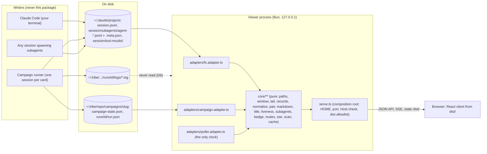
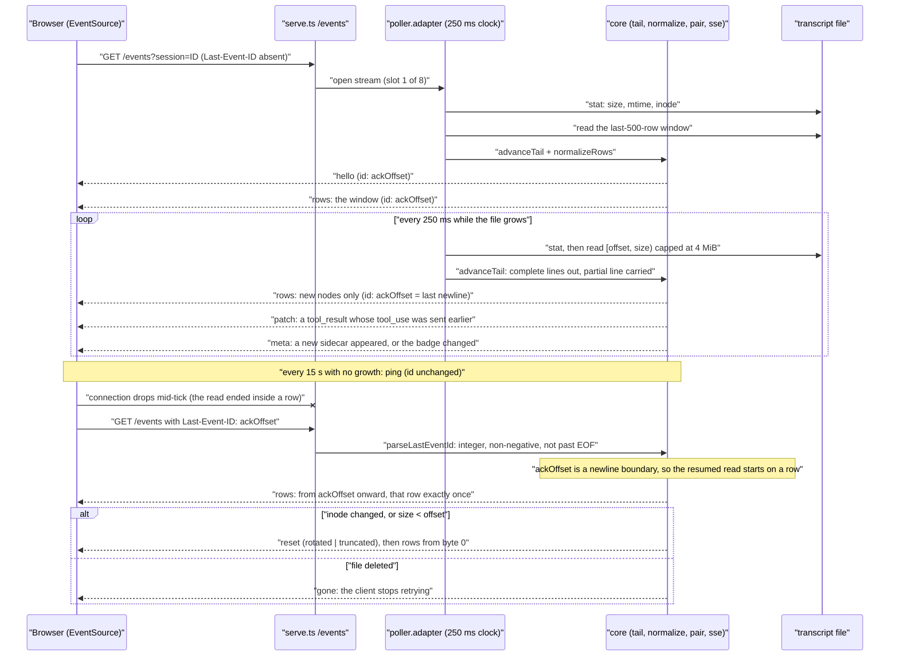
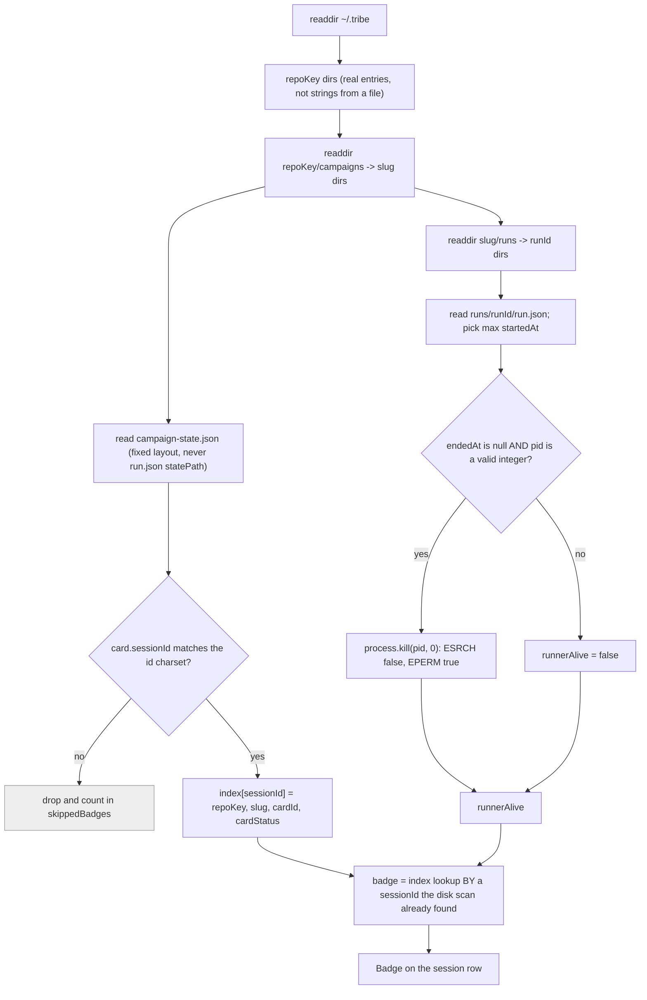

# Viewer consolidation — implementation spec (the How)

Card: `~/.tribe/-Users-hip-repo-tribe/cards/viewer-consolidation.md` (Option A, approved 2026-09-11).
State: `~/.tribe/-Users-hip-repo-tribe/viewer-consolidation/STATE.md` (D1–D9, P1, F1/F2).
References: `references/` next to this file — read `tribe-viewer-research.md` (B1–B25),
`kanna-store-vs-transcript.md` (L1–L9), `runner-log-vs-transcript.md`, `option-a.body.html`.

This document answers **How**. It does not reopen What or Why: the scope fence in the card is
settled law, and every ruling D1–D9 below is quoted, never paraphrased.

---

## 0. The oracle (read this before any parsing or rendering decision)

> **The Claude Code transcript files on this machine are the oracle.** Kanna's code is a
> reference, never the standard. **Under-rendering** (a row type or content block present on disk
> that the viewer drops silently) **is a bug. Over-rendering** (showing a raw-JSON fallback card
> for an unknown row) **is by design.** File order is the display order — never sort by timestamp.

Claude Code on this machine is **2.1.267**. Every count in this spec was measured on
2026-09-11 over the real corpus at `~/.claude/projects`, not recalled:

| Fact | Measured |
| --- | --- |
| Parent transcripts | 181 files |
| Subagent sidecar transcripts | 727 files (`<session>/subagents/agent-*.jsonl`) |
| Subagent `.meta.json` sidecars | 813 |
| Session directories | 257, of which 116 have a `subagents/` folder |
| `tool-results/` spill directories | 26, holding 153 files |
| Rows parsed | 126,410 |
| Rows that failed `JSON.parse` | **0** |
| Rows with a `parentUuid` naming a uuid absent from the same file | **0** |
| Timestamp inversions in file order | **899** — therefore file order, never timestamp order |
| `isSidechain: true` in a **parent** file | **0** (77,195 in sidecar files) |
| `tool_result` with no `tool_use` in the same file | **0** of 33,584 |
| `tool_use` with no `tool_result` in the same file | **1** of 33,584 |
| Largest transcript | 13,178,184 B in **677 lines** (≈19 KB/line average) |
| Most rows in one transcript | 2,515 |

Two of those numbers are load-bearing and are cited again later: **0 dangling `parentUuid`** plus
**899 timestamp inversions** is the proof for "file order is the display order"; **0
`isSidechain: true` in parent files** is the proof that the parent stream needs no sidechain
filter (Kanna has one; we do not need to port it, and its absence is not a defect).

---

## 1. Standing constraints this design is built to (quoted)

- **D6** — "The viewer reads the Claude transcript ONLY. The runner's per-session log stays as a
  watchdog/debug artifact; the viewer never reads it."
- **D7** — "No second transcript store. Every parse/render need resolves in memory from the
  transcript."
- **D1** — "Stack: React + Vite client with a build step (Kanna-style)."
- **D2** — "Liveness of a session = file growth only (mtime within N min or size grew)."
- **Card, scope fence** — "No design tokens invented by the implementer: the client consumes the
  owner's design system (P1). Until P1 is delivered, the spec names tokens; the build does not
  start."
- **`pure-core.md`** — "core logic never constructs or reaches out for its dependencies; it
  receives them."
- **`fail-closed-edges.md`, obligation 4** — "A path from outside is contained before it is used."
- **D10** — "the sidebar shows by default only projects whose newest session is within 30 days; a
  visible 'show N older projects' link (URL `?all=1`) reveals the rest. Stateless default, not a
  preference, so D7 holds. Sessions inside a project are never hidden."

Shaman rulings taken as settled (do not reopen): SSE transport with `id:` on every frame,
`Last-Event-ID` resume by byte offset (refined in §6.1 to the offset after the last complete
newline — the same ruling, made safe) and `retry:` set; the URL scheme in §3; static serving of a
built `dist/` from a fixed allowlist with no dev server in production; the title rule; live =
grew-or-mtime-within-10-min; the sidecar-glob subagent tree; single-forward-pass tool pairing with
orphan cards; collapsed raw-JSON cards for unknown rows; `<persisted-output>` loaded on expand.

---

## 2. Goal map — every G maps to a named, end-user-level proof

Every row's proof is observed **where the goal states the behaviour**: G1, G2, G4 and G6 are
user-visible claims, so each is proved in a real browser against the real server, not at an API or
unit boundary. Layer-local tests still exist and are still required — they are listed as
*supporting*, never as the proof of a user-visible claim.

| # | Goal (abridged) | Proof (the assertion that decides the goal) | Supporting | Where |
| --- | --- | --- | --- | --- |
| G1 | `~/.tribe` absent; list + render every kind from a fixture tree built from nothing | `e2e/dom-kinds.e2e.test.ts` — headless Chromium against the real server: for **every** kind in §4's `RenderNode` union, a matching `[data-kind=…]` element is present in the DOM, and the subagent tab tree is present as DOM tabs | `core/normalize.coverage.test.ts` (one case per row of §7), `e2e/real-transcript.e2e.test.ts` | §7, §16.2 |
| G2 | Appended line rendered within 1 s; follows tail at bottom, stops when scrolled up | `e2e/live-tail.e2e.test.ts` — a **controlled writer** appends a row and records its own `performance.now()`; the browser reports when that row's `[data-row-id]` first exists; worst sample ≤ 1000 ms. Follow proved on `scrollTop`: it advances on append while at bottom and is byte-identical before/after append while scrolled up | `adapters/poller.adapter.test.ts`, `client/src/useEventStream.test.ts` | §6, §16.3 |
| G3 | Badge from campaign state; click filters; runner prints root URL + one session URL per card | `e2e/campaign-badge.e2e.test.ts` — the real runner on Haiku 4.5; both stdout lines captured verbatim; the badge is asserted in the DOM; the filter is proved by **clicking the badge element** and asserting the resulting session-row count and the URL | `core/badge.test.ts`, `runner/core/viewer-launch.test.ts` | §9, §10, §16.4 |
| G4 | Read-only, 127.0.0.1, zero writes, every path contained, fail-closed refusals, `Host` checked | `core/paths.containment.test.ts` (lexical **and** resolved-symlink containment), `adapters/readonly.test.ts` (no write-family call reachable; narrow catches distinguish a parse error from a filesystem error), `serve.security.test.ts` (`Host`/`Origin`, the refusal matrix), `deletion-guard.test.ts` rule 5 | `structure.test.ts` (§12.6) | §12, §13 |
| G5 | Status page, `/live`, scan adapter, session-tail reader, `--tribe-root` gone; no `runs/*/logs/` read | `deletion-guard.test.ts` (grep guard over the package) + `git diff --stat` in the PR body | — | §11 |
| G6 | `install.sh` builds the client; runner spawn serves the built output; `bun test` green both packages; c3-215 updated; D9 applied | `e2e/served-build.e2e.test.ts` — hash every file in a **fresh** `bun run build`, then fetch `/` and every asset it references from the **running** server and assert the hashes are equal (this is what "the runner's spawn serves the built output" actually claims); plus `test-install-viewer-build.sh` | `bun run check` in both packages, `bunx @c3x/cli@11.6.3 check`, ADR + change units | §10.3, §10.4, §11.3, §15 |

The three file names in G4's proof column are the names the plan actually creates: tasks 4, 15 and
20 respectively. A goal map that names a test nobody schedules is a goal with no proof at all.

---

## 3. Architecture

Three layers, one process. The diagram is the contract; the ASCII sketch under it is the same
picture with the module names spelled out.



```
                 ~/.claude/projects/          ~/.tribe/*/campaigns/*/
                 (content: everything)        (badge only: 2 files)
                          |                            |
                   adapters/fs.adapter.ts    adapters/campaign.adapter.ts
                          \                            /
                           \__ the ONLY world-touching modules __/
                                          |
                                    core/**  (PURE)
                     paths · tail · records · normalize · markdown
                     title · liveness · subagents · badge · routes · sse
                                          |
                                      serve.ts
                        (composition root: HOME, port, Host check,
                         wiring, dist/ allowlist, SSE lifecycle)
                                          |
                     JSON API + SSE  ------------------  dist/ static
                                          |
                          client/src (React 19 + Vite)
                   maps RenderNode[] -> components; tokens only
```

**The pure core decides everything and touches nothing.** The two adapters are the only files
that name `node:fs`; `adapters/poller.adapter.ts` is the only clock owner; `serve.ts` is the only
file that reads `process.env` / `process.argv`. This is the current package's discipline and it is
kept verbatim, enforced mechanically by `structure.test.ts` (§12).

**The server sends data, not HTML.** Today `core/live/normalize.ts` emits `html` strings. With a
React client that becomes both redundant and dangerous (it forces `dangerouslySetInnerHTML`). The
carried-over `markdown.ts` is therefore ported from *escape-then-markup* to a **token emitter**:
it produces an `MdToken[]` tree and never a string of HTML. The client maps tokens to React
elements, which React escapes by construction. This is strictly stronger than the current
escape-then-markup property, and §12 bans `dangerouslySetInnerHTML` mechanically so it cannot
regress. The existing `core/live/markdown.test.ts` corpus is carried over as the tokenizer's test
corpus (same inputs, token assertions instead of string assertions).

**Normalization runs on the server.** The client receives `RenderNode[]` and knows nothing about
Claude's row shapes. Consequence: `client/src/**` may `import type` from `core/`, never a value
import — enforced in §12. The whole coverage table (§7) is therefore testable under `bun test`
with no DOM.

### 3.1 Package layout

```
plugins/tribe/scripts/viewer/
  package.json            deps: react, react-dom  devDeps: vite, @vitejs/plugin-react,
                          @types/react, @types/react-dom, @happy-dom/global-registrator,
                          @types/bun, typescript
  tsconfig.json           server + core (bun types, noEmit)
  tsconfig.client.json    client (DOM lib, jsx: react-jsx)
  vite.config.ts          root: client/, build.outDir: ../dist, base: '/assets/'... see §10.3
  index.html              the SPA shell (Vite entry)
  serve.ts                composition root
  core/                   PURE — no fs, no clock, no env, no network
    model.ts              the wire contract: RenderNode, MdToken, SessionSummary, Frame, Route
    paths.ts              cwd encoding, containment, fixed-layout joins
    window.ts             complete-line selection over supplied bytes (the adapter decides nothing)
    cache.ts              pure cache/eviction policy over a supplied clock reading
    scan.ts               the project/session index + the D10 30-day partition
    tail.ts               pure tail transition: offset, ackOffset, carry, inode reset
    records.ts            tolerant JSONL row parse              (carried over, widened)
    markdown.ts           markdown -> MdToken[]                 (carried over, re-targeted)
    normalize.ts          rows -> RenderNode[]                  (rewritten, §7 is its contract)
    pair.ts               single forward pass tool_use/tool_result
    title.ts              title selection (§5.3)
    liveness.ts           live = grew or mtime within 10 min
    subagents.ts          sidecar tree (carried over from core/live/processes.ts)
    badge.ts              campaign badge derivation (pure over already-read JSON)
    routes.ts             URL -> Route (rewritten for §3.2)
    sse.ts                frame encode/decode, Last-Event-ID parse
  adapters/
    fs.adapter.ts         every transcript read (stat, readdir, ranged read, realpath)
    campaign.adapter.ts   the ONLY two ~/.tribe reads + the pid liveness probe
    poller.adapter.ts     the only clock owner: one poll loop per SSE stream
  client/
    src/main.tsx  src/App.tsx  src/routes.ts  src/api.ts  src/useEventStream.ts  src/rowStore.ts
    src/components/…        (§8)
    src/styles/tokens.css   COPIED from the owner's chosen theme at build time (P1, §8.2)
    src/styles/app.css      layout/typography only — zero literal colours (§12)
  dist/                   built by Vite; git-ignored; absence is a fail-closed startup error
  fixtures/build.ts       builds a whole ~/.claude/projects tree FROM NOTHING (§16.2)
  structure.test.ts       the executable purity + safety wall
  deletion-guard.test.ts  G5's mechanical proof
  e2e/                    opt-in, real proofs (§14)
  README.md
```

### 3.2 Routes

Two families. Everything under `/api` and `/events` is JSON/SSE; everything else that is not a
built asset returns the SPA shell so the client router can own the address bar.

| Method + path | Response | Notes |
| --- | --- | --- |
| `GET /` | `index.html` | list view; `?campaign=<slug>` pre-fills the filter; `?all=1` shows projects older than the D10 window (§5.6) |
| `GET /p/<encodedProjectDir>` | `index.html` | one project; `encodedProjectDir` is the on-disk directory name |
| `GET /s/<sessionId>` | `index.html` | one session; project resolved by scanning (§5.2) |
| `GET /s/<sessionId>/a/<agentId>` | `index.html` | one subagent tab |
| `GET /assets/<name>` | the built file | fixed allowlist read from `dist/` at boot (§12.4) |
| `GET /healthz` | `{"ok":true,"viewer":"tribe-viewer","v":2}` | **deliberately NOT the old body** — see §10.4, stale-viewer reuse |
| `GET /api/projects?all=1` | `{"projects":[Project],"olderCount":n,"skippedBadges":n}` | §5.1, §5.6; without `all=1`, `projects` is the D10 window and `olderCount` is the remainder |
| `GET /api/sessions?project=<dir>` | `{"project":Project,"sessions":[SessionSummary]}` | §5.1 |
| `GET /api/session/<sessionId>` | `{"session":SessionSummary,"subagents":[Agent],"badge":Badge\|null}` | metadata only. **Rows never come from here** — they arrive on `/events` or `/api/rows`; E1 asserts rows in the DOM, never from this route |
| `GET /api/rows?session=&agent=&before=&limit=` | `{"rows":[RenderNode],"from":n,"to":n,"more":bool}` | back-fill on scroll-up (§11.4) |
| `GET /api/block?session=&agent=&uuid=&i=` | `{"block":…}` | one elided block (a base64 image, a 64 KiB+ tool output) |
| `GET /api/spill?session=&name=` | `text/plain` | a `<persisted-output>` file, contained (§7.4) |
| `GET /events?session=&agent=` | `text/event-stream` | §6 |
| anything else | `404` with a one-line body | never a stack trace |

Every `sessionId` / `agentId` / `project` value above is validated and contained **before any path
is joined** (§12.2). `GET /live`, `GET /`-as-status-page, `GET /app.js`, `GET /app.css` and
`GET /api/processes` are **deleted** (§11).

---

## 4. Shared wire contract (`core/model.ts`)

```ts
export interface Project {
  dir: string;            // on-disk encoded directory name under ~/.claude/projects
  cwd: string | null;     // real cwd read from inside a transcript; null => label with `dir`
  sessionCount: number;
  newestMtimeIso: string | null;
  live: boolean;          // any session live (§5.4)
}

export interface SessionSummary {
  id: string;             // <sessionId>, the .jsonl basename
  projectDir: string;
  title: string;          // §5.3
  titleSource: 'custom-title' | 'ai-title' | 'last-prompt' | 'first-user' | 'session-id';
  sizeBytes: number;
  mtimeIso: string;
  live: boolean;
  subagentCount: number;
  badge: Badge | null;
}

export interface Badge {
  repoKey: string; slug: string; cardId: string; cardStatus: string;
  runnerAlive: boolean; runId: string | null;
}

export interface Agent {
  id: string;             // agentId, from agent-<id>.jsonl
  parentId: string | null;// from .meta.json parentAgentId, when it resolves in the same batch
  depth: number;          // spawnDepth, default 1
  agentType: string | null;
  label: string;          // description, else `agent <id>`
  toolUseId: string | null;
  model: string | null;
  sizeBytes: number; mtimeIso: string | null; birthtimeIso: string | null;
  live: boolean;
}

export type MdToken =
  | { t: 'text'; v: string }
  | { t: 'code'; v: string; lang: string | null }   // fenced block
  | { t: 'inline-code'; v: string }
  | { t: 'strong' | 'em'; c: MdToken[] }
  | { t: 'link'; href: string; c: MdToken[] }       // href gated exactly as today
  | { t: 'heading'; level: 1|2|3|4|5|6; c: MdToken[] }
  | { t: 'li'; ordered: boolean; c: MdToken[] }
  | { t: 'br' };

export interface RowAnchor {
  id: string;             // STABLE identity: `${at}:${blockIndex}` — see below
  uuid: string | null;    // the row's own uuid, when it has one
  i: number;              // 0-based line index in the file
  at: number;             // byte offset of the line's first byte
  ts: string | null;      // the row's timestamp, verbatim; NEVER used for ordering
}

export type RenderNode = RowAnchor & (
  | { k: 'prompt';    body: MdToken[]; chips: Chip[] }
  | { k: 'assistant'; body: MdToken[]; model: string | null }
  | { k: 'thinking';  body: MdToken[] }
  | { k: 'tool';      name: string; input: unknown; inputElided: boolean;
                      state: 'pending'|'ok'|'error'; result: ToolResult | null;
                      toolUseId: string | null; agentId: string | null }
  | { k: 'orphan_result'; toolUseId: string; result: ToolResult }
  | { k: 'image';     mediaType: string; bytes: number; blockIndex: number }
  | { k: 'attachment';label: string; detail: string | null }
  | { k: 'chip';      label: string; detail: string | null; href: string | null }
  | { k: 'divider';   label: string }
  | { k: 'error';     status: number | null; body: MdToken[] }
  | { k: 'raw';       rowType: string; json: string; bytes: number }
  | { k: 'unreadable'; count: number }
);

export type ToolResult =
  | { r: 'text';   body: MdToken[]; isError: boolean; elided: boolean }
  | { r: 'spill';  name: string; note: string; previewBody: MdToken[] } // <persisted-output>
  | { r: 'images'; count: number; blockIndex: number }
  | { r: 'refs';   count: number };                                     // array[tool_reference]
```

**`RowAnchor.id` is the node's stable identity across frames**, and it is what makes the `patch`
frame (§6.2) and the client's dedupe (§8.4) possible. It is `` `${at}:${blockIndex}` `` — the byte
offset of the row's first byte, then the index of the block within that row. Both halves are
properties of the bytes on disk, so the same node re-derived on a later tick, on a back-fill, or
after a reconnect gets the **same** id. `uuid` is deliberately *not* the identity: 13,848 measured
`attachment` rows and every `last-prompt`/`ai-title` row carry no uuid at all, and one row can
produce several nodes.

`RowAnchor.at` is the byte offset the `/api/rows` back-fill addresses by. **It is not the SSE
cursor** — that is `ackOffset` (§6.2), which is always a newline boundary. `RowAnchor.ts` is
carried for display only: **nothing ever sorts by it** (899 measured inversions).

```ts
/** A later-arriving fact about a node the client has already rendered — today, exactly one case:
 * a `tool_result` whose `tool_use` was emitted on an earlier tick (§7.5). The client replaces the
 * node with this `id` and re-renders it in place; it never appends. */
export interface Patch {
  id: string;                 // RowAnchor.id of the node being replaced
  node: RenderNode;           // the complete replacement node, not a delta
}

/** What a stat must report for the tail transition to be correct (§6.1). `inode` is what makes
 * rotation detectable when the replacement file is the same size or larger — size alone cannot. */
export interface FileObservation {
  sizeBytes: number;
  mtimeMs: number;
  inode: number;              // st.ino; 0 when the platform cannot supply one
  birthtimeMs: number;
}
```

---

## 5. On-disk discovery

Everything below reads only `~/.claude/projects`, resolved once in `serve.ts` from `HOME`.
`HOME` is the *only* environment value this package reads (§12.3), which is also what makes the
fixture e2e possible without inventing a flag.

### 5.1 The scan

```
projectsRoot = <HOME>/.claude/projects
1. readdir(projectsRoot)                        -> candidate project dir names
   - skip anything that is not a directory
2. for each project dir D:
     readdir(D)
       *.jsonl                                  -> session ids (basename minus .jsonl)
       <sessionId>/                             -> that session's sidecar home
3. for each session S:
     stat(S)                                    -> sizeBytes, mtimeIso, birthtimeIso
     head+tail read (§5.3)                      -> title, titleSource, cwd
     readdir(D/<S>/subagents)                   -> agent-*.jsonl  => subagentCount
4. project.cwd = the first non-null `cwd` field seen in any of its sessions' head reads
```

Depth is **fixed** at every step: no path component is ever taken from a file's contents, a query
parameter, or a JSON field. `readdir` results are real directory entries, which is what makes the
walk structurally traversal-free (§12.2 states the one exception and how it is contained).

Ordering: projects by `newestMtimeIso` descending, sessions within a project by `mtimeIso`
descending. This is *display* ordering of files, not of rows — §0's file-order rule is about rows
inside a transcript and is unaffected.

### 5.2 Resolving `/s/<sessionId>` without a project in the URL

`sessionId` is validated (`^[0-9a-fA-F-]{8,64}$`, no dots, no separators) and then **never
joined**: the server asks the scan index for a session with that id and uses the `projectDir` the
scan itself produced from `readdir`. A miss is a `404` with the message
`no session <id> under ~/.claude/projects`, never a path probe. Two sessions with the same id in
two project dirs (possible after a `relocated` row — 44 measured) resolve to the newest by mtime,
and the response carries `ambiguous: true` so the client can say so.

### 5.3 Title and `cwd` — bounded reads, never a whole file

Reading 181 files whole (566 MB) per list request is not acceptable, and D7 forbids a store. The
bounded alternative:

- **Head read**: first 64 KiB. Yields `cwd` (present on essentially every message row — 61,971
  assistant rows carry it) and the first user message.
- **Tail read**: last 256 KiB. Drop the first (possibly partial) line, parse the rest. Yields the
  last `custom-title` / `ai-title` / `last-prompt`.

Title rule (Shaman ruling, in order): last `custom-title`, else last `ai-title`, else
`last-prompt`, else the first user message, else the session id. Measured coverage over the
corpus: `custom-title` in 1/181 files (the row type only appeared in CC 2.1.267),
`ai-title` in 130/181, `last-prompt` in 176/181, a first user message in 175/181 — so the rule
resolves a human title for **180/181** files and falls through to the session id for 1.

`last-prompt` occurs ~14 times per file that has it, so a 256 KiB tail almost always contains one.
**This is an assumption with a measurement task attached**: plan task T1.5b measures, over all 181
files, how often the head+tail window resolves the *same* title a whole-file read resolves, and
the acceptance threshold is **≥ 99%** (≤ 1 file may differ). If the measurement misses, the window
grows — it is a constant, not a design change.

**Where the decisions live (`pure-core.md`).** The adapter performs exactly two acts — `stat` and
"read bytes `[a, b)`" — and decides nothing:

- **Which bytes form complete lines** is `core/window.ts#completeLines(buffer, dropLeadingPartial)`,
  a pure function. The tail read's "drop the first, possibly partial, line" is a line-boundary
  *decision* over supplied bytes, not an I/O act, so it is not the adapter's to make.
- **Cache policy** is `core/cache.ts`: a pure `decideCache(entryKey, existing, nowMs)` returning
  `hit | stale | miss` plus the eviction victim, over an explicitly supplied clock reading. The
  adapter holds the `Map` and calls it.
- **The tail transition** is `core/tail.ts#advanceTail` (§6.1), a pure function over a
  `FileObservation` and a byte chunk. The poller adapter observes and emits; it branches on nothing.

Cache identity: `path + ':' + sizeBytes + ':' + mtimeMs + ':' + inode`, bounded to 500 entries,
LRU, with a 60 s absolute expiry so a file rewritten within the same millisecond and size cannot
serve a stale summary forever. **This is not a store and does not violate D7**: it is keyed on the
file's own identity, holds derived summaries only, never survives the process, and a miss is always
a correct re-read. Stated explicitly because it is exactly the shape an auditor should challenge.

### 5.4 Liveness (D2)

`live = (sizeBytes grew since the previous scan) || (now - mtime <= 10 min)`. No pid, no campaign
state, no lock file. The "grew" half needs the previous scan's size, held in the same bounded
map; on the first scan only the mtime half can fire, which is correct (a file that has not been
touched in 10 minutes is not live).

### 5.5 Subagent discovery

`glob` is a fixed join, not a pattern walk: `readdir(<projectDir>/<sessionId>/subagents)`, keep
entries matching `^agent-(.+)\.jsonl$`, and for each read the sibling `agent-<id>.meta.json`.
Measured sidecar key coverage over 813 meta files: `agentType` 813, `description` 813,
`spawnDepth` 813, `toolUseId` 811, `parentAgentId` 360, `model` 351 — so `parentAgentId` is absent
more often than present and **absence means "hangs off the session"**, never an error.

Tree construction is carried over verbatim from `core/live/processes.ts` (including its
`reachesSession` cycle guard, F34/F36): a `parentAgentId` that does not name another entry in the
same batch, or that walks a cycle of any length, terminates at the session root. Order: by
`birthtimeIso`, then `agentId`.

`meta.json` is untrusted input: `toolUseId`, `description`, `agentType`, `model` are rendered as
text only; `parentAgentId` is used only as a lookup key within the batch; **none of them is ever
joined into a path**. The only path-forming value is the `agentId` captured by the regex above
from a real `readdir` entry.

### 5.6 The default project window (D10)

STATE.md D10, verbatim: *"the sidebar shows by default only projects whose newest session is within
30 days; a visible 'show N older projects' link (URL `?all=1`) reveals the rest. Stateless default,
not a preference, so D7 holds. Sessions inside a project are never hidden."*

Mechanically:

- `core/scan.ts#partitionProjects(projects, nowMs, windowDays = 30)` — pure — splits the scanned
  project list into `recent` (newest session's mtime within the window) and `older`.
- `GET /api/projects` returns `recent` plus `olderCount: older.length`. `GET /api/projects?all=1`
  returns everything and `olderCount: 0`.
- The sidebar renders a `show N older projects` link when `olderCount > 0`; it navigates to
  `?all=1`, which is a real URL the user can bookmark and share. There is no toggle state, no
  storage, and no per-project flag — that is what "stateless" means here and it is why D7 holds.
- **Sessions are never filtered.** The window applies to projects only; opening any project, or any
  `/s/<id>` URL, always shows every session it has. A session named by a campaign badge is
  reachable by its own URL regardless of its project's age, which is what keeps G3 independent of
  D10.

Measured today: 139 project directories exist and the large majority are `plugins-eval` and
`/private/tmp` throwaways. The window is the reason the sidebar is legible on this machine.

---

## 6. Tail and the SSE contract

### 6.1 The tail state machine (pure; carried over, with two defects fixed)

`core/tail.ts#advanceTail` is a **pure transition** over four supplied values — the previous state,
a `FileObservation` (§4), the decoded chunk, and the raw byte count that chunk was decoded from.
The poller adapter supplies them and branches on nothing (`pure-core.md`). Its carried-over
arithmetic is unchanged and must stay so: `offset = base.offset + consumedBytes`, never `fileSize`,
never `chunk.length` (F56).

Two state fields, and the distinction between them is blocker-4's fix:

| Field | Meaning |
| --- | --- |
| `offset` | every byte handed to the decoder so far, **including** the bytes of a trailing partial line still sitting in `carry` |
| `ackOffset` | the byte offset **immediately after the last complete newline consumed** — i.e. `offset - byteLengthOf(carry)` |

`offset` is the read cursor; **`ackOffset` is the only value ever published as an SSE `id:`**
(§6.2). Publishing `offset` would acknowledge the first bytes of a row the client has not been sent
— on reconnect the server would resume *after* them and that row would be silently truncated or
lost forever. `ackOffset` cannot do that: by construction there is a newline at that byte, so
resuming there always starts at a row boundary.

**Reset — two triggers, not one.** `reset` fires when **either**:

1. `obs.sizeBytes < state.offset` — truncation (the carried-over case), or
2. `obs.inode !== state.inode` and `state.inode !== 0` — **the file was replaced**.

Trigger 2 is blocker-5's fix. `fileSize < offset` cannot detect a rotation whose replacement file
is the same size or larger, and the old design promised a `"rotated"` reason it had no way to
produce. The inode arrives on the `FileObservation`; a platform that cannot supply one reports `0`
and the transition degrades to trigger 1 alone — fail-closed toward the behaviour we already had,
never toward a false reset. On either trigger the state resets to offset 0, the normalize state is
dropped, and a `reset` frame precedes the re-stream. Named tests in plan task 5 and task 19:
*truncated to shorter*, *replaced with a same-size file*, *replaced with a larger file*.

**The carry cap is one number: 1 MiB.** A partial line is held until it completes or until it
exceeds 1 MiB, at which point the tail emits one `unreadable` node, discards the carry, and
resynchronises at the next newline. (The earlier draft named both 1 MiB and 8 MiB, which is not a
cap but two; the single number is the contract.) The real case this exists for is a multi-megabyte
base64 image row caught mid-write — measured lines average 19 KB and the largest rows on this
machine are images.

### 6.2 One stream per open session view

`GET /events?session=<sessionId>[&agent=<agentId>]`.

A "session view" is one **focused** transcript — the parent, or one subagent tab — plus the
metadata that decorates it. Switching tabs navigates to `/s/<id>/a/<agent>`, which closes the old
`EventSource` and opens a new one. Cap: **8 concurrent streams**; a 9th gets `503` with the body
`too many live streams`.

| `event:` | `data` | Emitted |
| --- | --- | --- |
| `hello` | `{"session":SessionSummary,"agents":[Agent],"badge":Badge\|null,"from":n,"to":n,"truncatedBefore":n}` | once, on connect |
| `rows` | `{"rows":[RenderNode],"from":n,"to":n}` | initial window, then on every growth tick. **Append-only**: every node in a `rows` frame is new |
| `patch` | `{"patches":[Patch]}` | a later-arriving fact about a node already sent (§6.4) |
| `meta` | `{"agents":[Agent],"badge":Badge\|null,"live":bool}` | whenever the agent set, the badge, or liveness changes — including a **new sidecar appearing mid-stream** |
| `reset` | `{"reason":"truncated"\|"rotated"}` | §6.1's two triggers, respectively |
| `ping` | `{"t":"<iso>"}` | every 15 s |
| `gone` | `{"reason":"deleted"}` | the focused file disappeared; the client stops retrying |

**`id:` is on every frame and its value is always `ackOffset`** — the newline boundary of §6.1,
never the raw consumed offset. For `rows` that is the boundary after the last row in the frame; for
`patch`, `meta`, `ping` and `reset` it is the unchanged current `ackOffset`, so replaying from one
of those ids is idempotent (no rows were emitted between it and the previous `rows` frame).

`retry: 2000` is written once, in the first frame of every response.

**Resume.** On reconnect the browser sends `Last-Event-ID: <ackOffset>`.
`core/sse.ts#parseLastEventId` fails closed: a non-integer, a negative, or a value greater than the
file's current size is treated as "no cursor" and the stream restarts from the windowed tail with a
`reset` frame — never a seek past EOF, never a client integer used as a read length. A value the
server accepts is, by §6.1's construction, a newline boundary, so the resumed read starts on a row.
Named test (task 19): *a read ending mid-row, disconnect, reconnect with `Last-Event-ID`, the row
renders exactly once.*

Poll interval: **250 ms** (today: 400 ms). G2's budget is 1 s end-to-end; 250 ms leaves room for
parse and transport at one `stat` per tick per stream. Per-tick read is capped at **4 MiB**; the
remainder arrives on the next tick, and no byte is skipped or double-counted because `offset`
advances only by bytes actually consumed.

The whole lifecycle, including the two cases the earlier draft could not express — a later-arriving
tool result, and a resume after a read that ended mid-row:



### 6.3 The initial window

A 13 MB transcript is not sent in full on connect. The initial `rows` frame carries the **last 500
rows** and `truncatedBefore: <count>`; the client's "load earlier" affordance calls
`GET /api/rows?session=…&before=<at>&limit=500`, a ranged read backwards from a known byte offset —
no index, no store.

A `tool_result` whose `tool_use` is *before* the window is an **orphan** and renders as an
`orphan_result` node; it is never dropped (§0: under-rendering is a bug). Today's code drops
exactly this case — that is B1's other half.

### 6.4 Live tool results: the `patch` frame (B1's live half)

The historical case is easy: one window, one forward pass, the pair is found. The **live** case is
the one the earlier draft could not express, and it is the common case during a campaign: a
`tool_use` arrives on tick *n* and is emitted immediately as a `tool` node with `state: "pending"`
(it must be — holding it back until its result would defeat live rendering and make the `pending`
state unreachable), and its `tool_result` arrives on tick *n+k*, after the client has already
rendered the card.

An append-only wire cannot express that. So:

1. `core/pair.ts` keeps a **pending map** `tool_use_id -> RowAnchor.id`, carried in the stream's
   normalize state across ticks.
2. When a later tick produces a `tool_result` whose id is in that map, the normalizer emits **no
   new node**. It emits a `Patch` (§4) whose `id` is the already-sent node's `RowAnchor.id` and
   whose `node` is the complete replacement `tool` node with `state: "ok" | "error"` and its
   `result` attached.
3. The poller sends those in a `patch` frame, after the tick's `rows` frame (order matters: a patch
   may target a node emitted in the same tick).
4. The client (§8.4) keys its row list by `RowAnchor.id`. A `patch` **replaces in place**; a `rows`
   node whose id is already present is **ignored, not appended**. That dedupe is what makes a
   resume or an overlapping re-read harmless.

Named test (task 24, DOM-level): *`tool_use` in one tick, `tool_result` in a later tick — the
card's DOM element gains its result and the row count is unchanged.*

### 6.5 The eviction contract (B13, closed by construction)

Every per-stream structure has a stated maximum. "Bounded because our corpus is small today" is not
a bound — the oracle is open-world.

| Structure | Bound | What happens at the bound |
| --- | --- | --- |
| tail `carry` | 1 MiB (§6.1) | emit one `unreadable` node, drop the carry, resync at the next newline |
| per-tick read | 4 MiB | the remainder arrives next tick |
| pending tool map (`core/pair.ts`) | **512 entries** | evict the oldest entry; its eventual result then renders as an `orphan_result`, which is a correct, visible outcome rather than unbounded growth |
| server-side normalize state | the pending map above plus a seq counter | nothing else is retained; rows are **not** buffered server-side |
| client row list | **2,000 nodes** | evict from the head (oldest) when a `rows` frame pushes past it; "load earlier" re-fetches evicted rows from `/api/rows`, which is why eviction is safe |
| client patch targets | the row list above | a `patch` for an evicted id is dropped, because the node it names is no longer rendered |
| open streams | 8 | the 9th gets `503`; a closed connection releases its slot exactly once |

The property this table asserts, and that `e2e/perf.test.ts` measures: **nothing a stream holds is
proportional to the transcript's total size** — only to the window and the caps above. That is D7
restated as numbers.

---

## 7. The normalizer — measured coverage table

This section is the contract for `core/normalize.ts` and the checklist for its audit. Every count
is from the 2026-09-11 corpus scan (§0); `parent` and `sub` columns are separated where the
difference matters.

### 7.1 Top-level row types

| `type` | parent | sub | Rendered as | Note |
| --- | --- | --- | --- | --- |
| `assistant` | 15,335 | 46,636 | per content block (§7.2) | |
| `user` | 8,383 | 27,369 | per content block (§7.2) | includes every runner prompt — B2 |
| `attachment` | 10,671 | 3,177 | `attachment` chip, collapsed, consecutive ones grouped | label = `attachment.type` (§7.3) |
| `last-prompt` | 2,509 | 0 | title source (§5.3); also a `raw` card under "show metadata rows" | |
| `ai-title` | 2,113 | 0 | title source; `raw` under metadata | |
| `queue-operation` | 1,984 | 0 | `chip` — `operation`, plus `content` when present (1,391) | |
| `mode` | 1,867 | 0 | `chip` — `mode` | |
| `atis-latch` | 1,586 | 0 | `raw`, collapsed | undocumented; over-render by design |
| `permission-mode` | 1,310 | 0 | `chip` — `permissionMode` | |
| `system` | 1,048 | 0 | per `subtype` (§7.4) | payload is `content`, **not** `message` — B10 |
| `pr-link` | 710 | 0 | `chip` with `href` = `prUrl` | href gated (§12.5) |
| `file-history-snapshot` | 412 | 0 | `raw`, collapsed | |
| `frame-link` | 304 | 0 | `chip`, `href` = `frameUrl` when present (25) | |
| `bridge-session` | 242 | 0 | `raw`, collapsed | |
| `agent-name` | 238 | 0 | `chip` — `agentName` | |
| `file-history-delta` | 128 | 0 | `raw`, collapsed | |
| `artifact-autoreact-ledger` | 107 | 0 | `raw`, collapsed | |
| `custom-title` | 91 | 0 | title source; `raw` under metadata | CC 2.1.267+ |
| `cost-state` | 76 | 0 | `chip` — `totalCostUSD`, `totalDuration` | L1: there is no `result` row ever |
| `relocated` | 44 | 0 | `chip` — `relocatedCwd` | |
| `worktree-state` | 44 | 0 | `raw`, collapsed | |
| `artifact-comment-monitor` | 24 | 0 | `raw`, collapsed | a Claude row type — **never** renamed by D9 (§15) |
| `fork-context-ref` | 0 | 2 | `raw`, collapsed | |
| **anything else** | — | — | `raw`, collapsed | the open-world case; this is the rule, not the exception |

**The rule that makes this maintainable:** three buckets, and nothing outside them.
1. **Message rows** (`assistant`, `user`) render per block.
2. **Named metadata rows** render as a one-line `chip` or a `divider`.
3. **Everything else** renders as a collapsed `raw` card carrying `rowType` and the row's JSON
   (elided past 8 KiB, expandable via `/api/block`).

A new Claude Code release that invents a row type therefore renders as a raw card on day one and
is never silently dropped. **`core/normalize.ts` has no `continue` that discards a row.** The one
mechanical guarantee: `normalizeRows(rows).length >= rows.length - <metadata rows folded into
chips>`; expressed as the test `every input row produces at least one node or is accounted for in
a fold`, asserted over a fixture containing one row of every type in this table.

### 7.2 Content blocks

| role | block `type` | count | Rendered as |
| --- | --- | --- | --- |
| assistant | `tool_use` | 33,580 | `tool` card, paired (§7.5) |
| user | `tool_result` | 33,579 | attached to its `tool` card; unpaired => `orphan_result` |
| assistant | `thinking` (non-empty) | 9,391 | `thinking`, collapsed |
| assistant | `thinking` (empty string) | 8,411 | **not rendered** — see the named exception below |
| assistant | `text` | 10,597 | `assistant` with `MdToken[]` |
| user | `text` | 402 | `prompt` with `MdToken[]` — **B2's fix** |
| user | `image` | 15 | `image` node; bytes fetched on expand |
| — | `message.content` is a bare string (user) | 1,781 | `prompt` |
| — | `message.content` is a bare string (assistant) | 0 measured | handled anyway: treated as one `text` block |

**Named exception — empty `thinking`.** A `thinking` block whose `thinking` field is the empty
string carries no content; 8,411 of 17,802 measured are empty (they arrive with a `signature` and
nothing else — B9). Rendering them produces 8,411 empty cards. Skipping them is **not**
under-rendering, because there is nothing on disk to render; it is the only content-bearing block
type this spec declines to emit a node for, and it is declared here so an auditor does not have to
guess. `signature` is never rendered.

### 7.3 `attachment` rows — the largest non-message type

13,848 rows across 30 distinct `attachment.type` values. Top ten measured: `total_tokens_reminder`
6,578, `output_style` 2,423, `batching_reminder_sent` 923, `bash_output_audience_note` 678,
`skill_listing` 629, `task_reminder` 365, `deferred_tools_delta` 340, `remote_session_change` 209,
`agent_listing_delta` 203, `queued_command` 182.

Rendering each as its own card would bury the conversation. Rendering none would be
under-rendering. The design: each becomes an `attachment` node with `label = attachment.type`, the
client **groups consecutive attachment nodes into one collapsed strip** ("6 attachments"), and
expanding shows each one's JSON. Nothing is dropped; nothing dominates. Five types carry a
`rendered` field (5,654 rows) — when present it is shown as the detail line instead of raw JSON.

### 7.4 `system` rows, by `subtype`

| `subtype` | count | Rendered as |
| --- | --- | --- |
| `turn_duration` | 555 | `divider` — `"32.3s · 22 messages"` from `durationMs`/`messageCount` |
| `away_summary` | 188 | `chip`, `content` as detail |
| `stop_hook_summary` | 143 | `chip` — `hookCount`, `stopReason` |
| `local_command` | 107 | `chip` — the `<command-name>` parsed out of `content` (§7.6) |
| `informational` | 48 | `chip`, `content` as detail |
| `bridge_status` | 5 | `chip` |
| `compact_boundary` | 1 | `divider` — "context compacted" |
| `scheduled_task_fire` | 1 | `chip` |
| absent `subtype` | 0 measured | `raw` |

`system` payload is the **top-level `content` string** (350 rows carry it), not `message` — today's
normalizer looks for `message` and therefore drops all of them (B10). A row also carrying
`isCompactSummary: true` (1 measured, on a `user` row) renders as the compaction divider; Kanna
matches a string prefix instead, which we do not need.

### 7.5 Tool pairing

Single forward pass, `Map<tool_use_id, RowAnchor.id>` (Shaman ruling), carried across ticks in the
stream's normalize state. There are exactly two outcomes for a `tool_result`:

- **Its id is in the map.** Within the same pass, the `tool` node is completed before it is ever
  emitted. Across ticks — the live case — no new node is emitted and a `Patch` (§6.4) replaces the
  already-sent node in place. These are the same decision expressed at two different times, which
  is why the pending map must survive a tick and why its lifetime is bounded (§6.5: 512 entries).
- **Its id is not in the map** (the call is before the window, or its entry was evicted). An
  `orphan_result` node is emitted **in file position** — never dropped.
Measured: **0 orphan results and 1 unmatched call** across 33,584 calls in the whole corpus, so
the orphan path is rare — which is exactly why it must be tested rather than trusted (fixture case
`tool_result before its window`).

`tool_result.content` shapes measured: `string` 32,479; `array[text]` 847; `array[tool_reference]`
137; `array[image]` 116; `is_error: true` 992. Each maps to a `ToolResult` variant in §4.

A `tool_use` whose `name` is `Task` and whose `id` matches a sidecar's `toolUseId` renders with
`agentId` set, and the client turns it into a link to that subagent's tab (§8.1). Measured: 811 of
813 sidecars carry a `toolUseId`.

### 7.6 Two content-level conventions

- **XML chips.** Slash commands and reminders arrive as text: `<command-name>` 107,
  `<command-message>` 105, `<command-args>` 99, `<local-command-stdout>` 71, `<system-reminder>`
  26, `<ide_opened_file>` 2. `core/normalize.ts` extracts these into `chip` nodes (label = the
  command, detail = args/stdout) rather than dumping the XML into markdown. Parsing is a bounded
  regex over the *first* 4 KiB of the text, and an unbalanced or unrecognised tag degrades to
  plain text — never a throw.
- **`<persisted-output>` spills.** 98 measured occurrences. The marker carries an **absolute**
  path into `<projectDir>/<sessionId>/tool-results/<name>`. That path is **never used as given**
  (`fail-closed-edges` obligation 4): the normalizer takes `basename()` only, the result must match
  `^[A-Za-z0-9._-]{1,128}$`, and `GET /api/spill` re-joins it under the session's own
  `tool-results/` directory and proves containment before opening. The node keeps the preview text
  the marker already carries, so a refused spill still shows the first 2 KiB. Read capped at
  2 MiB. Note the directory also holds non-`.txt` artifacts (measured: `artifact-*.html`) — the
  gate is containment, never an extension allowlist.

### 7.7 What the transcript does not carry (L9 — declared, not a defect)

No `result` row exists on disk in any version (L1: 0 of 181 files), so there is no per-turn
cost/duration footer, no `task_notification`, no `background_tasks_changed`. `cost-state` rows
(76) give a cumulative cost chip and that is the whole of it. **Any audit finding that the viewer
is missing a Kanna behaviour whose data is not on disk is REFUTED in advance** (plan.md's
adjudication rule, clause (b)).

---

## 8. The client

React 19 + Vite (D1). No router library: `client/src/routes.ts` is ~40 lines of `URLPattern`-free
`pathname.split('/')` matching against the four shapes in §3.2, plus `history.pushState`. No state
library: one `useSyncExternalStore` over the event-stream hook. Both choices are deliberate — the
package's value is the parsing, not the framework surface.

### 8.1 Component tree

```
<App>                                   route dispatch; owns document.title
├── <Shell>                             two-column frame            tokens: paper, ink, rule
│   ├── <Sidebar>                                                   tokens: surface, rule
│   │   ├── <ProjectList>               one row per Project
│   │   │   └── <ProjectRow>            cwd label, session count    tokens: ink, ink-soft
│   │   │       └── <LiveDot>           live boolean                tokens: live
│   │   ├── <CampaignFilter>            the filter box; a badge click fills it
│   │   └── <ShowOlderProjects>        D10: "show N older projects" -> ?all=1   tokens: accent, ink-soft
│   └── <Main>
│       ├── <SessionList>               route / and /p/<dir>
│       │   └── <SessionRow>            title, id, size, age        tokens: ink, ink-soft, rule
│       │       ├── <LiveDot>                                       tokens: live
│       │       ├── <SubagentCount>                                 tokens: ink-soft
│       │       └── <CampaignBadge>     slug · card · status · runner  tokens: badge-bg, badge-ink, warn
│       └── <SessionView>               route /s/<id>[/a/<agent>]
│           ├── <SessionHeader>         title, live, badge          tokens: ink, rule, live
│           ├── <AgentTabs>             parent + one tab per Agent  tokens: surface, accent, rule
│           ├── <RowList>               windowed RenderNode[]
│           │   ├── <PromptCard>        k=prompt                    tokens: surface, ink, accent
│           │   ├── <AssistantCard>     k=assistant                 tokens: paper, ink
│           │   ├── <ThinkingCard>      k=thinking, collapsed       tokens: ink-soft, rule
│           │   ├── <ToolCard>          k=tool, collapsible + result tokens: surface, rule, ink-soft,
│           │   │                                                           error (state=error)
│           │   ├── <OrphanResultCard>  k=orphan_result             tokens: warn, rule
│           │   ├── <ImageCard>         k=image, fetch on expand    tokens: rule
│           │   ├── <AttachmentStrip>   consecutive k=attachment    tokens: ink-soft, rule
│           │   ├── <ChipRow>           k=chip                      tokens: ink-soft, badge-bg
│           │   ├── <Divider>           k=divider                   tokens: rule, ink-soft
│           │   ├── <ErrorCard>         k=error (apiErrorStatus)    tokens: error, surface
│           │   ├── <RawCard>           k=raw, collapsed JSON       tokens: ink-soft, font-mono
│           │   └── <UnreadableNote>    k=unreadable                tokens: warn
│           ├── <Markdown>              MdToken[] -> elements       tokens: ink, font-sans, font-mono,
│           │                                                              accent (links), surface (code)
│           ├── <LoadEarlier>           back-fill button            tokens: accent
│           └── <FollowTail>            "⇣ follow live" pill        tokens: accent, live
└── <ConnectionNote>                    SSE state                   tokens: warn, ink-soft
```

The token names beside each component are the real ones from §8.2 (`--surface-raised` for a lifted
card, `--accent-soft` for the faintest wash, `--size-14` for transcript text, `--space-12` for card
padding, `--radius-8` for a card corner, `--badge-radius` for the campaign chip, `--focus-ring` for
every focusable element). **No component contains a literal colour, font family, radius, or spacing
value** — §12.6 enforces it mechanically, and §8.2's table is the complete vocabulary.

### 8.2 The design system (P1) — the tokens, verbatim

The card's fence: *"No design tokens invented by the implementer: the client consumes the owner's
design system (P1). Until P1 is delivered, the spec names tokens; the build does not start."*

**P1's candidates now exist** at `docs/tribe/planning/viewer-consolidation/design/` — three themes
(`matcha/`, `coffee/`, `sea-salt/`) that share **one schema**; only the values differ. The owner
picks one theme; nothing else about the client changes. What remains open is the *choice*, not the
interface, which is why this section can now name the real tokens.

**There is no alias layer, and the implementer invents nothing.** The token names below are copied
from `design/matcha/tokens.css` and are identical in all three candidates. Every component style
uses these names and only these names:

| Group | Tokens |
| --- | --- |
| Surface | `--paper`, `--surface`, `--surface-raised` |
| Ink | `--ink`, `--ink-soft` |
| Structure | `--rule`, `--rule-weight`, `--rule-style`, `--card-stroke` |
| Accent | `--accent`, `--accent-soft` |
| Status | `--live`, `--warn`, `--error` |
| Badge | `--badge-bg`, `--badge-ink`, `--badge-radius` |
| Type | `--font-sans`, `--font-mono` |
| Size | `--size-12`, `--size-13`, `--size-14`, `--size-16`, `--size-20`, `--size-24` |
| Leading | `--leading-tight`, `--leading-body`, `--leading-loose` |
| Space | `--space-4`, `--space-8`, `--space-12`, `--space-16`, `--space-24`, `--space-32` |
| Radius | `--radius-4`, `--radius-8` |
| Depth | `--shadow`, `--focus-ring` |

Note the scales are **named by their value, not by an index**: `--space-12` is 12 px and
`--radius-8` is 10 px in matcha. An earlier draft of this spec invented `--space-1…6` and
`--radius-1…3`; those names exist nowhere and are retracted.

Mechanism:

1. The owner names the theme. Its `tokens.css` is the single stylesheet imported once at the app
   root, before any component style.
2. `vite.config.ts` copies `design/<chosen-theme>/tokens.css` to `client/src/styles/tokens.css` as
   a pre-build step; the copy is git-ignored and the owner's file stays the source of truth.
3. `client/src/styles/app.css` and every `.tsx` reference tokens only via `var(--…)`. §12.6 bans a
   literal colour, font, radius or `px` length anywhere under `client/` except `tokens.css` itself.

**Dark mode is free and must not be re-implemented.** Each `tokens.css` already declares its dark
values twice — under `@media (prefers-color-scheme: dark)` and under `[data-theme="dark"]` — so the
client follows the OS with no application code. The client sets `data-theme` only if it later
offers a manual override, which this card does not.

**`design/<theme>/preview.html` is the reference implementation of both screens.** Its class names
(`.item`, `.badge`, `.tool`, `.tab`, `.thinking`, `.pill`) map one-to-one onto the components in
§8.1, so a hunter building `SessionRow` or `ToolCard` has a rendered target to match rather than a
description to interpret.

**The gate: no phase starts before the owner names the theme** — see §17 R1 and plan.md's Global
Constraints. This is the card's "the build does not start", read at its word.

### 8.3 Follow-the-tail (G2)

One rule, no heuristics: the row list is a scroll container; `atBottom = scrollHeight -
scrollTop - clientHeight <= 32px`. While `atBottom`, every incoming `rows` frame scrolls to the
new bottom. A user scroll that leaves the 32 px band sets `following = false` and shows the
`<FollowTail>` pill; clicking it (or scrolling back into the band) resumes. New rows arriving
while not following never move the viewport — the list grows below the fold. This is the direct
fix for B7 (today the transcript section is not a scroll container at all and `pinToBottom` is a
no-op).

**How it is proved (G2's second clause).** A screenshot cannot show that the viewport *did not*
move, so the proof is the number itself: in headless Chromium, read `scrollTop` of
`[data-scroll="rows"]`, append a row through the controlled writer, wait for that row's
`[data-row-id]` to exist, and read `scrollTop` again.

- While following: the second reading is **greater** than the first, and `scrollHeight - scrollTop
  - clientHeight <= 32`.
- After scrolling up 400 px: the second reading is **byte-identical** to the first, and the
  `[data-testid="follow-pill"]` element exists.
- After clicking that pill: `scrollTop` returns to the bottom band and the following behaviour
  resumes on the next append.

Those three assertions are the whole of G2's follow clause, and they are observed in the browser,
never inferred from component state.

### 8.4 The client row store — identity, dedupe, eviction

One structure, and the three rules that make §6.4's live patch and §6.5's bound work:

- Rows are held in insertion order, keyed by `RowAnchor.id`. Every rendered element carries
  `data-row-id` and `data-kind` — which is also what the DOM-level e2e proofs assert against (§2).
- A node arriving in `rows` whose id is **already present is ignored**, never appended. This is what
  makes a resume, an overlapping re-read, or a back-fill that overlaps the window harmless.
- A `patch` **replaces** the node with that id in place, preserving its position. A patch naming an
  id that is not present (evicted, or never sent) is dropped silently — it is not an error.
- At 2,000 nodes the head is evicted (§6.5); "load earlier" re-fetches from `/api/rows`.

---

## 9. The campaign badge — algorithm and containment

The **only** two files read under `~/.tribe` (D8), and the only reason the viewer knows campaigns
exist.

```
tribeRoot = <HOME>/.tribe
1. readdir(tribeRoot)                                     -> repoKey candidates (real dir entries)
2. for each repoKey: readdir(<tribeRoot>/<repoKey>/campaigns) -> slugs (real dir entries)
3. read <tribeRoot>/<repoKey>/campaigns/<slug>/campaign-state.json
     shape: { sequence: string[], cards: { <cardId>: { status, sessionId, … } } }
     for each cardId in sequence with a card whose sessionId is a valid session id:
       index[sessionId] = { repoKey, slug, cardId, cardStatus: card.status ?? 'unknown' }
4. readdir(<…>/<slug>/runs) -> runIds; read <…>/runs/<runId>/run.json for each
     latest = max by startedAt
     runnerAlive = latest.endedAt == null && processAlive(latest.pid)
5. badge(sessionId) = index[sessionId] + { runnerAlive, runId: latest.runId }
```

Caps: at most 200 campaigns and 200 runs per campaign are read per scan; the whole badge scan is
cached for 5 s (wall clock, in memory) because the list view and every open stream want it.



The containment step is the diamond at `E` and the word **BY** at `M`: the session id read out of a
campaign state file is only ever a lookup key against ids the filesystem scan produced. It never
becomes a path.

**Containment — this closes B3, the third blocker, structurally rather than by filtering:**

- `repoKey`, `slug`, `runId` come from `readdir` — they are real directory entries, never strings
  from a file. No traversal is expressible.
- `sessionId` **is** a string from a file, and it is used **only as a `Map` key**, never joined
  into a path. The badge index is looked up *by* the session ids the §5.1 scan already found on
  disk. A `sessionId` of `../../../etc/passwd` in a state file therefore indexes nothing and opens
  nothing. It is additionally required to match `^[0-9a-fA-F-]{8,64}$` and dropped otherwise, so
  the failure is loud in tests rather than merely harmless.
- `run.json`'s **`statePath` is never read at all.** Today's code reads that absolute path
  verbatim (B3's other half). The new code resolves `campaign-state.json` by fixed layout next to
  the run directory. `repo`, `answersPath`, `escalationsDir`, `logsDir` are likewise never opened
  — `logsDir` in particular is what D6 forbids.
- `pid` is an integer from a file: it is validated `Number.isInteger && > 0 && < 2**22` and passed
  only to `process.kill(pid, 0)` inside `campaign.adapter.ts`, which catches `ESRCH`/`EPERM` and
  returns a boolean. `EPERM` means alive-but-not-ours, which is `true`.

Clicking a badge fills the campaign filter (`?campaign=<slug>`), which filters the session list to
sessions whose badge slug matches, newest first. That is the whole of "follow a campaign" — there
is no page bound to "the running card", which is what B4 was.

---

## 10. Runner integration

### 10.1 What stays

`--viewer-port` (validated 1–65535) and `--no-viewer`; a `/healthz` reuse probe; the detached,
`unref`ed spawn that can never gate a run; the `child.on('error')` stderr degradation. What the
probe *accepts* changes — see §10.4, which is not optional.

### 10.2 What changes — the exact stdout lines

Today (`core/viewer-launch.ts#viewerUrlFor`):

```
campaign viewer: http://127.0.0.1:4321/live?repo=<repoKey>&slug=<slug> (read-only)
```

After:

```
campaign viewer: http://127.0.0.1:4321/?campaign=<slug> (read-only)
card C5: http://127.0.0.1:4321/s/d7d21837-6f4e-4b1a-9a02-2b6e4c1f8e55
```

- Line 1 is printed once, before the first card's session, by `cli/main.ts` exactly where it is
  printed today. `<slug>` is `encodeURIComponent`'d (the existing function already does this for
  `repo`/`slug`; the guard is kept).
- Line 2 is printed **once per card, the instant the SDK assigns a session id** — that is
  `buildSessionIOForCard`'s `onSessionStart` in `core/loop/card-actions.ts:487`, which already runs
  at exactly that moment and already has the card id in scope.

Plumbing, minimal and purity-preserving:

| Change | File |
| --- | --- |
| `viewerUrlFor(homeDir, port)` -> `viewerRootUrl(port, slug)`; add `sessionUrlFor(baseUrl, sessionId)` — both pure string math | `runner/core/viewer-launch.ts` |
| `RunLoopConfig` gains `viewerBaseUrl: string \| null` (null = `--no-viewer`/`--dry-run`/skip) | `runner/core/types.ts` |
| `LoopIO` gains `LinePort` (`printLine`) — **the interface already exists** in `ports/ports.ts:305` for the watchdog; it is reused, not invented | `runner/ports/ports.ts` |
| `printLine: (line) => console.log(line)` | `runner/adapters/run-io.adapter.ts` |
| `onSessionStart` calls `io.printLine(...)` when `viewerBaseUrl !== null` | `runner/core/loop/card-actions.ts` |
| `main()` sets `viewerBaseUrl` from the launch decision before building the loop config | `runner/cli/main.ts` |

`--tribe-root` **is deleted from the viewer**, which is what the card means by "drop `--tribe-root`
plumbing for the viewer": the runner never passed it, and the viewer now resolves both roots from
`HOME` (§5, §12.3). The spawn argv becomes `['bun', <entryPath>, '--port', String(port)]` — the
same shape it has today, minus a flag that no longer exists.

### 10.3 `install.sh` and the build

The root `install.sh` deliberately does not touch `scripts/` (it says so in its own comment); the
plugin-level hook `plugins/tribe/install.sh` is the right home. Added at its end, in the same
`set -euo pipefail` style the repo's `rule-bash-strict-mode` requires:

```sh
# --- viewer client build (D1: React + Vite, served as static files) ---
VIEWER_DIR="$PLUGIN_DIR/scripts/viewer"
if [ -d "$VIEWER_DIR" ]; then
  if command -v bun >/dev/null 2>&1; then
    ( cd "$VIEWER_DIR" && bun install --frozen-lockfile && bun run build ) \
      && printf '  built   viewer client -> %s/dist\n' "$VIEWER_DIR" \
      || printf 'WARN: viewer client build failed — the viewer will refuse to start until `bun run build` succeeds\n' >&2
  else
    printf 'WARN: bun not found — skipping the viewer client build\n' >&2
  fi
fi
```

- The build failing **warns and continues**; it never fails the whole install (the installer links
  agents and skills, which must keep working on a machine with no bun).
- `serve.ts` fails closed when `dist/index.html` is absent: one line on stderr —
  `viewer: client not built — run ./install.sh (or: cd plugins/tribe/scripts/viewer && bun run build)`
  — and exit code 2. Never a blank page, never a stack trace.
- `dist/` is git-ignored. Committing a build artifact into a symlink-installed plugin would make
  every client change a binary-ish diff; the installer is the build step, which is exactly what D1
  asked for.
- `plugins/tribe/scripts/doctor.sh` gains one check: `viewer client built (dist/index.html)`.
- New test `plugins/tribe/scripts/tests/test-install-viewer-build.sh`: runs the hook with
  `CLAUDE_DIR` pointed at a temp dir, asserts `dist/index.html` exists afterwards, and asserts the
  hook still exits 0 when `bun` is masked out of `PATH`.

### 10.4 Stale-viewer reuse — why `/healthz` must change

A viewer spawned before this card lands is a long-lived detached Bun process that **does not
reload**: its route table and its boot-time static asset map are fixed at start. Symlink-installing
new source on disk changes nothing about it. So on the first campaign after the upgrade, the
runner's probe would find that old process answering on 4321, reuse it, and print
`http://127.0.0.1:4321/s/<sessionId>` — a URL the running process has never heard of. The user gets
a 404 and the card's whole G6 claim ("the runner's spawn serves the built output") is false while
every test is green. Today's probe cannot tell the two apart, because it checks only
`viewer === 'tribe-live-viewer'` and ignores `v` entirely.

The fix is a deliberate, breaking identity change:

| | Before | After |
| --- | --- | --- |
| `/healthz` body | `{"ok":true,"viewer":"tribe-live-viewer","v":1}` | `{"ok":true,"viewer":"tribe-viewer","v":2}` |
| Runner probe accepts | `viewer === 'tribe-live-viewer'` | `viewer === 'tribe-viewer' && typeof v === 'number' && v >= 2` |

Three outcomes, all of them explicit:

1. **A v2 viewer answers** → reuse, exactly as today.
2. **Nothing answers** → spawn, exactly as today.
3. **Something answers that is not a v2 viewer** — the old viewer, or any unrelated process
   holding the port. The runner **does not spawn** (the port is taken; a spawn would die to
   `EADDRINUSE` invisibly, which is the failure mode the current code already cannot see) and
   prints exactly one stderr line:

   ```
   campaign viewer: stale viewer on port 4321, stop it or pass --viewer-port <n> (needs v2, got v1)
   ```

   The run proceeds; no session URL is printed, because printing a URL that 404s is worse than
   printing none. This is still "observability exhaust never kills a run".

Both sides are tested: the viewer's `/healthz` body is asserted exactly (task 20), and the probe's
three outcomes are asserted against a fake server that returns a v1 body, a v2 body and a
non-JSON body (task 27).

---

## 11. The deletion list (G5)

### 11.1 Files deleted outright

| Path | Lines | Why |
| --- | --- | --- |
| `core/derive.ts` + `core/derive.test.ts` | 176 + 366 | status-page derivation |
| `core/render.ts` + `core/render.test.ts` | 148 + 149 | status-page HTML renderer |
| `core/model.ts` | 69 | status-page model (replaced by the new `core/model.ts` of §4) |
| `core/live/model.ts` + `core/live/model.test.ts` | 65 + 29 | the old live wire contract, superseded by §4 |
| `adapters/scan.adapter.ts` + `.test.ts` | 380 + 338 | the `~/.tribe` five-file scanner **and the runner-log tail** (D6) |
| `core/live/page.ts` + `.test.ts` | 60 + 35 | the `/live` shell |
| `core/live/campaign.ts` + `.test.ts` | 73 + 99 | `run.json` -> `statePath` -> `selectLiveCard` (B3, B4) |
| `client/app.js`, `client/app.css`, `client/app.test.ts` | 192 + 55 + 222 | the vanilla client |
| `fixtures/session-valid.jsonl`, `session-malformed.jsonl`, `subagent-valid.jsonl` | 3 files | replaced by `fixtures/build.ts` (§16.2) |
| `e2e/harness.ts`, `e2e/harness.test.ts`, `e2e/live-viewer.e2e.test.ts` | 800 + 82 + 21 | rewritten against the new routes (§14) |
| `idle-timeout.integration.test.ts` | 87 | folded into `serve.security.test.ts` |

Total removed: **~3,200 lines** of the current 6,076. The PR body carries the real
`git diff --stat` numbers, not this estimate.

### 11.2 Files rewritten in place (logic carried, contract replaced)

`core/live/tail.ts` -> `core/tail.ts` (+ reset applied), `core/live/records.ts` -> `core/records.ts`
(widened: keep `subtype`, `content`, `attachment`, `isMeta`, `isCompactSummary`, `apiErrorStatus`,
`isApiErrorMessage`, `agentId`, `parentUuid`, and the raw line for `raw` cards),
`core/live/markdown.ts` -> `core/markdown.ts` (token emitter, §3),
`core/live/processes.ts` -> `core/subagents.ts` (tree + cycle guard kept; status/`ProcessNode`
dropped), `core/live/paths.ts` -> `core/paths.ts` (`sanitizeProjectDirName` kept verbatim; lexical
and resolved containment added), `core/live/routes.ts` -> `core/routes.ts` + `core/sse.ts`,
`core/live/normalize.ts` -> `core/normalize.ts` (rewritten; §7 is the contract),
`adapters/transcript.adapter.ts` -> `adapters/fs.adapter.ts`, `adapters/poller.adapter.ts`
(rewritten for §6).

### 11.3 Docs and model

| Target | Change |
| --- | --- |
| `plugins/tribe/scripts/viewer/README.md` | rewritten: one surface, the route table of §3.2, the discovery algorithm, the build step |
| `plugins/tribe/scripts/viewer/e2e/README.md` | rewritten for the three e2e proofs of §14 |
| `plugins/tribe/README.md` §"Status viewer" (l. 278–300) | retitled "Transcript viewer"; `--tribe-root` row deleted; the two-surface description replaced |
| `plugins/tribe/README.md` l. 249 | "zero-token **supervisor** script" -> "zero-token **watchdog** script" (D9) |
| `plugins/tribe/scripts/runner/README.md` §"Live viewer" (l. 125–157), l. 63–64, 76–77, 215–216, 814, 860 | the printed-URL shape, the two stdout lines, "status viewer" -> "watchdog" where it means the run.json reader |
| `.c3/c3-2-plugins/c3-215-tribe.md` row 76 (viewer Contract) | rewritten wholesale |
| `.c3/c3-2-plugins/c3-215-tribe.md` row 72 (runner Contract) | the viewer sentences updated to the new URL shape |
| `docs/superpowers/specs/2026-09-02-campaign-live-viewer-design.md` | header note: superseded by this spec + the new ADR |
| `.c3/adr/adr-20260911-viewer-consolidation.md` (new) | the decision record; `supersedes: adr-20260903-fix-viewer-launch-docs` |
| `.c3/changes/adr-20260911-viewer-consolidation/*.patch.md` (new) | change units for c3-215 rows 72 and 76 — **applied in the same PR** (`rule-change-unit-ships-with-code`) |

Both c3-215 rows must escape every literal `|` as `\|` (`rule-c3-table-cell-no-pipe`).

### 11.4 The grep guard (`deletion-guard.test.ts`)

Mechanical, so G5 is a test and not a claim. Over every non-test `.ts`/`.tsx` file in the package:

1. none contains `runs/` adjacent to `logs` (no code path can open a runner log — D6);
2. none contains the strings `scanTribeRoot`, `sessionTail`, `newestLog`, `--tribe-root`,
   `/live`, `/api/processes`, `app.css`;
3. the deleted paths in §11.1 do not exist;
4. `adapters/campaign.adapter.ts` is the **only** file whose source contains `.tribe`;
5. the whole package contains no `writeFile`, `appendFile`, `mkdir`, `rm`, `rename`, `unlink`,
   `spawn`, `exec` outside `fixtures/` and `e2e/` (G4's zero-writes claim, mechanised).

---

## 12. Security model (G4)

### 12.1 Read-only and local

127.0.0.1 only, hard-coded (no `--host`). Zero writes anywhere outside `fixtures/`/`e2e/`,
enforced by §11.4 rule 5. No `git`, no `gh`, no outbound network — the only `fetch` in the tree is
the runner's own probe, which lives in the runner package.

### 12.2 Path containment (`fail-closed-edges` obligation 4)

`core/paths.ts` exports one primitive and everything path-shaped goes through it:

```ts
export function containedJoin(root: string, ...segments: string[]): string | null
```

It returns `null` (never throws, never a partial path) when any segment is empty, is `.`/`..`,
contains `/`, `\`, or a NUL byte, or when the resolved result does not start with `root + sep`.
The caller turns `null` into a `400`/`404` with a one-line message.

Applied to, exhaustively: `project` (query), `sessionId` (path), `agentId` (path), `name`
(`/api/spill`), and every asset name. **Not** applied to `sessionId` from `campaign-state.json` or
to `statePath` from `run.json` — because neither is ever used as a path at all (§9); that is the
stronger form of the same obligation and it is why B3 cannot recur.

**Lexical containment is not enough, and the difference is testable.** `containedJoin` refuses
textual traversal, but it cannot see a symlink *inside* the root that points outside it — and that
is exactly the case this spec promises to refuse. So containment has two stages, and both are
mandatory before any open:

1. **Lexical** — `containedJoin` above, over the untrusted segments.
2. **Resolved** — `core/paths.ts#isContainedResolved(root, resolvedTarget)`, applied to the
   `realpath` the adapter reports for the candidate. A resolved target that does not start with
   `realpath(root) + sep` is refused, whatever the lexical result was.

`realpath` is an I/O act, so the adapter performs it and the pure function decides on the string it
returns. Named tests (task 4 for the decision, task 15 for the adapter): a symlink inside the
session directory pointing at `/etc/passwd`; a symlink pointing at a sibling session's directory; a
symlink whose target does not exist; and a **legitimate** symlink that resolves back inside the
root, which must be accepted — a containment check that refuses everything proves nothing.

`realpath` is also used once in `serve.ts` to resolve `HOME` and the two roots at boot.

### 12.3 Environment

`HOME` is the only environment value read, and only in `serve.ts`. `structure.test.ts` keeps
today's raw-source ban on `process.env` under `core/`, extended to `client/`, and adds a ban on
`process.argv` outside `serve.ts`.

### 12.4 Static assets

`dist/` is read into memory **once at boot** into a `Map<name, {body, contentType}>` built from a
`readdir` of `dist/assets` plus `dist/index.html`. A request for `/assets/<name>` is a map lookup,
never a path join. An unknown name is `404`. Content types come from a fixed extension table
(`.js`, `.css`, `.svg`, `.woff2`, `.png`); an unknown extension is not served.

### 12.5 Browser-side

- **`Host` header check** (B16, DNS rebinding): `Host` must be `127.0.0.1[:port]` or
  `localhost[:port]`; anything else is `403` before routing. If `Origin` is present it must match
  the same set. Named test: `serve.security.test.ts > refuses a rebound Host`.
- **No `dangerouslySetInnerHTML`, anywhere** — banned by §12.6. The server never emits HTML.
- Link `href`s in `MdToken`/`chip` nodes are gated to `http:`, `https:`, `mailto:` — the existing
  `markdown.ts` gate, carried over — and rendered with `rel="noopener noreferrer"`.
- `Content-Security-Policy: default-src 'none'; script-src 'self'; style-src 'self'; img-src
  'self' data:; connect-src 'self'` on the SPA shell. `img-src data:` is required by the 15
  measured base64 images.
- `X-Content-Type-Options: nosniff` on every response.

### 12.6 The structural wall (`structure.test.ts`, extended)

Carried over as-is: `core/**` names no world-touching module in any import form; adapters are
value-imported only by `serve.ts` or other adapters; no `process.env` in `core/**` (raw-source
scan, deliberately failing toward false positives — keep that comment).

Added:

1. `client/src/**` value-imports nothing from `core/` or `adapters/` (`import type` only).
2. No file in `client/**` contains `dangerouslySetInnerHTML`.
3. No file in `client/**` (`.css`, `.tsx`, `.ts`) contains a literal colour (`#rgb`, `#rrggbb`,
   `rgb(`, `rgba(`, `hsl(`, `oklch(`), a `font-family` value, or a bare `px` length outside
   `var(--…)` usage — except `client/src/styles/tokens.css`, which is the owner's file. This is
   the scope fence's "no design tokens invented by the implementer" made mechanical.
4. `adapters/campaign.adapter.ts` is the only file naming `.tribe` (also §11.4).
5. `process.argv` appears only in `serve.ts`.
6. Every rendered row element carries `data-kind` and `data-row-id`, and the row list carries
   `data-scroll="rows"`. These are the addresses §16.0's DOM proofs assert against, so they are
   part of the contract, not test scaffolding — a component that stops emitting one silently
   disarms a goal's proof.
7. No `catch` in `adapters/**` or `core/**` is bare: every `catch` either names the error classes it
   handles or immediately re-throws anything it does not recognise. `fail-closed-edges` obligation 1
   — and the distinction that matters here is **a malformed file (`SyntaxError` from `JSON.parse`)
   versus an unreadable one (`OSError`/`ENOENT`/`EACCES`)**: the first is a tolerated data shape
   that degrades to a counted skip, the second is an absent artifact that degrades to `null`. A
   single `catch {}` swallowing both makes a permissions bug look like an empty campaign forever.
   `adapters/readonly.test.ts` asserts the two are distinguishable by injecting each.

---

## 13. Failure modes — the fail-closed table

Every row is "what the user sees", and no row is a stack trace.

| Input / condition | Behaviour |
| --- | --- |
| `--port abc`, `--port 0`, `--port 70000` | one stderr line `viewer: --port expects an integer 1-65535, got "abc"`, exit 2 (today: `NaN` -> a random port, B14) |
| unknown flag | one stderr line naming it, exit 2 |
| port already in use | one stderr line `viewer: port 4321 is already in use`, exit 1 (today: a Bun stack dump, B14) |
| `dist/index.html` missing | one stderr line + exit 2 (§10.3) |
| `~/.claude/projects` missing or unreadable | the list renders, empty, with the note `no sessions found under <path>` — never a crash |
| `~/.tribe` missing entirely | every badge is `null`; nothing else changes (**this is G1's precondition**) |
| `campaign-state.json` malformed / wrong shape | that campaign contributes no badges; other campaigns unaffected (per-campaign fault isolation, carried over) |
| `run.json` malformed | `runnerAlive: false`, `runId: null` |
| `sessionId` in a state file is not a valid id | dropped from the index; counted in a `skippedBadges` number on `/api/projects` |
| a transcript line fails `JSON.parse` | counted; the window emits one `{"k":"unreadable","count":n}` node; never a throw (measured: 0 in 126,410 rows, so this is defence, not a hot path) |
| a row is a JSON array or a bare scalar | same as above |
| transcript deleted while streamed | `gone` frame, stream closed, client shows "this session's file is gone" and stops retrying |
| transcript truncated/rotated while streamed | `reset` frame, re-stream from 0 (§6.1) |
| carry exceeds the 1 MiB cap | one `unreadable` node, the carry is dropped, the tail resyncs at the next newline (§6.1) |
| `Last-Event-ID` non-integer, negative, or past EOF | treated as absent; `reset` + windowed restart (§6.2) |
| `/api/spill` name fails the charset or containment check | `400 spill name refused`; the preview text already on the card still shows |
| `/api/block` uuid not found in the file | `404`, the card keeps its elided placeholder |
| 9th concurrent SSE stream | `503 too many live streams` |
| `Host`/`Origin` mismatch | `403` |
| `process.kill(pid, 0)` throws `EPERM` | `runnerAlive: true` (alive, not ours) |
| the spill/preview path escapes its root **lexically** | refused by `containedJoin`; never opened |
| the path is lexically fine but **resolves** outside its root (a symlink) | refused by `isContainedResolved`; never opened |
| `JSON.parse` throws `SyntaxError` on a state file | that campaign contributes no badges; counted, never confused with an unreadable file |
| a state file is unreadable (`EACCES`, `ENOENT`) | degrades to `null` and is reported as absent, never as malformed |
| the file's inode changed since the last tick | `reset` with reason `rotated`, re-stream from byte 0 (§6.1) |
| `Last-Event-ID` names a byte that is not a newline boundary | impossible by construction: only `ackOffset` is ever published (§6.2) |
| a v1 (pre-consolidation) viewer holds the port | the runner prints one stale-viewer stderr line and does not spawn (§10.4) |
| a `patch` names a row id the client has evicted | dropped silently; not an error (§8.4) |

Every one of these is a named case in `serve.security.test.ts`, `core/*.test.ts`, or
`adapters/*.test.ts` — the table IS the test list.

---

## 14. Performance budget

Measured ceiling on this machine: **13,178,184 B in 677 lines** (one line averages 19 KB; the
largest lines are base64 images), 2,515 rows in the most row-dense file, 181 sessions across 139
project directories.

| Budget | Target | How it is held | Measured by |
| --- | --- | --- | --- |
| `GET /api/projects`, cold | ≤ 2.0 s over 181 sessions | head 64 KiB + tail 256 KiB per session, never a whole file | `perf.test.ts` against the real corpus, opt-in |
| `GET /api/projects`, warm | ≤ 150 ms | size+mtime-keyed LRU (500) | same |
| open a 13 MB session, first rows frame | ≤ 1.0 s | last-500-row window; ranged read backwards, no full parse | `perf.test.ts` |
| back-fill 500 more rows | ≤ 400 ms | ranged read from a known byte offset | `perf.test.ts` |
| append -> browser | ≤ 1 s (G2) | 250 ms poll + ranged read of the delta only | `e2e/live-tail.e2e.test.ts` |
| 8 concurrent streams, RSS | ≤ 300 MB | per-stream state is bounded by §6.5's eviction table in full — carry ≤ 1 MiB, pending tool map ≤ 512, no server-side row buffer; no materialised transcript (D7) | `perf.test.ts` (`process.memoryUsage().rss` after 8 streams on the 13 MB file, and again after 10 minutes of appends) |
| single SSE frame | ≤ 1 MiB | blocks over 64 KiB and images are elided to `/api/block` | `core/normalize.test.ts` |
| per-tick read | ≤ 4 MiB | the tick cap in §6.2 | `poller.adapter.test.ts` |

The "no materialised transcript" line is the D7 property restated as a number: nothing this
package holds is proportional to total corpus size; everything is proportional to *window* size
times *open streams*.

---

## 15. D9 naming sweep — the exact list

D9: *"'watchdog' is THE term for any mechanical process that watches a heartbeat and resumes/
relaunches work… 'supervisor' and 'monitor' as names for that process are retired."*

**Rename (7 sites — two `supervisor`, five `status viewer`).** The inventory is the exact output of
the two greps in plan task 29; an earlier draft of this spec said five and was wrong, which would
have made task 29's before-evidence contract unsatisfiable.

| # | File:line | From | To |
| --- | --- | --- | --- |
| 1 | `plugins/tribe/README.md:249` | "zero-token **supervisor** script" | "zero-token **watchdog** script" |
| 2 | `plugins/tribe/scripts/runner/core/watchdog/watch-loop.ts:81` | "a crash of the **supervisor**" | "a crash of the **watchdog**" |
| 3 | `plugins/tribe/README.md:225` | "this is what the **status viewer** below reads" | "this is what the **watchdog** reads" |
| 4 | `plugins/tribe/scripts/runner/README.md:76` | "the **status viewer** (`scripts/viewer/`) reads to answer 'is this campaign's runner actually alive'" | "the **watchdog** reads…" — the viewer never reads `run.json` for liveness; the watchdog does |
| 5 | `plugins/tribe/scripts/runner/README.md:129` | "the same package as the **status viewer**, grown a second surface" | rewritten with the section: one surface, no status page |
| 6 | `plugins/tribe/scripts/runner/README.md:814` | "the shape a Monitor/`until` loop or the **status viewer** polls" | "…or the **watchdog** polls" |
| 7 | `plugins/tribe/scripts/runner/README.md:860` | "the shape the **status viewer** uses to detect a dead runner" | "…the **watchdog** uses…" |

Hits 4 and 5 fall inside README ranges that §11.3 already schedules for rewriting, so they cost
nothing extra — but they must be *in the inventory*, because task 29's gate is "the grep returned
exactly this set before, and returns empty after".

**Explicitly NOT renamed — these are false positives and a finding against them is refuted in
advance:**

- `Monitor` and `ScheduleWakeup` in `runner/core/session.ts:61–113`, `core/brief-template.md:52`,
  `core/brief.test.ts:91`, `core/session.test.ts`, `core/loop.test.ts:469` — these are **Claude
  Code tool names**. Renaming them breaks the wait-tool denial hook.
- `artifact-comment-monitor` — a **Claude Code transcript row type** (24 measured, §7.1).
- Any remaining "viewer" wording that refers to this package: the viewer is a viewer; D9 is about
  the watch-and-resume process, not about the browser page.

F2 (`watchdog-naming-sweep`) is therefore **closed by this card's docs task**, as STATE.md allows
("can ride with the viewer card's docs task").

---

## 16. Evidence plan

The Warchief captures every artifact itself, by running the repo's own harness — never from a
hunter's report. This repo has **no GitHub Actions workflows**: "CI green" for G6 means the repo's
own gate set (`bun run check` in both packages, the `scripts/tests/*.sh` suite,
`bunx @c3x/cli@11.6.3 check`, `pre-gate.sh`, `gap-gate.ts`) run and pasted with real output.

### 16.0 The browser harness — one decision, used by every user-visible proof

G1, G2, G4's client half, G3's click leg and G6 are all claims about **what a person sees in a
browser**. A screenshot proves a picture was produced; it cannot prove a kind was rendered, that a
viewport did not move, or that the bytes served are the bytes just built. So every one of those
proofs drives a real browser and asserts on the DOM.

- **`playwright-core` is vendored as a devDependency of the viewer package** (version 1.63.0, the
  version already present on this machine), pinned in `bun.lock`. It is **not** read from
  `/tmp/pwshot` — a test that depends on a scratch directory is not reproducible, and `/tmp` is
  cleared.
- Browsers come from Playwright's standard registry at `~/Library/Caches/ms-playwright`
  (`chromium_headless_shell-1234/chrome-headless-shell-mac-arm64/chrome-headless-shell` is present
  today), overridable with `PLAYWRIGHT_BROWSERS_PATH`. `playwright-core` deliberately does not
  download browsers, which is why it is the right dependency here.
- **Fail-closed, never skip-silently**: if no browser is resolvable, the DOM e2e suites *fail* with
  the one-line remedy (`bunx playwright install chromium`). A user-visible goal must never be able
  to go green because its browser was missing.
- Screenshots are still captured — they are how a human reviews the result — but no goal's verdict
  rests on one.

Every rendered element carries `data-kind` (the `RenderNode.k`) and `data-row-id`
(`RowAnchor.id`), and the row list carries `data-scroll="rows"`. Those three attributes are a
**contract**, not test scaffolding: §12.6 asserts they are emitted, because the DOM proofs address
them.

### 16.1 BEFORE captures (base branch, `master`)

Reproducible today with no new campaign run, because real campaign homes already exist:

1. `bun plugins/tribe/scripts/viewer/serve.ts --port 4398`, screenshot `GET /` → the status page
   (`before-status-page.png`; the 387 KB, 17-campaign page of B25).
2. Screenshot `GET /live?repo=-Users-hip-repo-tribe&slug=<an existing finished campaign>` →
   `before-live-view.png`. This is the **defect** capture: the prompt is absent (B2) and every tool
   call shows with no result (B1). The PR names both by finding id, so the AFTER shot is a
   comparison, not decoration.
3. `before-healthz.json`: the old `/healthz` body, so §10.4's deliberate break is documented rather
   than discovered.
4. `before-counts.txt`: `wc -l` over the package (6,076) and `bun test` output (159 pass / 1 skip).

### 16.2 E1 — fixture tree built from nothing, asserted in the DOM (G1, G4)

`fixtures/build.ts` builds a **complete `~/.claude/projects` tree in an empty `mkdtemp`
directory**, from nothing — `fixtures-mirror-reality.md` obligation 2, and plan task **1 runs it
before any implementation task exists**.

It writes:

- `projects/<encoded-cwd-A>/<session-1>.jsonl` — one row of every type in §7.1 and one block of
  every type in §7.2, authored from the measured corpus: string prompt, array prompt, assistant
  text, non-empty thinking, empty thinking, `tool_use` + matching `tool_result` (string,
  `array[text]`, `array[image]`, `array[tool_reference]`, `is_error`), a `tool_result` whose call is
  outside the window (the orphan), a base64 `image` block, `isCompactSummary`, every `system`
  subtype, a `<persisted-output>` marker, a `<command-name>` chip, an `apiErrorStatus` row, an
  invented `type: "not-a-real-row-type"` (the raw card), and one malformed line.
- `projects/<encoded-cwd-A>/<session-1>/subagents/agent-*.jsonl` + `.meta.json` — a depth-2 tree,
  one sidecar with no `parentAgentId`, one naming a missing agent (the orphan-tree case), one
  self-referential cycle (F36).
- `projects/<encoded-cwd-A>/<session-1>/tool-results/<id>.txt` — the spill the marker points at,
  plus **a symlink beside it pointing at `/etc/passwd`** (the containment case of §12.2) and one
  legitimate symlink resolving back inside the session directory.
- `projects/<encoded-cwd-B>/<session-2>.jsonl` — a second project, so the list has two.
- **A third project whose newest session is 90 days old** — D10's window case (§5.6).
- **The three empty shapes**: a project directory with no sessions, an empty `projects/` directory,
  and a `HOME` with no `.claude` at all.

`e2e/dom-kinds.e2e.test.ts` spawns the real `serve.ts` with `HOME` pointed at that tree and **no
`~/.tribe` inside it** (G1's precondition), opens a real Chromium page at `/s/<session-1>`, and
asserts **in the DOM**:

- for every `k` in §4's `RenderNode` union, `document.querySelectorAll('[data-kind="k"]').length >= 1`
  — the assertion is over the union itself, so a kind added to the model without a component fails
  the test rather than silently disappearing;
- the subagent tabs are present as elements and clicking one navigates to `/s/<id>/a/<agentId>` and
  renders that agent's rows;
- the `<persisted-output>` card fetches nothing until expanded, then shows the spill;
- the sidebar shows two projects and a `show 1 older projects` link; `?all=1` shows three (D10);
- the empty-project, empty-root and no-`.claude` shapes each render the "no sessions found" note,
  not an error page and not a blank pane.

`e2e/url-refusals.e2e.test.ts` drives the same server over HTTP with the shapes a caller controls
(`fixtures-mirror-reality` obligation 1 — here the caller's input is the URL, not a path): a valid
id, `..`, a percent-encoded `/`, a double-encoded `..%2f`, a NUL byte, an id from the other
project, an absent id, and both symlinks in `tool-results/` (the escaping one refused, the
legitimate one served).

`e2e/real-transcript.e2e.test.ts` runs the same DOM assertions read-only against the **largest real
transcript on the machine** (13 MB) and one real session with subagents, and records §14's numbers
to `perf.json`.

### 16.3 E2 — live tail, measured from the writer's own clock (G2)

`e2e/live-tail.e2e.test.ts`, opt-in behind `TRIBE_VIEWER_E2E=1`.

The latency number does **not** come from a transcript row's `timestamp` field — that is the
model's clock, it can precede the write by seconds, and it makes the measurement a proxy. Instead
the test owns the writer:

1. Start the server against a fixture session and open it in Chromium.
2. A **controlled writer** in the test process appends one well-formed row, recording
   `performance.now()` at the instant `writeSync` returns, and the `RowAnchor.id` that row will
   have (it is `` `${byteOffsetItWasWrittenAt}:0` `` — computable before the write).
3. The page is polled for `[data-row-id="<that id>"]`; the sample is
   `arrivalMs - writeCompletedMs`, both from clocks the test owns.
4. 40 samples, appended at irregular intervals (so a tick boundary is sometimes hit and sometimes
   missed). **Worst sample ≤ 1000 ms.** `latency.json` records every sample; nothing is clamped or
   discarded, and a missed budget is reported as measured, never widened.

Then, in the same run:

- **The subagent case, which G2 names explicitly**: append to an existing `agent-*.jsonl` while its
  tab is open, and measure the same way.
- **A subagent appearing mid-stream**: create a brand-new `agent-*.jsonl` + `.meta.json` while the
  **parent** stream is open, and assert a new tab element appears without a reload (§6.2's `meta`
  promise).
- **The scroll assertions of §8.3**, on `scrollTop`, three readings as described there.
- **The patch case of §6.4**: write a `tool_use` row, wait for its card, then write the matching
  `tool_result` row in a later tick; assert the card's DOM element gains its result **and** that
  `document.querySelectorAll('[data-row-id]').length` is unchanged.
- **Resume**: kill the page's connection mid-write, reconnect, and assert every row appears exactly
  once — the direct DOM form of blocker 4.
- **Rotation**: replace the transcript with a **same-size** file of different content and assert the
  view resets and re-renders (blocker 5's user-visible form).

Screenshots `after-live-following.png`, `after-live-scrolled.png`, `after-resume.png` accompany the
numbers.

### 16.4 E3 — campaign badge and runner lines (G3)

`e2e/campaign-badge.e2e.test.ts`, opt-in, model **Haiku 4.5**. The current harness's recipe is
carried over: a throwaway `git init` repo with no remote, a campaign home under the real
`$HOME/.tribe`, one staged card whose spec and plan force a `hunter` dispatch, validated with
`--dry-run` first, then the real `run.ts` on `--viewer-port 4399`.

- Both stdout lines asserted **verbatim**: `campaign viewer: http://127.0.0.1:4399/?campaign=<slug> (read-only)`
  and `card C1: http://127.0.0.1:4399/s/<sessionId>`.
- The printed session URL is **opened in the browser** and asserted to render that session — a
  printed URL that 404s is a G3 failure however green the unit tests are.
- The badge is asserted in the DOM (slug, card, status, runner state), then **the badge element is
  clicked** and the resulting session-row count and `location.search` are asserted. G3's click leg
  is a click, not a component test.
- After the runner exits, a reload shows `runnerAlive: false`.
- **Teardown kills only what this test spawned**: the runner's process group by the pid the test
  holds, and the viewer child by the pid the test holds. It never kills "whatever holds port 4399"
  — that is someone else's process and outside this card's authority. If the port is occupied at
  start, the test **refuses to run** with a clear message rather than clearing it.

### 16.5 E4 — the served build is the built build (G6)

`e2e/served-build.e2e.test.ts`: run `bun run build` into a temporary `outDir`, hash every produced
file, start the server, fetch `/` and every asset the shell references, and assert the hashes
match. This is the assertion that "the runner's spawn serves the built output" actually makes, and
it is also what catches §10.4's stale viewer from the viewer side.

Plus `test-install-viewer-build.sh` (the hook builds; the hook survives a missing `bun`) and
`bun run check` in both packages.

### 16.6 Hosting

Screenshots and JSON artifacts are committed under
`docs/tribe/planning/viewer-consolidation/evidence/` and referenced from the PR body by same-origin
`raw` URLs on the card branch (private repo; this is the pattern the tribe already uses). Every
link is opened and verified before the PR is reported green.

---

## 17. Risks, assumptions, and what is deliberately left out

### Risks

| # | Risk | Mitigation |
| --- | --- | --- |
| R1 | **P1: the owner has not yet named a theme.** The candidates exist (`design/matcha`, `design/coffee`, `design/sea-salt`, one shared schema), so the token *interface* is settled (§8.2) — only the choice is open. | The card says "the build does not start", and that is read at its word: **every phase is gated on P1**, not just the client. The cost of the stricter reading is low precisely because the schema is already fixed — nothing in phases 0–2 would change if the owner picked a different theme — and the benefit is that the owner's handover rule is honoured literally rather than reinterpreted by the implementer. |
| R2 | The head+tail title window (§5.3) misses on unusual files. | T1.5b measures it over all 181 real files with a ≥99% threshold before the client is built; the window is a constant, not a design. |
| R3 | Adding `react`/`vite`/`playwright-core` makes the package's `bun install` a network dependency where today it has zero runtime deps. | Pinned versions + committed `bun.lock`; `bun install --frozen-lockfile` in the build; the **server** keeps zero runtime deps (React is a client-only dependency) so `serve.ts` still runs on a machine that never built. |
| R4 | Claude Code changes the transcript format (L2: system rows vanished 2.1.211–2.1.215 and returned at ~2.1.233). | The open-world rule in §7.1: an unknown type is a raw card, never a drop. The coverage table records the version it was measured on (2.1.267). |
| R5 | A 13 MB session with 19 KB lines makes a naive window read slow. | Windowed back-read + the 4 MiB/tick cap + per-block elision (§14); measured by `perf.test.ts`, not assumed. |
| R8 | A browser is required for the proofs of G1, G2, G4 and G6, so a machine without one cannot verify them. | `playwright-core` is a pinned devDependency and the browser comes from Playwright's standard registry (§16.0). The suites **fail** rather than skip when no browser resolves — a user-visible goal must never go green because its browser was missing. |
| R9 | The `/healthz` change (§10.4) is deliberately breaking: a viewer from before this card is no longer reusable. | That is the point — the alternative is silently serving 404s from a stale process. The runner degrades to one clear stderr line and the run proceeds; both sides are tested. |
| R6 | The runner's `printLine` plumbing touches `LoopIO`, which many runner tests construct. | `LinePort` already exists and is structurally typed; every existing mock satisfies it by adding one method. The plan gives this its own task with the runner suite (645 tests) as its proof. |
| R7 | Deleting the status page removes the only place escalations/reports were visible. | The card's fence says so explicitly ("Read the files directly, which is how the campaign-driving skill already handles them"). Noted, not mitigated. |

### Deliberately out of scope (named, so an auditor does not file them)

- Per-turn cost/duration footers, `task_notification` and background-task chips — **not on disk**
  (L9, §7.7).
- Any prefs file (hide, rename, read markers, bookmarks) — D7 and the card's fence.
- Sending messages, resuming, orchestrating, or writing anything to `~/.claude` — the fence.
- Runner-log changes and the `resetsAt` migration — follow-up **F1**, sequenced after this ships.
- Syntax highlighting, Mermaid, virtualization libraries — the window (§6.3) is the answer to size;
  a highlighter is a later, additive card.
- Decoding an encoded project directory name back to a path — the encoding is non-injective (L7);
  we read `cwd` from inside the rows instead (§5.1), and fall back to the raw directory name.
- **Per-project hide/pin as a stored preference** — D10 settled the noise problem with a *stateless*
  30-day default plus `?all=1` (§5.6), which needs no persistence and so keeps D7 intact. A real
  preference (hide this project forever, pin that one) is follow-up **F3**.
- **A manual light/dark toggle.** The tokens already carry both modes and follow the OS (§8.2); a
  toggle is one `data-theme` assignment and a control, and this card does not ask for it.
